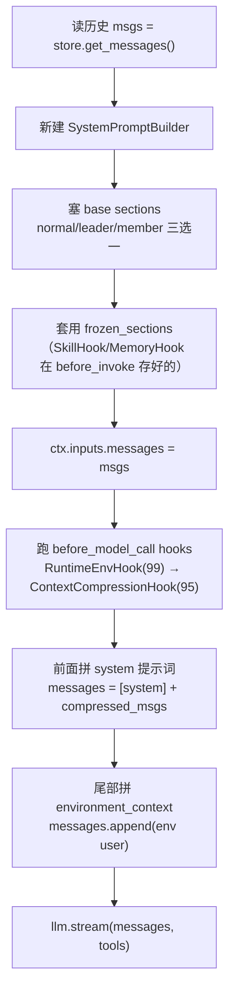
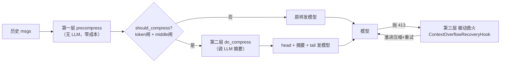

# 上下文窗口怎么分配：openclaw、jiuwenswarm 与 Twinkle 的做法

> 日期：2026-08-26
> 领域：Context Engineering（单域架构分析）
> 源码：openclaw 在 `D:/code/opensource/github/openclaw`（TypeScript）；jiuwenswarm 在 `D:/code/opensource/gitcode/jiuwenswarm`（Python）；**Twinkle 在本文所在仓库**（Python，代码级细讲见 §六起）
> 本文先讲三家策略异同，再以代码为准细讲 Twinkle 自己的实现。

---

## 一、要解决的问题

模型每次回答能"看到"的文字量有上限，叫**上下文窗口**（context window，比如 12.8 万 / 20 万 token）。但往里塞的东西很多：

- 系统提示词（告诉模型是谁、能干什么）
- 工具说明（每个工具叫什么、怎么用）
- 技能清单（有哪些技能可用）
- 历史对话（之前说了什么）
- 工具返回结果（工具跑出来的内容，往往很长）
- 记忆笔记（长期记住的用户偏好、事实）

不提前分配的话，要么某一块把窗口挤爆，要么该记住的旧信息被挤掉。三家都不选"塞满了再整体砍"，而是**提前给每一块分好配额 / 设好处理时机**——区别在分多少块、怎么分、什么时候动手。下面先看两个参考实现，再看 Twinkle 自己。

---

## 二、openclaw：进对话前就裁好

**思路**：每块东西在"进入对话之前"就按字数裁剪到位，不依赖运行时再猜。用"字符数"而不是 token，因为字符可以直接数、不用额外调模型算 token——精确且零成本。这让它敢给最多的块设配额（9 块里 7 块都有）。

**方案**（每块的配额）：

| 组成部分 | 配额 | 超了怎么办 |
|---|---|---|
| 启动记忆（USER.md 等） | 单文件 2 万字、总量 6 万、USER.md 特殊只给 4 千 | 留头留尾去中间；AGENTS.md 更特殊，抽关键词做摘要 |
| 技能清单 | 最多 150 个、总共 1.8 万字 | 先缩短每个描述，还不够就减少数量，自动填满配额 |
| 工具说明（目录模式） | 总共 1.8 万字 | 减少条目，提示"用搜索查更多" |
| 工具返回结果 | 按工具脾气分别设 | 命令行结果存成文件只给路径；读文件给"接着读"提示；搜索限匹配数和每行长度 |
| 历史摘要 | 最多占窗口一半 | 分块压缩 |
| 整体兜底 | 占满"窗口减 1.6 万预留"时触发 | 保留最近 2 万字，旧的全压缩 |

**特点**：先裁后塞，字符精确，覆盖最广；靠"折半试"在"多放几个"和"每个放多少"之间自动找平衡。

---

## 三、jiuwenswarm：工具结果和记忆管细，其余整体兜底

**思路**：面向复杂长任务（企业级 agent），工具结果和记忆是窗口消耗大头、且能"暂存后恢复"，所以把配额重点投在这两类，做一条多级暂存-恢复链；其余（系统提示词、技能正文）量小又不能恢复，干脆塞进总窗口靠整体压缩兜底，更省事。

**方案**：

| 组成部分 | 配额 | 超了怎么办 |
|---|---|---|
| 工具返回结果（最花心思） | 一轮内总额 1.5 万 + 每类工具留最近几条 + 按用得多不多给倍率（用得多的翻倍） | 重复和连续错误折叠；太大的让 AI 生成摘要，原文暂存可恢复 |
| 记忆注入 | 历史问答目录 8 千 + 会话笔记 12 万字上限 + 每次召回 8 千 | 多级暂存-恢复链，配额严格递增（8 千 → 8.5 万 → 9.2 万 → 10 万）防互相打架 |
| 技能正文 | 只限同时激活几个（默认 1 个）+ 目录树行数 | 正文本身不限长 |
| 工具说明 | 常驻几个 + 其余"模型要用时再拉" | 不全塞，按需加载 |
| 整体兜底 | 窗口满 10 万触发整窗压缩 + 撞 413（模型说太长了）时按窗口×0.85 压 | 保留尾部 10 条，旧历史压成摘要 |

**特点**：配额偏科（集中在工具/记忆），形式最多——字数、字符、条数、比例、密度倍率五种混用；靠"密度倍率"自适应（用得多的工具给更多配额）。

---

## 四、两家都不做的（行业共识）

- **系统提示词整体**：不单独设配额。靠它里面各子块（启动记忆、技能清单等）各自的配额间接约束。
- **模型历史回复**：不单独设配额。靠整体压缩回收。

这两块直接交给整个窗口管，不细分。

---

## 五、Twinkle 的定位（一句话）

Twinkle 是这两家的**精简学习版**：不抄 jiuwenswarm 那套多级暂存-恢复链（太重），学 openclaw 的"字符预算 + 截断"思路做记忆，自己拼出"**三层递进压缩**"做历史。一句话总策略：

> **平时靠"分块组装 + 冻结前缀"让窗口稳定高效；快满时走"三层递进压缩"由轻到重地省地方；真撞墙（413）了还有被动救火兜底。而且，压缩只改"给模型看的那份副本"，存下来的历史 `history.json` 永远无损。**

下面以代码为准细讲。

---

## 六、Twinkle 把什么塞进了窗口（内容布局）

一次模型调用，最终发给模型的 `messages` 数组长这样（从上到下）：

```
┌─────────────────────────────────────────────────────────────┐
│ messages 数组（发给模型的内容，自上而下）                       │
├─────────────────────────────────────────────────────────────┤
│ [0] system   ← 系统提示词（每步现拼，永不压缩）                  │
│              身份原则 → 长期记忆策略 → 被动召回(USER/MEMORY.md) │
│              → 可用技能清单                                     │
├─────────────────────────────────────────────────────────────┤
│ [1] system   ← [prior context summary]（仅当触发过 LLM 摘要时才有）│
├─────────────────────────────────────────────────────────────┤
│ [2..]        ← 对话历史（含工具结果）                           │
│   user → assistant(tool_calls) → tool(result) → ...          │
│   ↑ 这一段可能已被三层压缩处理过                                  │
├─────────────────────────────────────────────────────────────┤
│ [尾] user    ← <environment_context> 当前平台/日期（永不压缩）     │
└─────────────────────────────────────────────────────────────┘
   另附 tools= ← 工具定义清单（整轮冻结，不在 messages 里）
```

下面逐块说来源和代码位置。

### 6.1 系统提示词（system，position 0）

系统提示词不是写死的一整块字符串，而是**每一步重新拼**出来的。拼它的人叫 `SystemPromptBuilder`（[prompts.py](../../twinkle/agentserver/prompts.py)），逻辑非常简单：

```python
class SystemPromptBuilder:
    def add_section(self, section): self._sections[section.name] = section  # 同名覆写，不堆叠
    def build(self):
        return "\n\n".join(s.content for s in
            sorted(self._sections.values(), key=lambda x: x.priority))     # 按 priority 升序拼
```

每个小块叫一个 `PromptSection(name, content, priority)`。`build()` 按 `priority` 从小到大、用 `\n\n` 拼起来，**同名 section 后写的覆盖先写的**（不堆叠），结果确定、幂等。

每步往 builder 里塞的 section 有两类（[agent.py:524-537](../../twinkle/agentserver/agent.py#L524-L537)）：

| section | priority | 来源 | 何时注入 |
|---|---|---|---|
| `system_prompt` | 10 | `build_system_prompt()`：身份原则、运行环境、工作区路径、工具指南 | 每步 loop 直接塞 |
| `memory_strategy` | 80 | `MemoryHook`：何时搜/写长期记忆的策略 | `before_invoke`（每请求一次） |
| `memory_static` | 81 | `MemoryHook`：被动召回的 `USER.md` + `MEMORY.md` 正文 | `before_invoke` |
| `skills` | 90 | `SkillHook`：可用技能清单 | `before_invoke` |

所以最终 system 提示词的顺序是：**身份原则(10) → 长期记忆策略(80) → 被动召回(81) → 技能清单(90)**。

> ⚠️ 注意区分两个"priority"：**section 的 priority** 决定它在系统提示词里的排列顺序（上面这张表）；**Hook 的 priority** 决定 hook 之间的执行先后（见 §八）。别混了。

### 6.2 对话历史（含工具结果，中段主体）

历史来自 `SessionStore`，每步开头全量读出来（[agent.py:517](../../twinkle/agentserver/agent.py#L517)）：

```python
msgs = self._session_store.get_messages(session_id)
```

历史里只有三种角色，**没有 system**（system 每步现拼、不存历史）：

- `user`：用户提问（[agent.py:502](../../twinkle/agentserver/agent.py#L502)）
- `assistant`：模型回复（含 `tool_calls`，[agent.py:586-591](../../twinkle/agentserver/agent.py#L586-L591)）
- `tool`：工具执行结果，按 `tool_call_id` 配对（[agent.py:610-615](../../twinkle/agentserver/agent.py#L610-L615)、[agent.py:687-692](../../twinkle/agentserver/agent.py#L687-L692)）

**工具结果是怎么进上下文的？** 模型决定调工具 → loop 执行工具拿到 `result`（字符串）→ 追加一条 `{"role":"tool","tool_call_id":..., "content":result}` 进 SessionStore → 下一轮读出来就在历史里了。所以工具结果天然属于"历史"这一块，也最容易把窗口撑爆（§七重点处理它）。

### 6.3 运行环境（尾部 user，position 末）

`当前平台`、`当前日期`这种**每步都可能变**的易变信息，单独放最后一条 user 消息（[agent.py:547-552](../../twinkle/agentserver/agent.py#L547-L552)）：

```python
env_entries = ctx.extra.pop("environment_context", None)
if env_entries:
    env_text = "\n\n".join(e["content"] for e in env_entries)
    ctx.inputs.messages.append(
        {"role": "user", "content": f"<environment_context>\n{env_text}\n</environment_context>"})
```

注入它的是 `RuntimeEnvHook`（[runtime_env_hook.py](../../twinkle/agentserver/hooks/builtin/runtime_env_hook.py)）：

```python
class RuntimeEnvHook(AgentHook):
    priority = 99  # before_model_call 最先跑
    async def before_model_call(self, ctx):
        content = f"当前平台：`{sys.platform}`\n当前日期：`{datetime.date.today().isoformat()}`"
        ctx.extra.setdefault("environment_context", []).append({"content": content, "source": "runtime_env"})
```

**为什么放尾部、为什么用 user 而不是 system？** 这是刻意的，为了**保 prefix cache**（见 §八）。多放一条 SystemMessage 会让 provider 把它合并进 system 参数、破坏前缀字节稳定。

### 6.4 工具定义（tools= 参数，不在 messages）

工具清单在循环开始时冻结一次，整轮不变（[agent.py:510-512](../../twinkle/agentserver/agent.py#L510-L512)）：

```python
tool_schemas = self._tool_manager.schemas()   # 一次冻结 tool schemas:invoke 内不变
...
async for stream_event in self._llm.stream(messages=ctx.inputs.messages, tools=ctx.inputs.tools):
```

team 模式下还会按白名单过滤掉执行类工具（Leader 只协调不干活，[agent.py:513-515](../../twinkle/agentserver/agent.py#L513-L515)）。

---

## 七、内容怎么"组装"出来的（数据流 + 为什么这个顺序）

### 7.1 每步组装流程

组装发生在 ReAct 循环里，每个 think 步骤都走一遍（[agent.py:516-552](../../twinkle/agentserver/agent.py#L516-L552)）：



关键时序：**先跑 `before_model_call` hook（含压缩），再拼 system 头和 env 尾**。这意味着——压缩钩子看到的是"纯历史"，system 提示词和 env 还没进来，所以**系统提示词和环境信息永远不会被压缩**。

### 7.2 frozen_sections：跨步稳定的"冻结前缀"

`SkillHook`、`MemoryHook` 在 `before_invoke`（**每请求一次**，不是每步）就把技能清单、记忆策略塞进 `ctx.extra["frozen_sections"]`（[skill_hook.py:38-39](../../twinkle/agentserver/hooks/builtin/skill_hook.py#L38-L39)、[memory_hook.py:36-40](../../twinkle/agentserver/hooks/builtin/memory_hook.py#L36-L40)）。loop 每步把这些冻结段套用到 builder：

```python
for sec in ctx.extra.get("frozen_sections", []):   # 跨步稳定
    builder.add_section(sec)
```

**为什么这么设计？** 配合工具清单的"整轮冻结"，目的就一个：**让 `messages` 数组的前缀字节在整轮里保持不变**。前缀稳定 → provider 端的 prefix cache（KV-cache）能命中 → 省钱省时。注释写得很直白（[agent.py:510-512](../../twinkle/agentserver/agent.py#L510-L512)）：

> 一次冻结 tool schemas:invoke 内不变；对齐 jiuwenswarm:tools 跨步稳定 → system prefix 字节稳定 → provider 自动 prefix cache 命中。

### 7.3 env-at-tail：易变的东西别污染前缀

`当前日期`每天变、`sys.platform`也可能变。如果把它们塞进 system 提示词，前缀每天都变，prefix cache 天天失效。所以 Twinkle 把它放尾部 user 消息，让前缀保持冻结（[runtime_env_hook.py:2-8](../../twinkle/agentserver/hooks/builtin/runtime_env_hook.py#L2-L8) 的注释说明了理由）。

---

## 八、Hook 执行顺序一览（真实 priority）

| Hook | priority | 事件 | 作用 |
|---|---|---|---|
| `RuntimeEnvHook` | 99 | before_model_call | 注 env 到 `ctx.extra` |
| `ContextCompressionHook` | 95 | before_model_call | 压缩历史 `ctx.inputs.messages` |
| `SkillHook` | 90 | before_invoke | 冻结技能清单 |
| `MemoryHook` | 80 | before_invoke | 冻结记忆策略 + 静态召回 |
| `ProgressiveToolHook` | 70 | before_invoke + before_model_call | 注入延迟工具导航到 frozen_sections + 过滤 `ctx.inputs.tools`（**opt-in，默认关 = no-op**） |
| `ContextOverflowRecoveryHook` | 60 | on_model_exception | 413 被动救火 |
| `RetryHook` | 50 | on_model_exception | 一般错误重试 |

hook 装配分两类（[server.py:89-97](../../twinkle/agentserver/server.py#L89-L97) 自动 wire、[server.py:240](../../twinkle/agentserver/server.py#L240) 调用方传入）。`ContextCompressionHook`、`RuntimeEnvHook`、`ContextOverflowRecoveryHook` 都是**自动 wire**（不靠调用方传），因为它们的依赖（`llm`）在工厂里就有。

---

## 九、窗口快满了怎么办（长上下文处理：三层递进）

这是重头戏。Twinkle 不搞"塞满了再整体砍一刀"，而是**三层防线，由轻到重、能用便宜的就不用贵的**：



入口是 `ContextCompressionHook.before_model_call`（[context_compression_hook.py:31-38](../../twinkle/agentserver/hooks/builtin/context_compression_hook.py#L31-L38)），它只做一件事：调 `compress_messages`，把返回的新 list 赋给 `ctx.inputs.messages`（赋新 list，不改原 list）。

### 9.1 第零步：先估 token（不用 tiktoken）

`estimate_tokens` 用字符数 ÷3 估算（[compression/__init__.py:24-45](../../twinkle/agentserver/compression/__init__.py#L24-L45)），中英文折中，**不依赖 tiktoken**，零成本。够用来做阈值判断（不追求精确）。

### 9.2 第一层：无 LLM 前置压缩（`precompress_messages`）

先把"白捡"的便宜活干完，干完可能就低于阈值了，省一次 LLM 摘要（对齐 jiuwenswarm 成本递进思路）。它链式跑两步（[compression/__init__.py:111-116](../../twinkle/agentserver/compression/__init__.py#L111-L116)）：

**① ToolResultBudget — 总量超预算就裁最大的一条**（[compression/__init__.py:48-75](../../twinkle/agentserver/compression/__init__.py#L48-L75)）

- 所有 tool 结果 token 总和 > `9000` 才触发；
- 在候选里挑**单条最大**的（且 > `3000` 字符），把它裁成 `3000` 字符预览 + `[...trimmed, original N chars in history.json]` 标记；
- **保护最新 1 条**永不裁（`protect_latest=1`）。

**② MicroCompact — 同名工具结果批量清旧**（[compression/__init__.py:78-108](../../twinkle/agentserver/compression/__init__.py#L78-L108)）

- 只对 `read_file / glob / command_exec / web_fetch / web_search` 这 5 个"产出大且可重取"的工具；
- 同名工具结果数 − 留最近 3 条 > `5` 才清（留够多的才动手，避免频繁清）；
- 旧的清成 `[Old tool result content cleared]`，留最近 3 条原文。

这两层都只改"发给模型那份副本"，**`history.json` 原文不动**。

### 9.3 第二层：LLM 摘要压缩（`do_compress`）

前置压缩完仍超阈值，才动用 LLM 做摘要。先过两道闸判断要不要压（[compression/__init__.py:183-193](../../twinkle/agentserver/compression/__init__.py#L183-L193) `should_compress`）：

- **token 闸**：`estimate_tokens(msgs) > token_threshold`
- **middle 闸**：切出来的"中段"非空（确实有东西可压）

两道都过才压。`token_threshold` 的算法（[context_compression_hook.py:41-45](../../twinkle/agentserver/hooks/builtin/context_compression_hook.py#L41-L45)）：

```python
def _get_token_threshold():
    if CONTEXT_TOKEN_THRESHOLD > 0:
        return CONTEXT_TOKEN_THRESHOLD          # 手动绝对覆盖（向后兼容）
    return int(resolve_context_window_limit() * CONTEXT_TRIGGER_RATIO)   # 窗口 × 0.8
```

`resolve_context_window_limit` 三级解析（[model_catalog.py:28-47](../../twinkle/config/model_catalog.py#L28-L47)）：手动覆盖 > 模型字典前缀匹配（gpt-4o-mini=128000、claude-3-5-sonnet=200000）> 默认 128000。默认 `gpt-4o-mini` → 128000 × 0.8 = **102400 token** 才触发压缩。

压的过程（[compression/__init__.py:196-210](../../twinkle/agentserver/compression/__init__.py#L196-L210)）：

1. **切三段** `split_messages_head_middle_tail`：head=首条 system（历史里通常没有，故 head 多半为空）、tail=最后 `keep_recent_pairs×2`=12 条消息、middle=中间段。
   - **tail 切割时有个精巧保护**：如果 tail 起点落在一条 `tool` 消息上，就向左挪，让它配对的 `assistant(tool_calls)` 也进 tail。因为"孤立的 tool 结果前面没有对应的 assistant 调用"会破坏 OpenAI 消息契约（[compression/__init__.py:119-136](../../twinkle/agentserver/compression/__init__.py#L119-L136)）。
2. **摘要中段**：调 LLM（`tools=[]` 不让它调工具），用**结构化 4 节 prompt**（关键事实与决定 / 已用工具与文件 / 待办与当前任务 / 错误与修复，[compression/__init__.py:155-163](../../twinkle/agentserver/compression/__init__.py#L155-L163)）把 middle 压成一条摘要。
3. **拼回**：`head + [system: [prior context summary] 摘要] + tail`。
4. **降级**：摘要 LLM 调用失败（摘要是优化、非承重）→ 退化成 `head + tail`（丢 middle，无摘要），不报错（[compression/__init__.py:204-208](../../twinkle/agentserver/compression/__init__.py#L204-L208)）。

`summary_prompt_mode` 默认 `structured`（用硬编码 4 节常量）；`free` 才用 config 里的 `summary_prompt`（[compression/__init__.py:166-180](../../twinkle/agentserver/compression/__init__.py#L166-L180)）。

### 9.4 第三层：413 被动救火（`ContextOverflowRecoveryHook`）

万一前两层都没挡住，模型真的抛了 413 / `context_length_exceeded`，这个钩子在 `on_model_exception` 事件被动救火（[context_overflow_recovery_hook.py:97-143](../../twinkle/agentserver/hooks/builtin/context_overflow_recovery_hook.py#L97-L143)）：

1. **三层判定是不是溢出错误**：`status_code==413` 直接认；`400` + 溢出关键词 认；`None` + 关键词兜底认（[context_overflow_recovery_hook.py:52-70](../../twinkle/agentserver/hooks/builtin/context_overflow_recovery_hook.py#L52-L70)）。
2. **解析真实 token 数**：从错误信息正则抓 `actual_tokens` 和 `limit_tokens`，兼容 Anthropic（`N tokens > M`）和 OpenAI（`maximum context length is N`）两种格式（[context_overflow_recovery_hook.py:23-40](../../twinkle/agentserver/hooks/builtin/context_overflow_recovery_hook.py#L23-L40)）。
3. **激进压缩**：`keep_recent_pairs` 改用更激进的 `aggressive_keep_recent`（默认 3，正常是 6）+ `threshold_override = limit × 0.85`（解析到真实 limit 就用真实值，最准；解析不到就用字典兜底值 ×0.85，消除旧版"盲压 0"的缺陷，[context_overflow_recovery_hook.py:119-128](../../twinkle/agentserver/hooks/builtin/context_overflow_recovery_hook.py#L119-L128)）。
4. **请求重试**：`ctx.request_retry(delay=0)`，loop 会重新调一次模型。
5. **熔断**：连续失败超 `max_recovery_attempts` 次 → 注入 `force_finish`，让模型直接吐"上下文持续溢出，请开始新会话"收场，不再无谓重试（[context_overflow_recovery_hook.py:156-167](../../twinkle/agentserver/hooks/builtin/context_overflow_recovery_hook.py#L156-L167)）。成功后计数器清零（[context_overflow_recovery_hook.py:145-154](../../twinkle/agentserver/hooks/builtin/context_overflow_recovery_hook.py#L145-L154)）。

### 9.5 贯穿全程的关键设计：history 无损

这一点非常重要，贯穿三层：

> **压缩只塑形"给模型看的那份副本"，`SessionStore` 里的 `history.json` 始终完整无损。**

- 第一层、第二层都返回**新 list**，不改输入；
- `ContextCompressionHook` 是 `ctx.inputs.messages = compressed`（赋新值，不 in-place）；
- 注释反复强调："压缩结果不写回 SessionStore——history.json 始终无损；这里只改变 LLM 看到的内容"（[context_compression_hook.py:5-6](../../twinkle/agentserver/hooks/builtin/context_compression_hook.py#L5-L6)）。

好处：压缩激进也不丢真历史，换会话/回看/审计都能拿到完整原文；模型看到的只是"塑形后的视图"。

---

## 十、Twinkle 配置真实数值一览

以下都是 `twinkle/resources/config.yaml` 的**真实默认值**，不是举例：

| 配置项 | 默认值 | 含义 |
|---|---|---|
| `context_compression.token_threshold` | `0` | 0 = 走比例路径（窗口 × ratio） |
| `context_compression.trigger_ratio` | `0.8` | 触发比例（A/B 共用） |
| `context_compression.keep_recent_pairs` | `6` | 保留最近 6 对 = 12 条消息为 tail |
| `context_compression.summary_prompt_mode` | `structured` | 用硬编码 4 节摘要 prompt |
| `micro_compact.trigger_threshold` | `5` | 同名工具"可清数" > 5 才清 |
| `micro_compact.keep_recent_per_tool` | `3` | 每个工具留最近 3 条原文 |
| `micro_compact.compactable_tool_names` | `read_file, glob, command_exec, web_fetch, web_search` | 可批量清的工具 |
| `micro_compact.cleared_marker` | `[Old tool result content cleared]` | 清空标记 |
| `tool_result_budget.tokens_threshold` | `9000` | tool 结果总 token 超此才裁 |
| `tool_result_budget.large_message_threshold` | `3000` | 单条超此才算"大"候选 |
| `tool_result_budget.trim_size` | `3000` | 裁成 3000 字符预览 |
| `tool_result_budget.protect_latest` | `1` | 保护最新 1 条不裁 |
| `memory.auto_inject.enabled` | `true` | 被动召回默认开 |
| `memory.auto_inject.max_chars_user` | `4000` | `USER.md` 字符预算 |
| `memory.auto_inject.max_chars_memory` | `12000` | `MEMORY.md` 字符预算 |
| 模型字典 | `gpt-4o-mini`=128k / `claude-3-5-sonnet`=200k / 默认 128k | 窗口大小查表 |

记忆的被动召回（`USER.md`/`MEMORY.md`）超字符预算时，用**保首尾丢中间**的 head+tail 截断（[memory_hook.py:51-61](../../twinkle/agentserver/hooks/builtin/memory_hook.py#L51-L61)），首部是画像/核心偏好（稳定）、尾部是最近事实（新），丢中间陈旧段。`daily_memory` 不自动注入——需要时模型自己 `memory_search('daily_memory/<日期>')` 拉。

---

## 十一、三方对比（完整表）

把 Twinkle 放回 openclaw / jiuwenswarm 的坐标系：

| 维度 | openclaw | jiuwenswarm | **Twinkle** |
|---|---|---|---|
| 总策略 | 先裁后塞，进对话前就到位 | 工具/记忆管细，其余整体兜底 | 三层递进压缩 + 冻结前缀，副本塑形不改原文 |
| 配额覆盖 | 最广（9 块里 7 块） | 偏科（集中在工具/记忆） | 工具结果 + 记忆有预算，历史靠整体压缩兜底（轻量） |
| 计量单位 | 字符（可直接数） | 字数/字符/条数/比例/倍率混用 | 字符 ÷3 估 token（够用，不依赖 tiktoken） |
| 自适应方式 | 折半试找平衡 | 密度倍率（用得多给得多） | 成本递进（能用无 LLM 就不调 LLM） |
| 记忆侧 | 字符截断（简单） | 多级暂存-恢复链（精细） | 字符预算 head+tail 截断（学 openclaw）+ 主动 `memory_search` |
| 压缩分层 | 单层（进对话前裁好） | 多级暂存-恢复链 | precompress（无LLM）→ LLM 摘要 → 413 救火，三层递进 |
| 历史是否无损 | — | — | **始终无损，只塑形副本** |

Twinkle 的取舍很清楚——**精简学习版**：不抄 jiuwenswarm 那套多级暂存-恢复链（太重），学 openclaw 的"字符预算 + 截断"思路做记忆，自己拼出"三层递进压缩"做历史。几个鲜明特点：

1. **成本递进**：能用便宜手段（字符裁剪）解决的就不调 LLM；前置压缩完可能就够，省一次 LLM 摘要。
2. **冻结前缀 + env-at-tail**：一切为了让 `messages` 前缀字节稳定，吃满 provider 的 prefix cache。
3. **副本塑形**：压缩只改"模型看到的那份"，`history.json` 永远完整——激进了也不怕丢真历史。
4. **契约保护**：tail 切割主动避让孤立 tool 结果，不破坏 OpenAI 消息契约。
5. **被动兜底**：三层没挡住还有 413 救火 + 熔断，不会无限撞墙。

### 潜在缺口（客观描述，非建议改动）

- **无整体任务 token 预算**：压缩按"窗口 × 0.8"触发，没有"整个任务只能花多少 token"的预算概念（这点三家其实都没有）。
- **`max_steps=1000` 兜底循环长度**：靠步数上限防无限循环，不靠 token 预算。
- **token 估算 ÷3 偏粗**：够做阈值判断，但不精确（故意的，省掉 tiktoken 依赖）。

---

## 十二、小结

三家思路一脉相承（都提前管、不事后整体砍），但落点不同：

- **openclaw**：进对话前就用字符精确裁好，覆盖最广，靠折半试找平衡。
- **jiuwenswarm**：工具结果和记忆管到多级暂存-恢复链，配额偏科，靠密度倍率自适应。
- **Twinkle**：三层递进压缩（无 LLM 前置 → LLM 摘要 → 413 救火）+ 冻结前缀吃 prefix cache + 副本塑形不改原文，是两者的精简学习版。

Twinkle 的上下文工程可以记成三个"一"：

- **一张布局**：`[system 提示词] + [压缩后的历史] + [env 尾部]`，外加一份冻结的 `tools`。系统提示词内部又按 priority 拼成 `身份 → 记忆 → 技能`。
- **一套冻结**：`frozen_sections`（技能/记忆策略）+ 工具清单整轮冻结 + env 放尾，全为 prefix cache。
- **三层压缩**：precompress（无 LLM 裁工具结果）→ LLM 摘要中段 → 413 被动救火熔断；全程只塑形副本，`history.json` 无损。

代码不大，但层次分明、取舍清楚——这就是 Twinkle 作为学习版想展示的"上下文工程"全貌。
