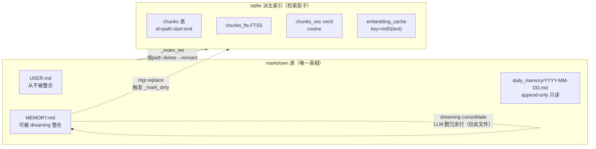

# Memory 去重缺口分析

> 记录于 2026-09-03。结论：**sqlite 向量库/FTS 不具备独立去重能力**，仅 markdown 层 dreaming consolidate 对 `MEMORY.md` 去重，sqlite 被动反映。跨文件与 USER.md/daily 的重复无任何机制清理。后续待优化。

## 1. 问题

写入重复记忆时，去重分别发生在哪一层？

- **markdown 层**：dreaming 的 `_consolidate` 用 LLM 删 `MEMORY.md` 内语义重复/矛盾行（B/C 类）。**仅对 `MEMORY.md` 生效**，不碰 `USER.md`，不碰 `daily_memory/*.md`（append-only 只读）。
- **sqlite 层**：`chunks` / `chunks_fts` / `chunks_vec` 是 markdown 的**派生检索索引**，自身**无任何去重逻辑**。

用户的初始理解"markdown 可通过 dreaming 去重"只对 `MEMORY.md` 成立。

## 2. 两层架构



关键 schema 事实（[store.py:89-114](twinkle/agentserver/memory/store.py#L89-L114)）：

- `chunks.id` 主键 = `"{path}:{start}:{end}"`（[store.py:299](twinkle/agentserver/memory/store.py#L299)）——**位置键，非内容键**。同一条事实落在不同文件/不同行 → 不同 id → 各存一份。
- `embedding_cache` key = `md5(chunk_text)`（[store.py:358](twinkle/agentserver/memory/store.py#L358)）——但它是**省 embedding API 调用的缓存**，不省存储：chunk 行和 vec 行照样每条各插一份。
- `chunks_vec` 是 vec0 虚表，按 rowid 挂载，无 embedding 唯一约束。两份相同向量 → 两行。

## 3. sqlite 写入路径：delete-then-reinsert，无查重

写入链路：`write/edit/replace` → `_mark_dirty`（[store.py:226](twinkle/agentserver/memory/store.py#L226)）→ 去抖 timer 或 search 兜底触发 `_index_file`（[store.py:260](twinkle/agentserver/memory/store.py#L260)）。`_index_file` 步骤：

1. **指纹跳过**（[store.py:271-275](twinkle/agentserver/memory/store.py#L271-L275)）：mtime+size+hash 全等则跳过。这是"文件没变就不重算"的性能优化，**不是去重**。
2. **删该文件旧 chunk**（[store.py:282-290](twinkle/agentserver/memory/store.py#L282-L290)）：按 `path` 删 `chunks`/`chunks_fts`/`chunks_vec`。
3. **重分块 + 重插**（[store.py:293-316](twinkle/agentserver/memory/store.py#L293-L316)）：逐条 `INSERT`。

结论：sqlite 对**单文件**是全量重建当前内容。它不比较 chunk 内容、不查近邻向量、不判重复。markdown 里两行相同事实 → sqlite 老实存两份 chunk + 两份 vec。

查询侧也不去重（[store.py:469-479](twinkle/agentserver/memory/store.py#L469-L479)）：候选并集 → 加权打分 → 排序 → top-N 截断，无按文本/语义去重。同一条事实从两文件命中 → 两条都返回。

## 4. dreaming consolidate 的真实作用范围

[dreaming.py:205-268](twinkle/agentserver/memory/dreaming.py#L205-L268) 的 `_consolidate`：

- `mgr.read("MEMORY.md")`（[dreaming.py:215](twinkle/agentserver/memory/dreaming.py#L215)），只编号 MEMORY.md 非空行；LLM 出 `{infectious, redundant}` 行号；`mgr.replace("MEMORY.md", ...)` 删行（[dreaming.py:268](twinkle/agentserver/memory/dreaming.py#L268)）。
- **`USER.md` 从不被 consolidate**。
- **`daily_memory/*.md`** 在 `_scan_claims`（[dreaming.py:103-129](twinkle/agentserver/memory/dreaming.py#L103-L129)）中只读不写，物理上永远保留重复行。其按 `md5(line)` 跨文件聚合（[dreaming.py:119](twinkle/agentserver/memory/dreaming.py#L119)）仅作**晋升门判据**（跨日复现计数），不删 daily 内的重复。

所以 markdown 去重范围 = `MEMORY.md` 一个文件。

## 5. sqlite 被动反映 markdown 去重的唯一路径

sqlite 永不主动去重，但会被动反映 dreaming 对 MEMORY.md 的去重：

```
dreaming _consolidate 删 MEMORY.md 某冗余行
  → mgr.replace("MEMORY.md", ...)      (dreaming.py:268)
  → _mark_dirty("MEMORY.md")           (store.py:221)
  → 下一轮 _index_file 重建 MEMORY.md
  → 旧 chunk（含被删行）全删 → 只插剩余行 chunk
  → 被删行对应 chunk/vec 从 sqlite 消失
```

特点：

- **间接**：sqlite 不判断，只跟着 markdown 重建。
- **滞后**：需等 dreaming 定时 tick（`MEMORY_DREAMING_INTERVAL_SECONDS`）+ 前台空闲 busy-backoff（[dreaming.py:76-77](twinkle/agentserver/memory/dreaming.py#L76-L77)）+ 去抖窗口 + 下次 `_index_file`。中间窗口 sqlite 仍有重复。
- **仅 MEMORY.md**：USER.md 与 daily 的重复永不被任何机制清理，sqlite 永远有多份。

## 6. 重复场景对照

| 重复场景 | markdown 层去重 | sqlite 层去重 |
|---|---|---|
| MEMORY.md 内两行语义重复 | ✅ dreaming consolidate（B 类）删一条 | ❌ 无独立去重；等 dreaming 删后重建才被动消失 |
| USER.md 内 / USER.md ↔ MEMORY.md 重复 | ❌ USER.md 从不被 consolidate | ❌ 各存 chunk/vec，search 重复返回 |
| daily 跨日同文（9-1 与 9-2 写同一行） | ⚠️ `_scan_claims` 聚合成 1 claim，但仅晋升门判据，两 daily 文件物理均留行 | ❌ 两 daily 各被索引，各存一份 |

## 7. 缺口与优化维度（待定，不规定方案）

若后续要让 sqlite 层具备去重能力，需决策的维度（**此处只列问题，不预设答案**）：

- **去重粒度**：exact 文本去重（md5，简单）vs 近邻语义去重（向量距离阈值，复杂、需调阈值）。
- **去重时机**：写入时（insert 前查近邻，阻塞写入关键路径）vs 后台整理时（ dreaming-like 慢通道，不阻塞写入）vs 查询时（结果合并，不省存储）。
- **去重范围**：仅同文件内 vs 跨文件（MEMORY.md ↔ USER.md ↔ daily）。
- **与 dreaming 的分工**：sqlite 去重是否要让 dreaming consolidate 的职责收敛（如 consolidate 只管 MEMORY.md，sqlite 管跨文件）。
- **对齐参考**：jiuwenswarm 的 MemoryIndexManager 是否在此层做去重（见 [jiuwenswarm LTM design 记忆](docs/superpowers/research/)）——待核查，勿臆断。

> 当前实现的态度是"markdown 为准、sqlite 为影"——sqlite 不承担语义责任，只管忠实检索。任何在 sqlite 加去重的改动，本质是让索引层承担部分语义责任，需与现有 dreaming 分工对齐，避免两层各去重一遍。
