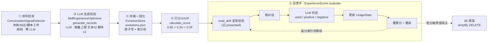

# Skill 自进化设计

> 让 SKILL.md 成为随真实使用而增长的"活文档"：把每次失败、纠正、可复用脚本都变成 skill 自身的增量。源码在 [`twinkle/agentserver/evolution/`](../../twinkle/agentserver/evolution) + [`hooks/builtin/evolution_hook.py`](../../twinkle/agentserver/hooks/builtin/evolution_hook.py) + [`skills/rpc.py`](../../twinkle/agentserver/skills/rpc.py)。对齐 jiuwenswarm `openjiuwen/agent_evolving` 做了裁剪（裁剪点见 §10）。**Phase 14 已落地**（里程碑 M18 ✅），当前在迭代反馈环细节。

## 0. 是什么 / 不是什么

skill 自进化 = 一个**闭环反馈系统**：从 agent 运行时的工具调用/对话中检测"信号"（失败、纠正、可复用脚本），用 LLM 把信号转成结构化"经验记录"存进每个 skill 的 `evolutions.json`，按 E/U/F 打分排序；下次模型 `read_skill` 加载该 skill 时经验随索引块按需呈现，再用 LLM 判定"这条经验这次帮上没帮上"回写使用统计——从而让 skill 内容随真实使用持续修正、去重、淘汰。

| 概念 | 改的是 | 是不是 skill 自进化 |
|---|---|---|
| 从 SkillHub/SkillNet 下载安装 skill | 装别人的 skill 进本地 | ✗ 消费侧 |
| dreaming / 长期记忆 | 把会话蒸馏进 `.twinkle_data/memory` 记忆库 | ✗ 不写不改 skill（见 [memory-system-design](memory-system-design.md) §9） |
| **skill 自进化** | **skill 自身的 SKILL.md + evolutions.json** | **✓** |

## 1. 两层架构

| 层 | 组件 | 职责 |
|---|---|---|
| **核心层** | `evolution/` 包（detector / optimizer / scorer / store / orchestrator） | 承载全部进化逻辑：信号检测、LLM 生成、存储固化、E/U/F 打分、反馈环、蒸馏 |
| **接线层** | `SkillEvolutionHook`（priority 80） | 把进化事件路由到核心层；`after_tool_call` 监听 read_skill 记经验 presented、`after_invoke` 跑反馈环 + 进化扫描 |
| **对外入口** | `skills/rpc.py` 6 个 RPC | 手动触发进化 / 查看经验 / 审批 / 蒸馏 |

进程级单例 `get_orchestrator()` 惰性构造，组合 store + optimizer + scorer + detector；optimizer 与 scorer **共用同一个 `LLMClient`**（与 agent 主循环同模型）。`server.py` 在 `if EVOLUTION_ENABLED` 为真时条件注册 Hook（`evolution.enabled` 默认 `true`——进化链默认跑）。

## 2. 闭环：5 步



### 2.1 信号检测（零 LLM，规则为主）

`ConversationSignalDetector` 扫消息列表，**纯正则 + 路径匹配，不调 LLM**——便宜、可复现、不会因 LLM 抽风错归因。三类信号：

| 信号 | 触发 | 归入 section | 默认 |
|---|---|---|---|
| `execution_failure` | tool 结果含失败关键词（error/exception/failed/timeout/enoent/permission denied…） | Troubleshooting | 开 |
| `script_artifact` | 代码执行类工具调用**成功**（结果无失败关键词且非空） | Scripts | 开 |
| `user_intent` | 用户纠正短语（wrong/should be/actually/不对/应该是…） | Instructions | 开 |

**关键——把信号归因到具体 skill**（不然失败不知道算谁头上）。`_detect_skill_from_tool_calls` 两条路：

1. 正则扫工具参数里的 `.../<skill_name>/SKILL.md` 路径 → 取目录名；
2. 工具名是 `skill_tool` 且参数含 `skill_name` → 直接取。

再用 `_resolve_active_skill` 取"**最近一次读过的 skill**"（消息索引 ≤ 当前）作为当前消息的归因。归因不到的信号丢弃。

启用的信号类型由 config `evolution.signals.*` 控制，orchestrator 每次 `evolve` 时读 `_get_enabled_signals()` 传给 detector。

### 2.2 LLM 生成经验

`SkillExperienceOptimizer.generate_records`：把「信号 + SKILL.md 摘要（截前 1500 字）+ 已有经验（最近 10 条，去重用）」拼进 prompt，调 LLM，解析 JSON draft 为 `EvolutionRecord[]`。

**经验来自三个渠道**（prompt 规定）：
- **A 预检测信号**——规则已归因到当前 skill 的 failure/script，默认应产出至少一条 append；
- **B 执行轨迹直接分析**——规则没完整捕获的：Agent 多次重试才成功的 workaround、导致错误的具体调用顺序/参数/前置检查缺失/恢复步骤；
- **C 脚本工件提取**——Agent 生成并成功执行的脚本，用 `target="script"`。

**数量上限（prompt 写死 + 代码强校验，独立计数）**：文本经验 ≤ 2 条、脚本经验 ≤ 1 条。超过按优先级保留最重要的（导致失败 > 导致低效但成功；高频可复现 > 单次偶发），其余标 `skip`。

**决策流**：相关性判断（不相关 → skip `irrelevant`）→ 去重判断（重复 → skip `duplicate`；相似但有增量 → `merge_target` 改写已有记录；**相似但本轮仍出错 → 优先改写不要跳过**；全新 → 继续）→ 优先级筛选 → 定 target（description/body/script）+ section。

**种子分**：生成时的初值（区别于后续 E/U/F 重算），按信号来源：failure=0.65 / user_intent=0.70 / script=0.60 / conversation_review=0.50。

LLM 输出 JSON 解析失败有重试（2 轮，追加固格式提醒），若干轮内不成就返回空——不崩。

### 2.3 存储 + 固化

`EvolutionStore`。v1 四个原语：`append_record` / `save_evolution_log` / `render_evolution_markdown` / `get_records_by_score`。

**"固化"不是把经验正文内联进 SKILL.md 正文**，而是注入一个 delimited 索引块 + 把正文写到 sidecar 文件：

- `append_record`：按 `merge_target` 决定 append 还是改写已有记录（merge）；`save_evolution_log` 用 **temp-file + rename 原子写盘**；
- `render_evolution_markdown`：脚本工件写 `evolution/scripts/<file>`（content 改成引用）；正文按 section 分组写 `evolution/<section>.md`，每条用 `<a id="{record.id}">` 锚定；同时往 SKILL.md 注入/替换一个 `<!-- evolution-index-start/end -->` 索引块（指向 sidecar）。

索引块存在则替换（`sub`），不存在则追加。`read_pristine_skill_content` 在**跨用户分享前剥掉这个块**，保证 SkillHub 上存的是作者原文。

**目录布局**（扩展现有 `skills/` 目录，不另起炉灶）：

```
skills/<skill_name>/
├── SKILL.md                      # 含 <!-- evolution-index-* --> 索引块
├── evolutions.json               # entries: EvolutionRecord[]
└── evolution/
    ├── <section>.md              # 经验正文，按 record.id 锚定
    └── scripts/<file>             # script-target 记录的脚本工件
```

### 2.4 打分 E/U/F

`ExperienceScorer`。综合分 `Score = w_e·E + w_u·U + w_f·F`（默认 0.5 / 0.3 / 0.2）。

| 维度 | 含义 | 计算 | 无数据兜底 |
|---|---|---|---|
| **E 效能** | 经验正面效果占比 | 贝叶斯平滑 `(pos+1)/(pos+neg+2)`，Beta(1,1) 先验 | 0.5（中性） |
| **U 利用率** | 被采纳率 | `times_used / times_presented` | 0.5 |
| **F 新鲜度** | 时间衰减 | `0.5 + 0.5·2^(-days/90)`，90 天半衰期（1.0→0.5）；**skill 版本不匹配再 ×0.7** | 0.5 |

版本对齐：经验记录带 `skill_version`，skill 改版后旧经验自动降权，避免过时经验误导。

### 2.5 反馈环（闭环的关键 / 最硬核）

`ExperienceScorer.evaluate`。**经验下次被呈现给 agent（模型 `read_skill` 该 SKILL.md、看到索引块）后，取之后的对话片段（截断 ~4000 字），用 LLM 逐条判定这条经验有没有被用到 / 正面 / 负面**，再 `update_score` 回写 `UsageStats`、重算 E/U/F、重排——高分在索引块里靠前、低分被蒸馏淘汰。

LLM 判定每条经验输出 `{record_id, used, positive, negative, reason}`。`update_score` 消费三个布尔：

```
if used:     stats.times_used += 1
if positive: stats.times_positive += 1
if negative: stats.times_negative += 1
record.score = calculate_score(...)   # 重算
```

> **注意分工**：`update_score` 不自增 `times_presented`——分母 U 由"呈现层"（`after_tool_call` 监听 read_skill 记 presented 的 Hook）维护。

**呈现计数落盘点**：`after_tool_call` 呈现时只在内存记 `_presented_ids_by_skill`（对象不入盘）；`run_feedback_loop` 时从 store fresh 读出记录后 `times_presented += 1` 再 save。否则 `evolutions.json` 里 presented 恒 0、`calculate_utilization` 永走 0.5 兜底、U 维失效。这是当前迭代修的关键点。

闭环完整跑通：**生成经验 → 打种子分 → 呈现（模型 read_skill）→ 跑对话 → LLM 判定 → 更新 used/positive/negative → 重算 E/U/F → 重排 → 高分在索引块靠前、低分被蒸馏淘汰**。

## 3. 触发与呈现（Hook）

`SkillEvolutionHook`（priority 80，低于 `SkillHook` 90）：

| 时机 | 做什么 |
|---|---|
| `after_tool_call` | 监听 `read_skill(skill,"SKILL.md")`：返回值 = SKILL.md 原文（含索引块）+ top-3 高分经验正文追加块 → 记这 top-3 为 presented 进 `_presented_ids_by_skill`（只记事件、不 +1）。读 `evolution/<section>.md` sidecar 记该 section 全部 non-skip；非 read_skill 不记。 |
| `after_invoke` | 先 `_run_feedback_loop`（对本轮 presented 的经验取对话片段做 LLM 效果判定、回写 times_presented/used、重算分），再 `_run_evolution`（调 `orchestrator.evolve_all`：detector 只跑一次、按 `skill_name` 分发信号给各 skill，从 `ctx.agent._messages` 取对话消息做信号检测 + 生成经验）。末尾清空 `_presented_ids_by_skill`。 |

触发点由 config `evolution.trigger` 控制：`after_invoke`（默认）和 `none` **已接通**；`after_tool_call` / `after_model_call` 两档 **仍 deferred**（需新回调，成本/语义风险高）。`evolution.enabled` 默认 `true`；关时 Hook 不注册，整条链路零开销。

> **缓存视角**：经验正文不进 system message / 前缀 / history，只随 `read_skill` 返回值进 tool_result（动态区，不扰前缀 cache）。返回值的"两块"都进上下文：索引块（id+score+summary+sidecar 链接，SKILL.md body 的一部分）+ top-3 正文追加块。top-3 这几条会出现两次——索引块里带 summary+链接，追加块里带详细正文；索引块的 sidecar 链接模型用不上，真正喂模型的是追加块正文，索引块对模型属半冗余。

## 4. 数据模型

`evolutions.json` 存 `EvolutionLog.entries: [EvolutionRecord]`。

**EvolutionRecord**：

| 字段 | 作用 |
|---|---|
| `id` | `ev_<8位hex>`，生成时定 |
| `source` | execution_failure / user_intent / script_artifact / conversation_review |
| `timestamp` | ISO UTC |
| `context` | 信号上下文（摘取的工具调用/对话片段） |
| `change` | `EvolutionPatch`，一条具体改动 |
| `score` | E/U/F 综合分（种子分初值，后续重算） |
| `usage_stats` | `UsageStats`，打分用 |
| `skill_version` | 生成时 skill 版本，新鲜度惩罚用 |
| `summary` | 一句话摘要 |

**EvolutionPatch**（即 `change`）：`section`（Instructions/Examples/Troubleshooting/Scripts/...）、`action`（append/merge/replace/skip）、`content`、`target`（description/body/script）、`merge_target`（改写哪条已有记录 `ev_xxxxxxxx`）、`skip_reason`、脚本工件字段（`script_filename`/`script_language`/`script_purpose`）、`keywords`、`summary`。

**UsageStats**：`times_presented`（被呈现次数，呈现层写）/ `times_used` / `times_positive` / `times_negative` / `last_presented_at` / `last_evaluated_at`。

> **去掉 jiuwenswarm 的 `applied` 字段**。它在 jiuwenswarm 里基本是摆设（唯一能置 True 的 `mark_records_applied` 无调用方，approved 记录以 `applied=False` 进 json）。Twinkle **以"渲染进索引块"为生效事实**，不靠这个字段。

## 5. 审批门控（不静默写改）

生成的经验不直接落盘，先 stage，按 `auto_save` 决定停下等人批还是自动批。`OnlineEvolutionOrchestrator.evolve()` 流程：

1. **守卫**：skill 的 `SKILL.md` 不存在 → `skipped_skill_not_found`；
2. **信号检测**：signals 为 None 时自动调 detector，只保留归因到当前 skill 的信号；无信号 → `no_signals`；
3. 读 SKILL.md 内容 + 已有经验（去重用）；
4. LLM 生成经验；无记录 → `no_records`；
5. **分支**：
   - `auto_save=False`（默认）→ 塞进内存 `_pending[skill]`，返回 `staged`，**停下等人批**；
   - `auto_save=True` → `_commit` 直接落盘 + 重渲染索引块，返回 `auto_approved`。

`_pending` 是进程内 dict（**v1 不持久化**——重启丢失待批）。`approve` / `reject` 按 `record_ids` 精细选择（None = 全批/全拒），批准的走 `_commit`，未批的留在 pending。"不静默写改"防 LLM 误判直接改坏 skill。

## 6. 蒸馏（淘汰低质）

经验库会膨胀，所以定期蒸馏。`ExperienceScorer.simplify` 逐条提 `DELETE / MERGE / REFINE / KEEP`：

- **规则前置**：分 < `min_score`（默认 0.4）**且** 零调用（used+positive+negative 全 0）→ 直接 `DELETE`，**不调 LLM**；
- 其余送 LLM 判定（`SIMPLIFY_PROMPT`）。

`OnlineEvolutionOrchestrator.simplify` 执行 DELETE：从 entries 移除、`save_evolution_log` 落盘、`render_evolution_markdown` 重渲染。MERGE/REFINE 建议 v1 只返回不自动执行（审批门控）。对应 RPC `skills.evolve_simplify`。

## 7. 对外 RPC（6 个）

经 `skills/rpc.py` 暴露。内联（`dispatch_skill_rpc` yield 单帧）与非内联（`run_skill_rpc` 后台 `create_task`，完成发一帧）分流：

| RPC | 作用 | 模式 | 审批门控 |
|---|---|---|---|
| `skills.evolve` | 手动触发一个 skill 的进化（传 messages + skill content） | 后台 | 是（受 `auto_save`） |
| `skills.evolve_list` | 查某 skill 的经验记录与分数（按分降序，top-50） | 内联 | — 只读 |
| `skills.evolve_pending` | 查待批列表（可按 skill 过滤） | 内联 | — 只读 |
| `skills.evolve_approve` | 批准 pending 记录（`record_ids` 可选，None=全批） | 后台 | — |
| `skills.evolve_reject` | 拒绝 pending 记录 | 后台 | — |
| `skills.evolve_simplify` | 蒸馏清理 | 后台 | 是 |

RPC 失败帧 body 带 `error`，前端 `request()` 因 `payload.error` reject。

## 8. 配置

[`config/schema.py`](../../twinkle/config/schema.py) `EvolutionConfig`（+ 子配置）。优先级：env var > `.env` > YAML 默认。

| 配置块 | 字段 | 默认 | 作用 |
|---|---|---|---|
| `evolution` | `enabled` | `True` | 总开关（默认开，进化链默认跑；关 = Hook 不注册，零开销） |
| | `trigger` | `after_invoke` | 触发点；`after_invoke`/`none` 已接通，`after_tool_call`/`after_model_call` 仍 deferred |
| | `auto_save` | `False` | 自动批 vs 审批门（已接通 config；默认关 = stage 等人批，不静默写改） |
| | `max_text_records` | `2` | 单轮文本经验上限 |
| | `max_script_records` | `1` | 单轮脚本经验上限 |
| `scoring` | `w_effectiveness`/`w_utilization`/`w_freshness` | `0.5`/`0.3`/`0.2` | E/U/F 权重 |
| | `freshness_half_life_days` | `90` | 新鲜度半衰期 |
| | `stale_version_penalty` | `0.7` | 版本不匹配惩罚系数 |
| `distill` | `min_score` | `0.4` | 蒸馏门槛（分低于此且零调用 → DELETE） |
| `signals` | `execution_failure` | `True` | 失败信号开关 |
| | `script_artifact` | `True` | 脚本工件信号开关 |
| | `user_intent` | `True` | 用户纠正信号开关（默认开，高质量信号） |

> 带严格 JSON 输出契约的 prompt（生成 `SKILL_EXPERIENCE_GENERATE_PROMPT`、评估 `EXPERIENCE_EVAL_PROMPT`、蒸馏 `SIMPLIFY_PROMPT`）**硬编码进各业务模块常量，不进 config**——用户改坏 → 解析失败 → 静默失效。自由文本 prompt 才进 config（此子系统无）。

## 9. 可观测

走 instrumentor monkey-patch，**不 inline 进业务代码**（对齐项目可观测约定）。[`observability/instrumentors/evolution.py`](../../twinkle/observability/instrumentors/evolution.py) 的 `instrument_evolution` patch `OnlineEvolutionOrchestrator.evolve` → 发 `twinkle.skill.evolution` span，携带 `skill.name` / `evolution.status` / `evolution.message`。

- `evolve` 内部的 LLM 调用（信号检测后的经验生成）以 `gen_ai.chat` span 嵌套在本 span下；
- `run_feedback_loop` **不 patch**——它返回 None（无 status），span 诊断价值低；其 LLM 调用仍是不可区分的 `gen_ai.chat`（接受，YAGNI）。

## 10. 与 jiuwenswarm 的差异（裁剪点）

Twinkle 是学习精简版，对齐 jiuwenswarm `agent_evolving` 的闭环骨架，做了以下裁剪：

| 点 | jiuwenswarm | Twinkle |
|---|---|---|
| `applied` 字段 | 有，但摆设（`mark_records_applied` 无调用） | **去掉**，以渲染进索引块为生效事实 |
| pending 持久化 | `ExperienceManager` 快照持久化 | **v1 内存 dict 不持久化**（重启丢待批） |
| 手动入口 | `/evolve` slash 命令 | **RPC `skills.evolve`**（无 slash） |
| 主动复盘 | fuzzy review（每 5 轮塞 follow-up prompt） | **无** |
| 重组 | `/evolve_rebuild` 重组成 SKILL.md | **无** |
| 自动建 skill | `SkillCreateRail`（也在路上） | **无** |
| LLM 客户端 | per-component | **单 LLMClient 共享**（optimizer + scorer） |
| 可观测 | 无独立层 | **instrumentor patch evolve** → OTel span |

## 11. 边界速查

| 边界 | 现状 |
|---|---|
| 总开关 | `evolution.enabled` 默认开（进化链默认跑）；关 = Hook 不注册零开销 |
| 触发点 | 默认 `after_invoke`；`after_invoke`/`none` 已接通，另两档 deferred |
| 写改前默认审批 | 是（`auto_save=False`）；`auto_save=True` 才自动落盘 |
| 信号检测 LLM | **零**（纯正则 + 路径匹配，便宜可复现） |
| 经验生成 LLM | 每次 `evolve` 一调（含重试） |
| 反馈环 LLM | 每轮呈现后一调（判定 used/positive/negative） |
| 数量上限 | 单轮文本 ≤2 / 脚本 ≤1，独立计数 |
| 呈现 | `read_skill(SKILL.md)` 返回值含索引块 + top-3 正文追加块（都进上下文）；记 top-3 为 presented；读 sidecar 记该 section 全部 non-skip；只记 id+呈现点索引供反馈环 |
| 待批持久化 | v1 内存（重启丢失） |
| 蒸馏 | 分 <0.4 且零调用 → 直接 DELETE（不调 LLM）；其余 LLM 判定 |
| 跨用户分享 | `read_pristine_skill_content` 剥掉索引块，存作者原文 |
| 缓存 | 经验不进 messages（不进前缀也不进 history），只在 hook 内部记 presented 事件，不扰 cache |

## 12. 效果怎么保证（六道保险）

1. **真闭环**（非一次写入）：生成 → 呈现 → 判定 → 打分 → 重排，得分随真实效果升降；
2. **数量上限 + 去重**：文本≤2 / 脚本≤1，重复→merge 改写、相似→skip，防膨胀；
3. **蒸馏淘汰**：分<0.4 且零调用 → 删，定期清低质；
4. **不静默**：默认审批门，写改前必须人批；`auto_save` 才自动落；
5. **规则归因**：信号检测和"失败算哪个 skill"靠正则+路径匹配，不用 LLM；
6. **版本对齐**：新鲜度 F 在版本不匹配时 ×0.7，旧经验自动降权。

## 13. 源文件索引

| 组件 | 文件 |
|---|---|
| 数据模型（EvolutionRecord/Patch/UsageStats/Signal） | [evolution/types.py](../../twinkle/agentserver/evolution/types.py) |
| 信号检测（规则，零 LLM） | [evolution/signal_detector.py](../../twinkle/agentserver/evolution/signal_detector.py) |
| LLM 生成经验 | [evolution/optimizer.py](../../twinkle/agentserver/evolution/optimizer.py) |
| 存储 + 固化（evolutions.json + 索引块 + sidecar） | [evolution/store.py](../../twinkle/agentserver/evolution/store.py) |
| E/U/F 打分 + 反馈环 + 蒸馏 | [evolution/scorer.py](../../twinkle/agentserver/evolution/scorer.py) |
| 编排器（evolve/approve/reject/feedback/simplify） | [evolution/orchestrator.py](../../twinkle/agentserver/evolution/orchestrator.py) |
| 进程单例 + 组件装配 | [evolution/__init__.py](../../twinkle/agentserver/evolution/__init__.py) |
| 接线层 Hook（呈现记录 + 触发） | [hooks/builtin/evolution_hook.py](../../twinkle/agentserver/hooks/builtin/evolution_hook.py) |
| 6 个进化 RPC | [skills/rpc.py](../../twinkle/agentserver/skills/rpc.py) |
| Hook 条件注册 | [agentserver/server.py](../../twinkle/agentserver/server.py) |
| 可观测 instrumentor | [observability/instrumentors/evolution.py](../../twinkle/observability/instrumentors/evolution.py) |
| 配置 schema（`EvolutionConfig`） | [config/schema.py](../../twinkle/config/schema.py) |

> jiuwenswarm 参考实现拆解见 [`docs/superpowers/research/2026-08-02-jiuwenswarm-skill-self-evolution.md`](../superpowers/research/2026-08-02-jiuwenswarm-skill-self-evolution.md)。
