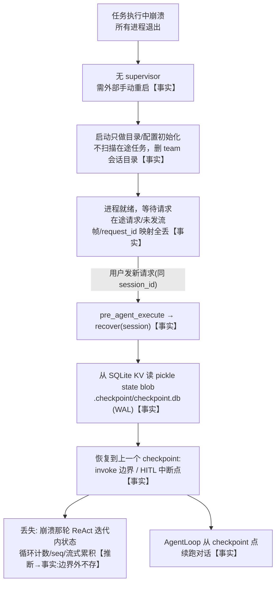

# jiuwenswarm 崩溃恢复机制调研与 Twinkle 改进建议

> 调研日期：2026-08-27
> 调研对象：jiuwenswarm（参考实现 `D:\code\opensource\gitcode\jiuwenswarm`）+ Twinkle（本项目）
> 调研问题：任务执行中崩溃、所有进程重启后，任务如何恢复？

## 0. 标记约定与调研方法

为便于审核，本文严格区分三类陈述：

- **【事实】**：可直接在代码中验证，附 `文件:行号` 引用。
- **【推断】**：基于【事实】的判断，非代码直接写出。
- **【建议】**：面向 Twinkle 的改进方向，未落地前为提案。

调研方法：4 个并行子 agent 分别覆盖 jiuwenswarm 的**进程层 / 会话状态层 / 连接消息层** + Twinkle 现状；其后对关键机制（checkpointer、context_engine）做了源码精读交叉印证。jiuwenswarm 框架核心是 `openjiuwen` pip 包（装于各 venv 的 site-packages，本文引用 `.venv_develop`）。

> 局限：~~Twinkle `compression/` 模块内部结构、jiuwenswarm offload 存储内容未深挖~~ **已深挖**（见 §3.3、§5.6）。

---

## 1. 概述

**核心结论（先读这条）**：

> jiuwenswarm 的崩溃恢复能力**并不强**，与 Twinkle 同属"弱恢复"梯队。它唯一比 Twinkle 多的，是一个**会话状态 checkpointer**——把 agent 对话状态在 invoke 边界/HITL 中断时存成 SQLite blob，下一条用户请求到达时懒恢复。**在途任务的"执行"本身不会被自动续接**；进程不自动重启、ws 不自动重连、在途请求与未发流帧直接丢失。

jiuwenswarm 之所以"看起来能恢复"，靠的是 **存状态快照 + 请求驱动懒重放**，而非"启动时扫描续接任务"。这与"进程崩溃后自动把中断任务接着跑完"的直觉不同，需先校正这个预期。

---

## 2. jiuwenswarm 崩溃恢复全景

### 2.1 进程层【事实】

- **无进程监管/自动重启**：`jiuwenswarm/jiuwenclaw/app.py:28-71` 与 `start_services.py:75-125` 用 `subprocess.Popen` 拉起双进程（agentserver + gateway），主循环每 0.5s `proc.poll()`，**任一子进程退出即返回退出码 + 终止兄弟进程**。无 restart policy、无退避、无 supervisor。仓库内无 docker-compose/supervisord/systemd 配置（部署层 `jiuwenbox` 不在此仓库）。
- **启动时只做初始化，不扫描在途任务**：`app_agentserver.py:14-66` 启动做 `ensure_workspace_initialized`（目录）、`migrate_legacy_user_config`（配置）、`remove_team_mode_session_dirs_at_startup`（**删除** team 会话目录，非恢复）。
- **SIGTERM 优雅停机框架有，但 Windows 失效**：`app_gateway.py:1740-1860` 经扩展注册 SIGTERM→`shutdown_requested`；`app_agentserver.py` 用 `loop.add_signal_handler`，但 **Windows 下 `add_signal_handler` 抛 `NotImplementedError` 被静默吞**，且**不主动 flush 在途 session 到 checkpointer**。

### 2.2 会话状态层——checkpointer【事实，核心】

这是 jiuwenswarm 唯一比 Twinkle 强的机制。

- **checkpointer 实现**：`openjiuwen/core/session/checkpointer/persistence.py` 的 `PersistenceCheckpointer`。存储用 BaseKVStore，默认 SQLite（`.checkpoint/checkpoint.db`，开 WAL，`:962-973`）。jiuwenswarm 应用层**无条件** `set_checkpoint()` 装 SQLite（always-on）。
- **存什么**：`AgentStorage._get_state_to_save`（`:299`）= `session.state().get_state(copied=False)`——**整个 session state dict**，pickle 成 blob 存进 KV（按 `session_id + agent_id` 命名空间）。
- **恢复**：`AgentStorage.recover`（`:208`）从 KV 读 blob → `set_state(state)` 灌回整个 dict。
- **存取时机**（`:746-894`）：
  - `pre_agent_execute`（`:746`）：**请求到达时先 recover** 载入上次状态；
  - `interrupt_agent_execute`（`:771`）：HITL 中断时 save；
  - `post_agent_execute`（`:782`）：agent 完成后 save；
  - `post_workflow_execute`（`:860`）：异常时 save，正常完成则 **clear**。
- **VCS 增量日志存在但未接 ReAct**【事实】：`openjiuwen/core/session/vcs/` 有完整 `VersioningManager`（append/snapshot/restore/rewind）+ `JsonlBackend`（append-only log.jsonl+snapshots+commits+HEAD，原子写可选 fsync）。但 grep 全仓，VCS **只被 `agent_teams/` 层引用，`react_agent.py` 从不调用**。

### 2.3 连接与消息层【事实】

- **两条 ws 都无运行期自动重连**：Browser↔Gateway（`web_channel.py:206-424`，legacy server，`ping_interval=20`）与 Gateway↔AgentServer（`agent_client.py:161-249`，legacy client）仅协议级 ping/pong 保活。Gateway↔AgentServer 仅启动期 `_connect_with_retry`（20×3s）；运行期 `_message_receiver_loop` 断连只 log+sleep 空转死 socket，不重建连接，在途 unary 请求 60s 超时。
- **在途请求/消息无持久化队列**：全 `asyncio.Queue`/内存 dict（`message_handler.py:128-135`、`agent_client.py:125`、`app_gateway.py:290-291`），disconnect/退出时 clear。grep `durable|outbox|replay|pending_request` 零命中。
- **流式无断点续传**：G2A wire 有 `sequence` 序号（`agent_ws_server.py:924`）但 Gateway 无续传逻辑；浏览器事件帧无 sequence/last_event_id/resume_token；无客户端时事件**静默丢弃**（`web_channel.py:542-543`）。
- **request_id 不落盘、无法跨重启关联**：request_id 浏览器生成（`web_channel.py:439`），只存内存映射，重启即空。`_chat_resume` 仅回 `{"accepted":True}` ACK。
- **两层处理差异**：Gateway"断连即丢、不保留"（不主动取消 AgentServer 工作，无客户端则静默丢）；AgentServer"断连即取消"（`cancel_all_inflight_work` 主动取消所有在途流，但 session 状态落盘可恢复）。

### 2.4 端到端恢复流程【事实】



---

## 3. 核心机制深挖：checkpointer 存什么、recover 怎么重建【事实】

这一节回答两个关键问题：**存的是不是上下文窗口数据**、**为何 resume 不爆窗口**。

### 3.1 context 运行态作为 session.state 的一部分被整存

- **`save_contexts`**（`openjiuwen/core/context_engine/context_engine.py:274-311`）：遍历 context_pool，对每个 context 调 `context.save_state()`，组成 `states[context_id] = context_state`，再 `_save_state_to_session`（`:396`）→ `session.update_state({"context": states})`。即**把 context 运行态挂到 `session.state()["context"]` 键下**。
- **`_load_state_from_session`**（`:370-393`）：`session.get_state("context")` → `context.load_state(states)`。

### 3.2 save_state 存的具体字段

`SessionModelContext.save_state`（`openjiuwen/core/context_engine/context/context.py:746`）：

```python
def save_state(self):
    return {
        "messages": self._message_buffer.get_back(),          # 当前窗口 messages
        "offload_messages": self._offload_message_buffer.get_all(),  # 被溢出/offload 的 messages
    }
```

`load_state`（`:752`）：从 state 取这两块 → `rebuild` message_buffer + 重建 OffloadMessageBuffer。

### 3.3 为何 resume 不爆窗口、不重放压缩【事实+推断】

- jiuwenswarm **resume 时不读 append-only 全量 history 重建窗口**。它存的是**已经过 processor 处理过的结构化运行态**（`message_buffer` 当前窗口 + `offload_message_buffer` 溢出部分），recover 时 `set_state` 灌回 dict → `load_state` 直接 `rebuild` 两个 buffer。
- **`offload_messages` 存的是"原样移出窗口的原始消息"【已确认事实】**：offloader processor（`processor/offloader/message_offloader.py:147-168`、`message_summary_offloader.py:291-367`）把大 tool 消息**原件**存进 `offload_buffer[handle]`（`message_buffer.py:102-109`），buffer 里那个位置只留**截断占位**（`content[:trim_size]+"..."`）或 **LLM 摘要 + `[[OFFLOAD:handle]]` 标记**。原件不被消化，单独留存以供 `enable_reload` 机制（`config.py:42-48`）按需 reload 注入回 context。
- **为何 jiuwenswarm 必须存 save_state（checkpointer 必需性根因）【事实】**：`_message_buffer` 有 `max_context_message_num` 上限，`_if_need_resize`（`message_buffer.py:71-80`）在 `2×max` 时**直接裁掉最老消息**（`_context_messages = _context_messages[max:]`）。即 buffer 是**有状态、会丢老消息**的，崩溃后无法从 buffer 重建全量。故 jiuwenswarm 不存 save_state 就丢数据，checkpointer 是恢复**必需**。这与 Twinkle 形成根本对照（见 §5.6）。
- 因此"压缩窗口状态"就含在存的 blob 里，**不重放 processor 链、不读全量原始 history**。但 Twinkle 不该照抄这个两部分形态——见 §7 P1。

### 3.4 存的时机决定恢复粒度【事实→推断】

checkpointer 只在 **invoke 边界 + HITL 中断 + workflow 异常** 存（§2.2）。**ReAct 循环中间步不存**——这是 jiuwenswarm 的根本弱点：崩在两次 checkpoint 之间，那轮迭代的执行状态丢失（`post_agent_execute` 是整个 invoke 完成后才存）。这也是 §4 结论"弱恢复"的依据。

---

## 4. 诚实结论：jiuwenswarm 崩溃恢复能力【推断】

- **进程层**：弱。无监管、无自动重启、无启动扫描续接。
- **会话状态层**：中等偏弱。有 checkpointer（SQLite blob）提供**会话级对话连续性**，但只在边界存、请求驱动懒恢复，崩在循环中间丢那轮。
- **连接/消息层**：无。在途请求/流帧/request_id 映射全内存丢，ws 无运行期重连，无断点续传。

**VCS 是反面教材**【推断】：jiuwenswarm 造了一套能做逐步 checkpoint 的 VCS 子系统却没接到 ReAct 循环——典型的"造了重武器不用"。Twinkle 不该照抄这套；反而应利用自身已有的 per-step 写入基础设施，做到比 jiuwenswarm 更细的 step 级 checkpoint（见 §7 P1）。

---

## 5. Twinkle 现状【事实】

### 5.1 已落盘的是"数据"不是"执行状态"

| 已落盘 | 证据 |
|---|---|
| 消息历史（messages，含 tool_calls/tool_results）增量 JSONL | `twinkle/agentserver/sessions/store.py:251`；ReAct 每步即写——`agent.py:586-591`（Finish→append）、`agent.py:610-614`（tool 结果→append） |
| TodoStore per-session JSON | `twinkle/agentserver/todo/store.py:75-87` |
| 审批 pending `.approval_pending.json`（原子写） | `twinkle/agentserver/permissions/approval_registry.py:63-73` |
| cron job 定义 JSON | `twinkle/agentserver/cron/store.py` |

### 5.2 未落盘的（纯内存，重启即丢）

| 未落盘 | 证据 |
|---|---|
| ReAct 循环迭代计数（`itertools.count`）/ seq / 流式累积 / active task dict | `twinkle/agentserver/agent.py:516`、`server.py:134` |
| cron 运行态 `_runs` | `twinkle/agentserver/cron/scheduler.py:43`（注释 `# 内存`） |
| Gateway↔AgentServer ws 连接（无重连，断连即 `_fail_pending`） | `twinkle/gateway/agent_client.py:57-81`（仅 `ping_interval=30` keepalive，`:40-41`） |
| 在途请求/流帧（全内存 asyncio.Queue） | 同上 |
| request_id 映射 | 内存 dict |

### 5.3 被动恢复机制（有，但需用户手动触发）

- **孤儿 tool_call 修复**：`agent.py:837-871` `_fill_missing_tool_results()`，在每个 ReAct 循环开头检查最后一条 assistant 是否有未配对 tool_result 的 tool_calls，有则合成占位。在 `agent.py:498` 被调用。**需用户发下一条消息才触发**，agent 不会自动续跑。
- **interrupt snapshot**：`agent.py:465-476` 崩溃时写一条 `[SYSTEM] 任务中断` assistant 消息。但 SIGTERM 直接杀进程，asyncio finally 不执行，**snapshot 写不出来**。

### 5.4 进程监管 / 优雅停机【事实】

- **无自动重启**：`scripts/start_services.py:62-67` 任一子进程退出 → 全杀 → `SystemExit(0)`，无 restart policy/supervisor/watchdog。
- **无优雅 drain**：`server.py:main()`（`:225-251`）**AgentServer 自身无 signal handler**；SIGTERM 直接杀进程，asyncio finally 不执行；启动脚本仅 `p.terminate()` 全杀。OTel `atexit` flush 只管 span/metric。

### 5.5 长期记忆 vs session 在途状态【事实】

两者独立：`memory/store.py` 是跨 session 的知识库（md + SQLite FTS/向量，debounce 2s 落盘）；ReAct 在途状态是单次 run 的执行进度，**纯内存**。消息历史是两者桥梁——既是 session 对话记录，也是 MemoryHook 提取记忆的来源。

### 5.6 压缩机制：纯 compressor 型，每步从全量 history 重算【事实】

这节是 P1 恢复方案的关键依据（决定窗口能否重跑恢复）。

- **纯 compressor 型，无 offloader**：`compression/__init__.py` 三个压缩函数全是**就地替换**，不原件移出：
  - `_tool_result_budget`（`:48-75`）：大 tool result 的 content 截断成 `content[:trim_size] + "\n[...trimmed, original N chars in history.json]"`。
  - `_micro_compact`（`:78-108`）：可清旧 tool 消息 content 清成 `MICRO_COMPACT_CLEARED_MARKER`。
  - `do_compress`（`:196-210`）：middle 段 LLM 摘要成一条 system 消息，`head + [summary_msg] + tail`。
- **原件留底 history.jsonl 无损**：模块文档头（`:1-7`）明确"压缩结果不写回 SessionStore——history.json 始终无损；这里只改变 LLM 看到的内容"；`store.py:251` append 无损增量。
- **压缩窗口不落盘**：`ContextCompressionHook.before_model_call`（`context_compression_hook.py:31-38`）赋值 `ctx.inputs.messages = compressed`，注释（`:5`）"压缩结果不写回 SessionStore,只改 ctx.inputs.messages"。溢出恢复 hook 同理（`context_overflow_recovery_hook.py:130-136`）。
- **每步从全量 history 重算、窗口无状态**：`agent.py:517` `msgs = self._session_store.get_messages(session_id)` 每步加载全量 history → `:539` 构造 inputs → `:540` before_model_call 压缩 → 送 LLM → 丢弃。压缩窗口**不跨步持久化**，每步重算。
- **无 offloader 机制**：全仓 grep `enable_reload`、`[[OFFLOAD`、`offload_handle`、`reload_hint` 零命中。trim/micro_compact 移出的原件靠 **history.jsonl 留底**（不靠 offload_buffer+handle），无 reload 注入。

**对照 jiuwenswarm 的根本差异【推断】**：jiuwenswarm 的 `_message_buffer` 有状态、会 resize 丢老消息，故必须 save_state 才能恢复（§3.3）；Twinkle 的压缩窗口每步从无损 history 重算、无状态，**崩溃后从 history.jsonl 重跑 `compress_messages` 即可重建窗口，不爆窗口**（加载到内存不爆，爆的是送 LLM，压缩后才送）。代价是重跑一次 LLM 摘要。这一差异使 Twinkle 的 P1 checkpointer 性质与 jiuwenswarm 不同（见 §7）。

---

## 6. jiuwenswarm vs Twinkle 对比

| 维度 | jiuwenswarm | Twinkle | 谁更好 |
|---|---|---|---|
| 进程监管/自动重启 | ❌ Popen 一崩全杀 | ❌ `start_services.py` 一崩全杀 | 平 |
| 启动扫描续接在途任务 | ❌ 不扫，删 team 目录 | ❌ `server.py:main()` 干净启动 | 平 |
| 消息历史持久化 | ✅ 随 state blob（invoke 级） | ✅ history.jsonl **逐步增量** | **Twinkle 更细** |
| 结构化运行态（窗口/状态机） | ✅ checkpointer blob（invoke 级） | ❌ 纯内存 | jiuwenswarm |
| 请求驱动懒恢复入口 | ✅ `pre_agent_execute→recover` | ❌ 仅孤儿修复被动触发 | jiuwenswarm |
| 当前工作窗口恢复（不爆） | ✅ load_state rebuild buffer | 🟡 可重跑压缩恢复（每步本就全量加载+压缩），无快照需重跑 LLM 摘要 | jiuwenswarm 省重跑 |
| ws 运行期重连 | ❌ 仅启动期重试 | ❌ 无 | 平 |
| 在途请求/流帧持久化 | ❌ 全内存丢 | ❌ 全内存丢 | 平 |
| 流式断点续传 | ❌ 无 | ❌ 无 | 平 |
| SIGTERM 优雅 drain | 🟡 框架有/Windows 废 | ❌ 无 handler | jiuwenswarm 略好 |
| cron 计划/run 恢复 | 🟡 计划存/run 丢 | 🟡 计划存/run 丢 | 平 |

**净结论【推断】**：Twinkle 并不比 jiuwenswarm 差多少。压缩窗口因每步从无损 history 重算（§5.6），崩溃后可重跑压缩恢复、不爆窗口——"当前窗口 rebuild"这条 jiuwenswarm 的优势被缩小。真正仍落后的是"**请求驱动懒恢复入口 + iteration 配额持久化**"（恢复入口需用户手动触发、循环计数纯内存丢）。但 Twinkle 已有的"逐步增量写 history.jsonl"是比 jiuwenswarm invoke 级 checkpointer **更细的持久化地基**——稍加补全运行态快照，反而能超过它。

---

## 7. Twinkle 改进建议【建议】

> 判断原则：按工程本质该做就做，不拿"学习项目"当默认选最保守方案的理由。每条标注现状/差距/建议/参考/成本/前提。

> **范围说明**：本节对齐 jiuwenswarm 框架层恢复模型——"崩溃手动重启 + 用户发相同 session_id 请求触发 checkpointer 恢复续执行"（见 §2.4 流程）。建议分三档：**核心**（P1，对齐 jiuwenswarm 机制）、**可选增强**（P2/P3，非 jiuwenswarm 模型）、**暂缓**（P4）。

### P1（核心）：会话运行态 checkpointer + 请求驱动 resume

这是真正解决"任务恢复"的核心项。

- **现状（Twinkle 压缩窗口每步重算、无状态）**【事实，见 §5.6】：Twinkle 压缩是纯 compressor 型，`agent.py:517` 每步从全量 history.jsonl 加载 → 压缩 → 送 LLM → 丢弃，窗口不跨步持久化、不落盘；原件留底 history.jsonl 无损。**循环计数 `itertools.count`（`agent.py:516`）纯内存**，重启即丢；无续接入口（仅 `_fill_missing_tool_results` 被动修复，需用户手动触发）。
- **关键认知修正【推断】**：因压缩窗口每步从无损 history 重算，**Twinkle 即使不存压缩窗口快照，恢复时从 history.jsonl 重跑 `compress_messages` 即可重建窗口、不爆窗口**（加载到内存不爆，压缩后才送 LLM）。故 P1 的 checkpointer 性质 ≠ jiuwenswarm：jiuwenswarm 因 `_message_buffer` 有状态会 resize 丢老消息（§3.3），checkpointer 是**恢复必需**；Twinkle 靠 history 重跑可恢复，P1 是**省重跑压缩成本 + 干净恢复 iteration 配额的优化**，非必需。
- **唯一不可从 history 干净推断的【事实】**：`iteration`（max_iter 配额消耗）。messages 可重跑压缩得到；last_phase/status 冗余（从 history 最后一条 + `_fill_missing_tool_results` 推断）。
- **建议**（两个方案，按精度/成本权衡）：
  - **方案 A（存压缩后窗口 + iteration）**：`sessions/<id>/runtime.json` = `{ messages: 压缩后窗口(ctx.inputs.messages 快照), iteration }`。恢复直接 load → 修孤儿 → 续跑。**省一次重跑 LLM 摘要**，恢复快。messages 已压缩、不大。存时机：ReAct 每步 flush（已有 per-step 写入点 `agent.py:586/610`，顺手多写 runtime），比 jiuwenswarm invoke 级更细。
  - **方案 B（只存 iteration，窗口重跑）**：`runtime.json` = `{ iteration }`。恢复：从 history.jsonl 全量加载 → 重跑 `compress_messages` 重建窗口 → 修孤儿 → 续跑。**省空间**，但付一次重跑 LLM 摘要成本（且摘要可能因 LLM 非确定性略变）。
  - 两者都：请求驱动懒恢复入口（用户发同 `session_id` → 读 runtime → 续跑到完），**启动时不自动全量扫描续跑**（对齐 jiuwenswarm 安全模型，避免重启后突发恢复打爆 LLM）。
- **参考**：抄 jiuwenswarm 的**机制**（请求驱动懒恢复 + step 级快照），**不抄其两部分 save_state 形态**——Twinkle 无 offloader，不需要 `offload_messages`；甚至 `messages` 都可不存（方案 B）。Twinkle 的 P1 比 jiuwenswarm 更轻。
- **关键反例**：**别抄 jiuwenswarm 全套 VCS delta-journal**（`core/session/vcs/`）——造了不接 ReAct，过度设计。Twinkle 做 step 级 runtime + resume 入口即可。
- **成本**：低-中（1 写入点 + 1 resume 入口 + 测试；方案 B 更低，只存 iteration）。
- **前置前提**：~~阻塞~~ **已核查**（见 §5.6）：Twinkle 压缩纯 compressor 型、无 offloader、原件留底 history、窗口每步重算——据此确定 P1 存几部分（messages 可选 / iteration 必需）。

### P2（可选增强）：SIGTERM 优雅 drain（Windows-aware）

- **现状**：`server.py:main()` 无 signal handler；SIGTERM 杀进程，interrupt snapshot 写不出。
- **差距**：没有优雅停机，P1 的 checkpoint flush 来不及执行，恢复点会丢到上一个边界。
- **建议**：注册停机 hook → 遍历在途 session 调 checkpoint flush → 再退出。**Windows 关键**：`loop.add_signal_handler` 对 SIGTERM 抛 NotImplementedError（jiuwenswarm 已踩坑静默吞），改用 `ctypes`/`win32api.SetConsoleCtrlHandler` + 依赖 SIGINT(Ctrl+C) + stop event。
- **参考**：jiuwenswarm 的 Windows SIGTERM 失效——**反例，别重复**。
- **成本**：中。非 jiuwenswarm 模型核心，按需。

### P3（可选增强）：Gateway↔AgentServer ws 运行期重连

- **现状**：`twinkle/gateway/agent_client.py` 断连即 `_fail_pending`，无 backoff/重连。AgentServer 一崩 Gateway 永久失联。
- **差距**：AgentServer 崩溃被手动重启后，Gateway 若不重连，仍需手动重启全栈——与只想重启一边的诉求冲突。
- **建议**：`_message_receiver_loop` 的 recv 异常分支，从空转死 socket 改为指数 backoff 重建连接 + 重连后重建 pending 订阅。
- **参考**：**抄 Twinkle 自己已有的** `twinkle/agentserver/mcp/reconnect.py` `with_reconnect` 模式（MCP 传输层已落地），不抄 jiuwenswarm（它运行期也没重连）。
- **成本**：中。非 jiuwenswarm 模型核心，按需。

### P4（暂缓）：其他项（记录在案）

- **P4-1 在途请求 durable queue + 流式 resume_token**：两家都无，成本高，且 CLAUDE.md 明确多通道/企业特性 out of scope。暂缓。
- **P4-2 cron 在途 run 标记恢复**：`CronSchedulerService._runs` 内存态丢失，但 job 下周期会再触发，边际价值低。暂缓。

---

## 8. 待确认问题（审核后可决定是否深挖）

1. **【已核查·结论见 §5.6】** Twinkle `compression/` 模块 + 两个 hook 的内部结构：**纯 compressor 型，无 offloader**（trim/micro_compact/LLM 摘要就地替换），原件留底 history.jsonl 无损，压缩窗口不落盘、每步从全量 history 重算。故 P1 **不需要 offload_messages 部分**；messages 可不存（方案 B 重跑）或存（方案 A 省重跑）；唯一不可从 history 干净推断的是 iteration。
2. **【影响 resume 正确性】** Twinkle `sessions/store.py:251` 的 `fh.write(... + "\n")` 是否 flush/fsync？——"从 history 最后一条推断断点"依赖写入持久性，若仅 page cache 未落盘，崩溃可能丢最后一条。
3. **【已确认·见 §3.3】** jiuwenswarm `offload_messages` 存的是**原样移出窗口的原始消息**（`message_offloader.py:158-167` / `message_summary_offloader.py:354-363` 把原件存进 offload_buffer，buffer 留截断占位/摘要+handle，供 `enable_reload` 按需 reload）。结论：Twinkle 无 offloader 机制，runtime.json 不需 offload 部分。

---

## 9. 落地顺序建议【建议】

恢复模型对齐 jiuwenswarm：**崩溃手动重启 → 用户发相同 session_id → checkpointer 恢复续执行**。建议分三档：

- **【核心】P1 会话运行态 checkpointer + 请求驱动 resume** —— 让"手动重启后，用户发同 session_id 续跑到完"闭环。得益于 Twinkle 压缩窗口每步从无损 history 重算（§5.6），P1 比 jiuwenswarm 更轻：不需 offload 部分，messages 可选存/重跑，唯 iteration 必需。符合 CLAUDE.md Simplicity first。§8.1 已核查。
- **【可选增强·非 jiuwenswarm 模型】**
  - P2 优雅 drain：让恢复点更靠前、少丢一轮。
  - P3 ws 运行期重连：AgentServer 被手动重启后，免重启全栈。
- **【暂缓】** P4 durable queue / cron 在途 run。

建议作为独立 phase 推进（命名 Phase X: Crash Recovery / Session Resume），核心落地 P1。

---

## 10. 关键文件索引

### jiuwenswarm
- 进程：`jiuwenswarm/jiuwenclaw/app.py:28-71`、`start_services.py:75-125`、`app_agentserver.py:14-66`、`app_gateway.py:1740-1860`
- checkpointer：`openjiuwen/core/session/checkpointer/persistence.py:208/299/746-894/962`
- context 状态：`openjiuwen/core/context_engine/context_engine.py:274-311/370-407`、`context/context.py:746-768`
- VCS（未接 ReAct）：`openjiuwen/core/session/vcs/manager.py`、`jsonl_backend.py`
- cron：`jiuwenswarm/jiuwenclaw/gateway/cron/scheduler.py:128-193`、`store.py:15-41`
- 连接：`jiuwenswarm/jiuwenclaw/gateway/agent_client.py:161-249`、`web_channel.py:206-424`

### Twinkle
- 消息持久化：`twinkle/agentserver/sessions/store.py:251`
- agent loop：`twinkle/agentserver/agent.py:516/465-476/498/586-614/837-871`
- server：`twinkle/agentserver/server.py:134/211-220/225-251`
- ws：`twinkle/gateway/agent_client.py:40-41/57-81`
- 审批/cron/todo：`permissions/approval_registry.py:63-73`、`cron/scheduler.py:43`、`todo/store.py:75-87`
- 进程：`scripts/start_services.py:62-67`
- 压缩（待核查）：`twinkle/agentserver/compression/`、`hooks/builtin/context_compression_hook.py`、`context_overflow_recovery_hook.py`
- MCP 重连（可复用模式）：`twinkle/agentserver/mcp/reconnect.py`
