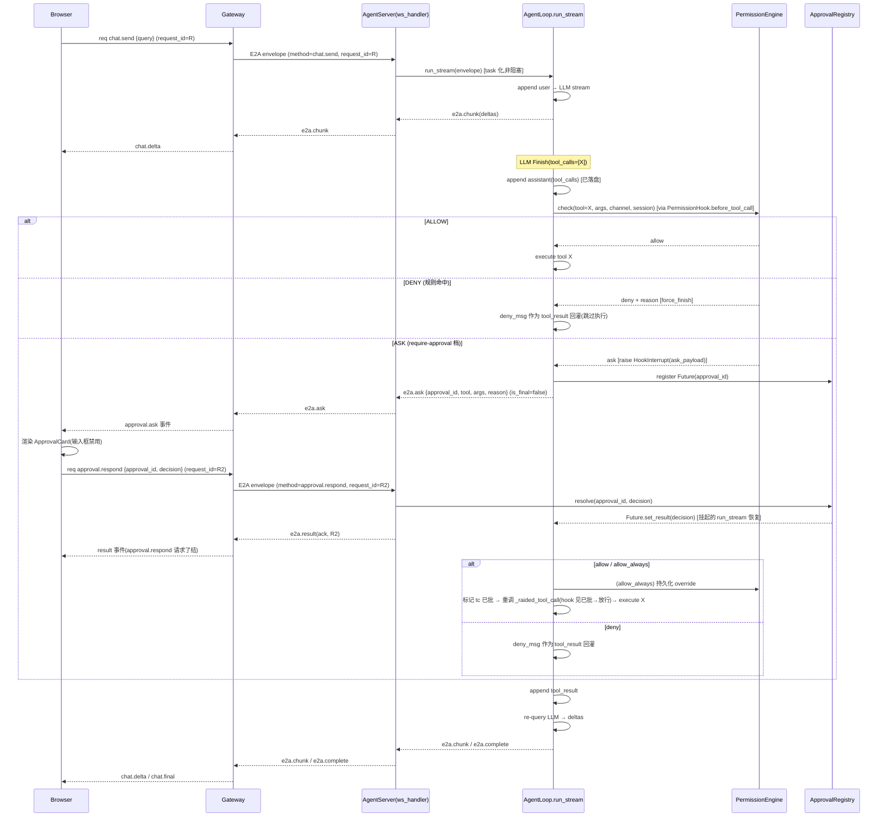
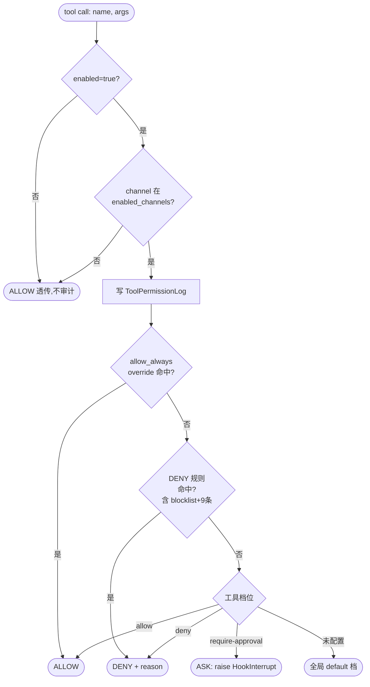

# Twinkle Phase 4 权限/审批系统设计文档

## 一、概述

Phase 4 给 Twinkle 的 Agent 执行循环装上**工具权限与人工审批(HITL)**能力:每次工具调用前,按策略判定放行(ALLOW)/拒绝(DENY)/需人工审批(ASK);ASK 时挂起 Agent 循环、把审批卡推给前端、等用户决策后恢复,并把每条决策写进审计日志。对照 jiuwenswarm 的 `permissions/` 包(策略层 + checker + file_guard 三轴 + shell_ast + command_intent)+ `permission_rail.py`(rail 式 ASK 审批编织),Twinkle 只搬其**核心语义**:3 档策略 + before_tool_call 拦截 + ASK 挂起/恢复 + 审计 + 通道门控 + allow_always 持久化 + RPC 配置。

### 1.1 两层拆分(理解本设计的前提)

Phase 4 是两层,务必分开看:

- **第一层:权限/审批框架(通用,tool-agnostic)**——对所有工具一视同仁:每工具一档(allow/deny/require-approval),在 `before_tool_call` 拦截,该审批就 ASK→挂起→用户决策→恢复→决策回灌。`web_fetch`、`command_exec`、未来的 `write_file` 全走这一套。**这一层是 Phase 4 的核心**(也是「尽量实现 jiuwenswarm 核心能力」所指),与 command_exec 的内部实现无关。
- **第二层:命令安全(command_exec 专有)**——只有 shell 类工具需要,因为一条 shell 命令串可能藏危险。read-only 工具直接 allow 档,不进安全检查。

### 1.2 范围

**做**:第一层审批框架建全(3 档策略 + before_tool_call 拦截 + ASK 挂起/恢复 + `ToolPermissionLog` 审计 + 通道门控 + `allow_always` 持久化 + RPC 配置);command_exec 安全加固(保留现有 blocklist,补抄 jiuwenswarm `builtin_rules.yaml` 9 条系统级 deny)。

**不做(defer,与 roadmap 一致)**:三轴文件路径判定 / shell AST(tree-sitter)/ LLM command_intent(L1/L3-Cmd)/ 完整 rail 框架(Twinkle hook 子集已够)/ session 级 auto_confirm(allow_always 已覆盖持久放行)/ 非 web 通道门控(仅配 web,余按需)。三轴、AST 是命令安全的增强,非核心;真要加,三轴(纯路径前缀)比 AST 轻,先加三轴。

---

## 二、核心设计决策(3 条)

### 2.1 决策 1:ASK 审批用「进程内 Future 挂起/恢复」,不走 abort-重起

**为什么**:AgentLoop 的 `run_stream` 是 async generator。在工具调用点 `yield e2a.ask` 后 `await future` 挂起,用户响应到达后 resolve future → 恢复继续跑。**一条请求一个 request_id 贯穿到底**,前端就是一条连续流:deltas → 审批卡 → 更多 deltas → final。UX 最干净,也和 Claude Code 自己的行内审批一致。

**代价与权衡**:AgentServer 的 `ws_handler` 要从「顺序阻塞」改成「每请求一个 task + send 锁」(否则挂起时读不到 `approval.respond`,死锁)。这是标准 ws server 模式,顺带让长工具调用不再阻塞用户发 abort、断连自动取消任务——是个通用健壮性改进,范围只限 `server.py`。

**对照 jiuwenswarm**:jiuwenswarm 用 rail 的 async 状态机(exception→状态持久化→invoke 返回→下次 invoke 检测→恢复)。Twinkle 选进程内 Future 而非持久化-恢复,是因为 Twinkle 的 `run_stream` 是单请求跑到底的 async generator,在生成器内部 `await` 即可挂起,无需把中间状态持久化到磁盘再在下次 invoke 重放。代价是 AgentServer 崩在挂起中重启会丢这条挂起流(由入口孤儿清理兜,见 7.1)。

### 2.2 决策 2:权限判定做成 `before_tool_call` Hook(`PermissionHook`),用增强的 `HookInterrupt` 承载 ASK

**为什么**:刚加的 hook 系统(commit 988ab1e)里 `HookInterrupt` 明确「reserved for HITL」(`hooks/base.py:161-169`)——审批正是 HITL。ALLOW→no-op、DENY→`request_force_finish(deny_msg)`(走现有 @hook 短路,deny 消息直接变 tool_result 回灌)、ASK→抛 `HookInterrupt(ask_payload)`;`_inner_run_stream` 在 `except HookInterrupt`(`agent_loop.py:227-236`)处识别 ask payload → 挂起/恢复(替换掉现在的「直接 error+return」)。**完全复用刚建好的 hook 基建,零新 AOP 框架**,且兑现了 roadmap「用 before_tool_call hook」的说法。

**为什么不让 ASK 走 @hook 的 force_finish**:`@hook` 装饰器的 before→body→after 是原子的,before 钩子只能 force_finish(立刻返回一个 canned 结果)或 HookInterrupt(中断);两者都不能「挂起等外部输入再恢复」。所以 ASK 的挂起点必须在 async generator 体内(`_inner_run_stream`),由 `except HookInterrupt` 捕获后 `yield e2a.ask` + `await future` 实现。这正是 `HookInterrupt` 被预留的用途。

**前置改动:`HookManager.execute` 必须让 `HookInterrupt` 穿透传播**。当前 `hooks/manager.py:90-95` 用 `except Exception` 兜底(fail-soft:一个回调失败不影响其他回调),而 `HookInterrupt` 是 `Exception` 子类——若不改,PermissionHook 抛的 `HookInterrupt` 会被 execute 吞掉(记成「回调失败」并继续),`@hook` 装饰器随后检查 force_finish(未设)→ 照常跑工具体,ASK 挂起流**完全失效**。所以 `execute()` 要改为「`except HookInterrupt: raise`(控制流信号,必须穿透);`except Exception:` 仍兜底其他回调」。这是启用 HITL 的必要前提,且对现状零影响(目前无任何 hook 抛 HookInterrupt)。

### 2.3 决策 3:command_exec 的硬 blocklist 上提为权限策略的一条 DENY 规则源,不再在工具内部硬拒

**为什么**:现在 `command_exec.py:48-52` 的 `_check_command_safety` 命中就返回 `[ERROR]`。Phase 4 后这些模式变成 `PermissionEngine` 的 DENY 规则,在工具执行**前**由 hook 判定 DENY→回灌 deny 消息 + 审计。command_exec 本身只剩 workspace 围栏(`_resolve_workdir`)这种工具自身契约的安全检查。**单一真源**:blocklist 模式表只存一份(`builtin_rules.COMMAND_DENY_PATTERNS`),command_exec 与 policy 都引用,杜绝双份维护。

**enabled=false 时不退步**:hook no-op,command_exec 自身的 blocklist 仍是唯一守卫(行为同今)。

---

## 三、整体架构

### 3.1 新增/改动文件一览

| 层 | 文件 | 动作 |
|---|---|---|
| AgentServer·新包 | `twinkle/agentserver/permissions/` | `models.py`、`policy.py`、`engine.py`、`audit.py`、`approval_registry.py`、`builtin_rules.py`、`__init__.py` |
| AgentServer·hook | `twinkle/agentserver/hooks/builtin/permission_hook.py` | 新 `PermissionHook` |
| AgentServer·核心 | `twinkle/agentserver/agent_loop.py` | 改 `except HookInterrupt`(`:227-236`);入口加孤儿清理;加「已批 tool_call_id」bypass;入口设 `APPROVAL_CHANNEL` ContextVar |
| AgentServer·新模块 | `twinkle/agentserver/permission_context.py` | `APPROVAL_CHANNEL` ContextVar + getter(照抄 `plan_todo_context.py`) |
| AgentServer·hook 框架 | `twinkle/agentserver/hooks/manager.py` | `execute()` 让 `HookInterrupt` 穿透传播(详见 §2.2 前置改动) |
| AgentServer·ws | `twinkle/agentserver/server.py` | `ws_handler` 并发化(task+send 锁+单会话单活动守卫);加 `approval.respond` 路由分支;`build_agent_loop` 注册 PermissionHook |
| E2A | `twinkle/e2a/models.py` | `E2AResponse.response_kind` 加 `e2a.ask` |
| schema | `twinkle/schema/message.py` | `EventType` 加 `APPROVAL_ASK` |
| Gateway | `twinkle/gateway/message_handler.py` | `_process_stream` 加 `elif e2a.ask` 分支(映射 `approval.ask`,is_final=false 不关流) |
| config | `twinkle/config.py` | `TWINKLE_PERMISSIONS` JSON env + 两个文件路径常量 |
| command_exec | `twinkle/agentserver/tools/builtin/command_exec.py` | `_check_command_safety` 改引 `builtin_rules`(单一真源),保留作 defense-in-depth |
| 前端 | `web/src/...` | `ApprovalCard.vue` + `webClient.respond()` + `useSessions` 处理 `approval.ask` + 输入框禁用 |

### 3.2 数据流骨架(对照 CLAUDE.md 的双进程图)

```
Browser ──ws (req approval.respond)──> Gateway (:19000) ──ws (E2AEnvelope)──> AgentServer (:18000)
       <──approval.ask 事件──              <──e2a.ask (is_final=false)──             AgentLoop
                                                                                      ├─ PermissionHook (before_tool_call)
                                                                                      └─ await future (挂起) ← ApprovalRegistry.resolve
```

`request_id` 是 load-bearing 标识:浏览器生成,线程 `req.id` → `Message.id` → `E2AEnvelope.request_id` → `E2AResponse.request_id` → 出站 `event.request_id`。Phase 4 在此之上加 `approval_id`(uuid)做 Future 的 key,见 §9。

---

## 四、完整交互流程

### 4.1 全链路时序



### 4.2 权限判定决策流(PermissionEngine.check 内部)



---

## 五、`permissions/` 包内部

| 模块 | 职责 | 关键形状 |
|---|---|---|
| `models.py` | 纯数据 | `PermissionLevel`(ALLOW/ASK/DENY)、`PermissionDecision(level, reason, source, rule_id, deny_message)`、`ToolPermissionLogEntry` |
| `policy.py` | 策略 + 规则合并 | `PermissionPolicy` 持有:工具档位表 `dict[tool_name→level]`、DENY 规则列表 `[(pattern, reason)]`、`approval_overrides`(运行时可变,见 §10)、`global_default`。`check(tool,args)` 按决策流(§4.2)合并,返回 `PermissionDecision` |
| `engine.py` | check + 通道门 + 审计 | `PermissionEngine(policy, audit, enabled, enabled_channels)`。`check(tool,args,channel,session,request)`:`enabled=false 或 channel not in enabled_channels → ALLOW 透传`;否则交 policy,每条决策写 `ToolPermissionLog`。`persist_allow_always(decision_data)` 写 overrides 文件 |
| `audit.py` | 结构化日志 | `ToolPermissionLog`——JSON 日志行(非 DB),字段见 §13。落 `PERMISSION_AUDIT_FILE`。writer 负责 `mkdir .twinkle_data(exist_ok=True)` |
| `approval_registry.py` | approval_id→Future | 模块级单例(对齐 TodoStore)。`register(id)→Future`、`handle_respond(envelope,send)`(resolve Future + 回 e2a.result ack)、`cancel_all()`(断连清理) |
| `builtin_rules.py` | DENY 规则源 | 导出 `COMMAND_DENY_PATTERNS: list[(re.Pattern, str)]` = 现有 8 条 + jiuwenswarm 9 条(见 §12)。command_exec 专用(匹配 `args["command"]`)。`matches(command)→reason|None` |

`PermissionEngine` 实例挂在 `AgentLoop`(`self._permission`),`build_agent_loop` 构造并注入;`PermissionHook.init(agent)` 取 `agent._permission`。

---

## 六、`PermissionHook`(before_tool_call)

```python
class PermissionHook(AgentHook):
    priority = 100  # 先于 LoggingHook 等 before_tool_call hook

    async def before_tool_call(self, ctx):
        inp: ToolCallInputs = ctx.inputs
        # bypass:本 run 已批准的 tool_call(ASK 恢复后重调用时命中,避免无限再问)
        if inp.tool_call_id in ctx.extra.get("_approved_tool_call_ids", set()):
            return
        decision = await self._engine.check(
            tool=inp.name, args=inp.args,
            channel=get_permission_channel(),      # ContextVar,run_stream 入口设
            session_id=ctx.session_id, request_id=ctx.request_id)
        if decision.level == "deny":
            ctx.request_force_finish(decision.deny_message)   # @hook 短路,deny_msg 变 tool_result 回灌
        elif decision.level == "ask":
            raise HookInterrupt(message="approval required", data={
                "approval_id": str(uuid4()), "tool": inp.name, "args": inp.args,
                "tool_call_id": inp.tool_call_id, "reason": decision.reason,
                "request_id": ctx.request_id, "session_id": ctx.session_id})
        # allow → no-op,工具正常执行
```

ALLOW/DENY 完全走现有 @hook 语义(零新机制);只有 ASK 用 `HookInterrupt`——正是 `hooks/base.py:161-169` 标注「reserved for HITL」的兑现。

`get_permission_channel()` 取自 `permission_context.py` 的 `APPROVAL_CHANNEL` ContextVar,由 `_inner_run_stream` 入口设定(与 `PLAN_TODO_SESSION_ID.set` 同位,`agent_loop.py:136` 附近),使无参的 hook 回调能定位当前通道。

---

## 七、挂起/恢复机制(改 `agent_loop.py:225-256`)

### 7.1 入口加孤儿清理

AgentServer 崩在挂起中重启时,历史里会有 `assistant(tool_calls)` 无 tool_result → LLM 报错(OpenAI 要求 tool_calls 后跟 tool 结果)。入口扫一次,补合成 tool_result:

```python
# _inner_run_stream 开头,系统提示插入后:
self._sanitize_orphan_tool_calls(session_id, envelope.request_id)
```

`_sanitize_orphan_tool_calls` 扫缓存消息;若末尾是 `assistant(tool_calls)` 且缺对应 tool_result,为每个缺失的 `tool_call_id` 追加 `{"role":"tool","tool_call_id":tc_id,"content":"[interrupted: previous request did not complete]"}`。这解锁 LLM。

### 7.2 `except HookInterrupt` 从「直接 error+return」改成「挂起+恢复」

```python
try:
    result = await self._raided_tool_call(ctx, name, args)
except HookInterrupt as hi:
    if "approval_id" not in hi.data:          # 非 ASK 的遗留中断 → 保留原行为
        yield E2AResponse(..., response_kind="e2a.error",
            body={"error":"tool execution interrupted"}, is_final=True)
        return
    # ASK: 注册 Future + yield e2a.ask + 挂起 await
    approval_id = hi.data["approval_id"]
    future = APPROVAL_REGISTRY.register(approval_id)
    yield E2AResponse(request_id=envelope.request_id, sequence=seq, is_final=False,
        status="in_progress", response_kind="e2a.ask",
        body={"approval_id":approval_id, "tool":hi.data["name"], "args":hi.data["args"],
              "tool_call_id":tc["id"], "reason":hi.data["reason"]})
    seq += 1
    decision = await future                   # ← 挂起点;ws_handler 并发化让 approval.respond 能 resolve
    if decision in ("allow","allow_always"):
        if decision == "allow_always":
            await self._permission.persist_allow_always(hi.data)
        ctx.extra.setdefault("_approved_tool_call_ids", set()).add(tc["id"])
        result = await self._raided_tool_call(ctx, name, args)  # 重调;hook 见已批→bypass→执行
    else:                                      # deny
        result = f"[tool denied by user: {hi.data['name']}] {hi.data.get('reason','')}"
# ↓ 无论 try 还是 except,都落到这里:drain todo + append role:tool(result)
for snap in drain_todo_events(): yield ...
await self._store.append(session_id, {"role":"tool","tool_call_id":tc["id"],"content":result}, ...)
```

### 7.3 三个关键不变式

- **(a) 已批 bypass 防止恢复后重调再问**:`ctx.extra["_approved_tool_call_ids"]` 记录本 run 已批的 `tool_call_id`;PermissionHook 见之即 return(放行)。`ctx.extra` 在 `run_stream` 入口创建(`agent_loop.py:92-99`),贯穿本 run 整个工具批次。
- **(b) 挂起不产生孤儿**:assistant(tool_calls) 在 `agent_loop.py:207-212` 已先落盘,挂起点在其后的工具执行环节。所以「挂起」时磁盘上是合法的 `[system, user, assistant(tool_calls)]`(无半截 tool_result)。孤儿只在进程崩溃时出现,由 §7.1 入口清理兜。
- **(c) deny 与 allow 走同一条回灌路径**:两者都设 `result` 后落到 `store.append(role:tool)`,对齐现有 tool-result linchpin(`agent_loop.py:247-256`)。

---

## 八、`ws_handler` 并发化(改 `server.py:79-113`)

`async for raw in ws` 顺序阻塞是死锁根因(挂起时读不到 `approval.respond`)。改成「每请求 task + send 锁 + 单会话单活动守卫」:

```python
def ws_handler(loop, store):
    async def handler(ws):
        await ws.send(json.dumps(ACK_FRAME, ensure_ascii=False))
        send_lock = asyncio.Lock()
        active: dict[str, asyncio.Task] = {}          # session_id → 运行中的 run_stream task

        async def send(resp):
            async with send_lock:                     # 并发写串行化(run_task 与 approval ack 并行)
                try: await ws.send(resp.model_dump_json())
                except Exception: log.debug("send on closed connection, dropping %s", resp.request_id)

        async def run_task(envelope):
            try:
                async for frame in loop.run_stream(envelope): await send(frame)
            except Exception as exc:
                await send(E2AResponse(request_id=envelope.request_id, is_final=True,
                    status="failed", response_kind="e2a.error", body={"error":str(exc)}))

        async for raw in ws:
            envelope = E2AEnvelope.model_validate_json(raw)   # 解析失败 → e2a.error,continue
            if envelope.method == "approval.respond":         # ← 不 spawn run,内联 resolve Future + ack
                await APPROVAL_REGISTRY.handle_respond(envelope, send); continue
            if handles_session_rpc(envelope.method):         # session RPC 仍内联单帧
                async for frame in dispatch_session_rpc(envelope, store): await send(frame)
                continue
            sid = envelope.session_id or envelope.request_id
            cur = active.get(sid)
            if cur is not None and not cur.done():           # 单会话单活动:挂起中再来 chat → 拒
                await send(E2AResponse(request_id=envelope.request_id, is_final=True,
                    status="failed", response_kind="e2a.error",
                    body={"error":"a request is already in progress for this session"})); continue
            task = asyncio.create_task(run_task(envelope))
            active[sid] = task
            task.add_done_callback(lambda t, sid=sid: active.pop(sid, None))
        # ws 关闭:取消所有挂起的 run_task(其 await future 被 cancel)
        for t in list(active.values()): t.cancel()
    return handler
```

这同时是个**通用健壮性改进**:长工具调用不再阻塞用户发 abort;断连自动取消任务。范围只限 `server.py`。`build_agent_loop` 在生产路径注册 `PermissionHook`(与现有 `LoggingHook` 并列)。

---

## 九、数据流与 request_id 贯穿(R vs R2)

最容易出微妙 bug 的地方,单列:

| 阶段 | request_id | 说明 |
|---|---|---|
| 原始 chat.send | **R**(浏览器生成) | deltas / e2a.ask / e2a.complete 全程带 R |
| approval.ask 事件 | R | 前端用 R 把审批卡**内联**到该条 chat 流(is_final=**false**,gateway demux 不关流) |
| approval.respond | **R2**(浏览器新生成) | 浏览器新请求,带 `params:{approval_id, decision, original_request_id:R}` |
| e2a.result ack | R2 | approval.respond 的了结帧 |
| 恢复后的 deltas/complete | **R** | 挂起的 run_stream 仍用原 `envelope.request_id=R`;gateway 的 R demux 队列一直开着(is_final=false 未关)→ 恢复帧按 R 路由回去 → chat.delta(R) → 前端续到原 chat 气泡 |

**关键**:Future 用 `approval_id` 做 key(不是 request_id),所以 approval.respond(R2) 能找到挂起的 R 流。前端看到的是**一条连续 chat**(R):deltas → 内联审批卡 → deltas → final;R2 只是审批卡的 fire-and-forget ack。

Gateway 侧无需改并发:`_process_stream` 已是 `create_task` per message(见 `message_handler.py:40`);R 的 task 挂起时仍活着,R2 的 task 独立。`message_handler._process_stream` 仅加 `elif resp.response_kind == "e2a.ask"` 分支映射 `approval.ask` 事件(模板照抄 `e2a.todo_update` 分支);`is_final=false` 使 `AgentClient.send_request_stream`(`agent_client.py:83-88`)的 `if resp.is_final: break` 不触发,R 流保持开放等恢复帧。

---

## 十、`allow_always` 持久化(对齐 jiuwenswarm)

落 `PERMISSION_OVERRIDES_FILE`(`<WORKSPACE_DIR>/.twinkle_data/permission_overrides.json`),引擎带 mtime 缓存热重载。两种形状:

- **shell 类(command_exec)**:命令头通配,`{"command_exec": ["git *","ls *","npm run *"]}`——下次 `command_exec("git status")` 命中 `git *` → ALLOW(不再问)。
- **非 shell 类**:`{"web_fetch": "allow"}`——整工具永久放行。

`persist_allow_always(decision_data)`:shell→append 命令头通配模式(默认取前两个 token,如 `npm run *`;单 token 命令取 `<cmd> *`,如 `ls *`);非 shell→置 `tools[name]="allow"`。**安全约束**:模式须紧到不过度放行(如 `npm *` 不得 bless `npm install -g`)。对照 jiuwenswarm:shell→`approval_overrides`(command-head 通配),非 shell→`tools.<name>="allow"`,热重载。

---

## 十一、配置(`TWINKLE_PERMISSIONS`,对齐 OTEL 的 opt-in 哲学)

`config.py` 加 JSON env(单变量,避免 6 个散开关),`enabled` 默认 **false = 系统关闭(全 ALLOW,无审计无 ASK)**,开启才介入:

```python
# twinkle/config.py(新增,import json)
_PERMISSIONS_DEFAULT = {
    "enabled": False,                  # 总开关,false=关闭(全 ALLOW,command_exec 仍走自身 blocklist)
    "enabled_channels": ["web"],       # 受门控的通道;非列表内通道 → ALLOW 透传
    "global_default": "allow",        # 未配置工具的默认档
    "tools": {                         # 每工具档位(显式列清,read-only 默认 allow)
        "command_exec": "require-approval",
        "web_fetch": "allow", "web_search": "allow",
        "todo_create": "allow", "todo_complete": "allow", "todo_list": "allow",
    },
    "rules": [],                       # 额外用户 DENY 规则:[{tool, pattern, reason}]
    "approval_overrides": {},          # 初始 overrides(通常空;运行时文件才是真源)
}
# PERMISSIONS = shallow-merge(_PERMISSIONS_DEFAULT, json.loads(env or defaults))
# 派生常量:PERMISSIONS_ENABLED / _ENABLED_CHANNELS(set) / _GLOBAL_DEFAULT / _TOOLS / _RULES
PERMISSION_OVERRIDES_FILE = <WORKSPACE_DIR>/.twinkle_data/permission_overrides.json
PERMISSION_AUDIT_FILE     = <WORKSPACE_DIR>/.twinkle_data/permission_audit.jsonl
```

`.env.example` 加示例;CLAUDE.md 配置表加行。**enabled=false 时 PermissionHook 仍注册但 `engine.check` 首句 `if not enabled: return ALLOW` 短路**(零成本 no-op,对齐 OTEL_ENABLED)。

---

## 十二、command_exec 加固(8 + 9 = 17 条,单一真源)

**单一真源**:blocklist 模式表只存一份 `builtin_rules.COMMAND_DENY_PATTERNS`,command_exec 与 policy 都引用:

- `builtin_rules.py` 导出 `COMMAND_DENY_PATTERNS: list[(re.Pattern, str)]` = **现有 8 条**(`rm -rf`/`del /f`/`rd /s`/`format`/`mkfs`/`shutdown`/`reboot`/`diskpart`,见 `command_exec.py:30-39`)+ **补抄 jiuwenswarm 9 条系统级 deny**(从 `git show enterprise_dev:jiuwenswarm/resources/builtin_rules.yaml` 逐条 verbatim 移植;类别:磁盘破坏 / 下载执行 `curl|sh` / 反弹 shell `bash -i>&/dev/tcp` / fork bomb / 凭据读取 `~/.ssh`、`.env`、`.aws` / 提权 `sudo su` / 数据外传 / 进程服务 `kill -9` / 全局包安装)。**精确正则在实现阶段从 jiuwenswarm 逐条核对移植,不在本设计臆造。**
- `command_exec._check_command_safety` 改为调 `builtin_rules.matches(command)`,**保留作 defense-in-depth**(enabled 时 hook 先拒、它极少触发;disabled 时它是唯一守卫 → 现有行为不退步)。
- policy 的 DENY 规则源 = 同一 `COMMAND_DENY_PATTERNS`(tool=command_exec,匹配 `args["command"]`)。

**enabled=true**:hook 命中 DENY → 回灌 deny 消息 + 审计,工具不执行。**enabled=false**:hook no-op,command_exec 自身 blocklist 仍拒(行为同今)。两种模式都不丢安全。

---

## 十三、审计日志(`ToolPermissionLog`)

JSONL append,落 `PERMISSION_AUDIT_FILE`,每次 check 一行:

```json
{"ts":1721...,"tool":"command_exec","decision":"deny","source":"rule","rule_id":"rm-rf",
 "reason":"blocked pattern: rm -rf","user_decision":null,
 "channel":"web","session_id":"s1","request_id":"r1"}
```

ASK 流产生 **2 行**:check 时 `decision:"ask",user_decision:null`;用户响应后 `decision:"ask",user_decision:"allow_always"`。对照 jiuwenswarm 的 `ToolPermissionLog`(结构化 JSON 日志行,非 DB)。writer 负责 `mkdir .twinkle_data(exist_ok=True)`。

---

## 十四、测试策略(守 `asyncio.run` + `free_port`,无 pytest-asyncio)

| 测试 | 验什么 |
|---|---|
| `test_permissions_policy.py` | policy.check 合并序:通道门 / override / DENY 规则 / 档位 / default(纯函数,无 async) |
| `test_permission_hook.py` | hook 三分支:ALLOW no-op / DENY 设 force_finish / ASK 抛 HookInterrupt(带 payload);用假 engine |
| **`test_approval_flow.py`(核心)** | 端到端挂起/恢复:假 LLM yield `Finish(tool_calls=[X])`→`X` 触发 ASK→捕 `e2a.ask`→resolve Future→验证恢复执行 + tool_result 回灌 + 再查询→complete |
| `test_ws_handler_concurrency.py` | ws_handler 挂起中收 `approval.respond`→resolve+ack+恢复帧按 R 路由回;`free_port`+真 ws |
| `test_command_exec_safety.py` | 17 条 deny(enabled)/reject(disabled),扩现有用例 |
| `test_orphan_cleanup.py` | 历史末尾 `assistant(tool_calls)` 无 result→入口清理补合成 tool_result→LLM 不报错 |

---

## 十五、落地步骤(writing-plans 据此展开,每步可独立测试)

1. `permissions/` 包(models/policy/engine/audit/approval_registry/builtin_rules/__init__)—纯逻辑,单测
2. `config.py`:`TWINKLE_PERMISSIONS` + 两个文件路径
3. E2A + schema:`e2a.ask` response_kind + `APPROVAL_ASK` EventType
4. `agent_loop.py`:孤儿清理 + `except HookInterrupt` 重写 + `_approved` bypass + `permission_context` ContextVar(设 channel)
5. `hooks/manager.py`(`execute()` 让 `HookInterrupt` 穿透,§2.2 前置改动)+ `PermissionHook` + `build_agent_loop` 注册
6. `server.py`:`ws_handler` 并发化 + `approval.respond` 路由
7. `gateway/message_handler.py`:`elif e2a.ask` → `approval.ask` 事件
8. `command_exec.py`:`_check_command_safety` 改引 `builtin_rules`(单一真源)
9. 前端:`ApprovalCard.vue` + `webClient.respond()`(专用,不污染 lastRequestId)+ `useSessions` 处理 `approval.ask` + 输入框禁用
10. 上述各测试
11. 文档:`docs/architecture.md` 加 §permissions、CLAUDE.md 配置表+约定、roadmap 标 Phase 4 落地

---

## 十六、明确不做(defer,与 roadmap 一致)

三轴文件路径判定 / shell AST(tree-sitter)/ LLM command_intent(L1/L3-Cmd)/ 完整 rail 框架(Twinkle hook 子集已够)/ session 级 auto_confirm(allow_always 已覆盖持久放行)/ 非 web 通道门控(仅配 web,余按需)。三轴、AST 是命令安全的增强,非核心;真要加,三轴(纯路径前缀)比 AST 轻,先加三轴。
