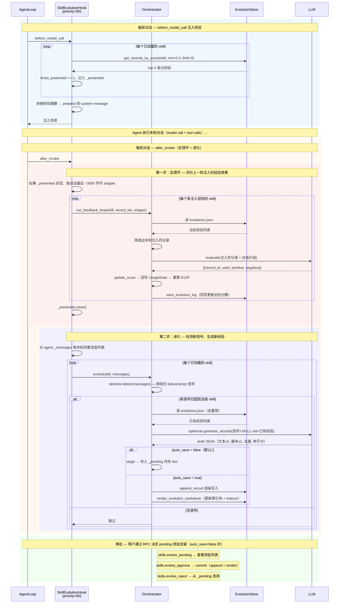

# Twinkle 的 Skill 自进化设计

> 日期：2026-08-02
> 性质：设计稿（借鉴一套被验证有效的闭环机制，落地到 Twinkle 架构）
> 关联：`docs/superpowers/research/` 下的参考实现拆解是依据，本文是 Twinkle 的落地设计
> 目标：把 skill 从"部署即冻结"变成"随使用持续修正的活文档"——在 Twinkle 现有 `SkillManager` + `AgentHook` + approval 架构上，落地一个**真闭环、不静默、规则归因**的进化系统。

---

## 一、目标与边界

**目标**：工具报错、用户纠正、可复用脚本这些"用了之后学到的"，固化回 skill 本身（`SKILL.md` + 经验库），让 skill 随真实使用持续修正、去重、重组。

### 借鉴（参考实现里被验证有效的设计）

- **闭环 5 步**：信号检测 → LLM 生成经验 → 存储+固化 → E/U/F 打分 → 反馈环判定。
- **规则归因**（正则/路径匹配，不用 LLM）——便宜、可复现，不会因 LLM 抽风错归因。
- **数量上限 + 去重**——单轮文本≤2 / 脚本≤1，重复走 `merge_target`、相似走 skip，防经验库膨胀淹没信号。
- **E/U/F 打分**——贝叶斯效能 + 利用率 + 新鲜度衰减（90 天半衰期）+ 版本不匹配惩罚。
- **经验不内联 SKILL.md 正文**——走 `<!-- evolution-index -->` 索引块 + sidecar 文件，不污染作者原文。
- **审批门控**——默认不静默写改，`auto_save` 才自动落盘。
- **蒸馏淘汰**——低分经验定期 DELETE/MERGE/REFINE/KEEP。

### 不借鉴（参考实现里的坑/摆设）

| 参考实现的问题 | Twinkle 的处理 |
|---|---|
| `applied` 字段是摆设（唯一能置 True 的方法无人调用，approved 记录永远 `applied=False`） | **不加这个字段**。"是否生效"以"渲染进索引块"为唯一事实，省一个永远 False 的死字段。 |
| `auto_scan` 默认值矛盾（代码默认 True、设计稿示例写 false） | **定一个、不再矛盾**：`evolution.enabled: false`（总开关默认关，进化会改用户 skill，保守 opt-in），代码与配置一致。 |
| 自动创建新 skill 的 rail 未就绪 | **v1 不做**。新 skill 走 SkillHub/SkillNet 下载或手建，进化只改已存在 skill。 |
| 离线 RL / trainer 是另一条轴 | **不纳入**。不接运行时进化环。 |
| 概念类名 ≠ 真实类名（文档一套、代码一套） | **设计稿即代码名**，从一开始一致。 |

### 与长期记忆（LTM）的边界

LTM（Phase 5a）把会话蒸馏进 memory store；skill 自进化改的是 **skill 文件自身**。两者不交叉，别混。一句话判别：改的是 `skills/<name>/` 下文件 → 自进化；改的是 memory store → LTM。

---

## 二、整体架构

### 2.1 借鉴：jiuwenswarm 的两层切分

jiuwenswarm 把 skill 自进化切成两层（它的文档叫 host / engine），**所有"要不要改、改成什么、怎么打分、怎么合并"都在核心层里**，适配层只做接线：

```
jiuwenswarm 仓库 (适配层, 薄)               openjiuwen SDK (核心层, 厚)
─────────────────────────────────────      ────────────────────────────────────────────
evolution_slash.py     (/evolve 命令)      ConversationSignalDetector    (信号检测)
evolution_helpers.py   (前端推送审批)      SkillExperienceOptimizer      (LLM 生成经验)
evolution_rails.py     (注册 rail)         EvolutionStore                (存储+固化)
skill_manager.py       (Web UI 编辑)       ExperienceScorer              (E/U/F 打分+反馈环)
                                           ExperienceManager             (审批门控)
                                           OnlineEvolutionOrchestrator   (编排进化流程)
                                           SkillEvolutionRail            (priority=80, AFTER_INVOKE)
```

Twinkle 照这个切法落地——接线层 = Hook + RPC，核心层 = `evolution/` 包。

### 2.2 Twinkle 架构全景

```
┌──────────────────────────────────────────────────────────────────────────┐
│                    接线层 (agentserver, 薄 — 只做路由)                     │
│                                                                          │
│  hooks/builtin/evolution_hook.py         skills/rpc.py                   │
│  ┌────────────────────────────────┐    ┌─────────────────────────────┐   │
│  │ SkillEvolutionHook             │    │ skills.evolve               │   │
│  │  priority≈80, AFTER_INVOKE     │    │ skills.evolve_list          │   │
│  │  → 路由事件到核心层             │    │ skills.evolve_simplify      │   │
│  │  → 注入经验到 agent context     │    │ skills.evolve_pending       │   │
│  └──────────────┬─────────────────┘    │ skills.evolve_approve/reject│   │
│                 │                      └──────────────┬──────────────┘   │
│                 │                                     │                  │
│                 └─────────────────┬───────────────────┘                  │
│                                   ▼                                      │
│  ┌──────────────────────────────────────────────────────────────────┐    │
│  │           orchestrator.py (OnlineEvolutionOrchestrator)           │    │
│  │           编排一次进化: 检测→生成→stage→审批→落盘                  │    │
│  └──────────────────────────────────────────────────────────────────┘    │
└──────────────────────────────────────────────────────────────────────────┘
                                    │
                                    ▼
┌──────────────────────────────────────────────────────────────────────────┐
│                    核心层 (evolution/ 包, 纯逻辑, 可单测)                  │
│                                                                          │
│  ┌──────────────────┐  ┌──────────────────┐  ┌──────────────────────┐   │
│  │signal_detector.py│  │optimizer.py       │  │store.py              │   │
│  │                  │  │                  │  │                      │   │
│  │ConversationSignal│  │SkillExperience   │  │EvolutionStore        │   │
│  │Detector          │─▶│Optimizer         │─▶│                      │   │
│  │                  │  │                  │  │· append_record       │   │
│  │规则扫工具结果     │  │LLM 生成          │  │· save_evolution_log  │   │
│  │归因到具体 skill   │  │EvolutionRecord   │  │· render_evolution    │   │
│  │                  │  │(上限+去重)        │  │  _markdown           │   │
│  └──────────────────┘  └──────────────────┘  │· get_records_by_score│   │
│                                              └──────────┬───────────┘   │
│  ┌──────────────────┐                                   │               │
│  │scorer.py         │◀──────────────────────────────────┘               │
│  │                  │                                                   │
│  │ExperienceScorer  │  evolutions.json + SKILL.md 索引块                │
│  │                  │  + evolution/<section>.md sidecar                 │
│  │· E/U/F 打分      │                                                   │
│  │· evaluate 反馈环 │                                                   │
│  │· simplify 蒸馏   │                                                   │
│  └──────────────────┘                                                   │
└──────────────────────────────────────────────────────────────────────────┘
```

### 2.3 核心组件映射：jiuwenswarm → Twinkle

| jiuwenswarm (openjiuwen SDK) | Twinkle (`evolution/` 包) | 职责 |
|---|---|---|
| `ConversationSignalDetector` | `signal_detector.py` | 规则扫工具结果，归因到 skill |
| `SkillExperienceOptimizer` | `optimizer.py` | LLM 生成 EvolutionRecord（上限文本≤2/脚本≤1 + 去重） |
| `EvolutionStore` | `store.py` | 读写 evolutions.json，渲染索引块 + sidecar |
| `ExperienceScorer` | `scorer.py` | E/U/F 打分 + evaluate 反馈环 + simplify 蒸馏 |
| `ExperienceManager` | `orchestrator.py` | 审批门控：stage → approve → commit |
| `OnlineEvolutionOrchestrator` | `orchestrator.py` | 编排一次完整进化流程 |
| `SkillEvolutionRail` (priority=80) | `evolution_hook.py` (priority≈80) | 挂在 agent 步骤末，AFTER_INVOKE 触发 |
| `evolution_slash.py` | `skills/rpc.py` | RPC 入口（evolve / evolve_list / evolve_simplify / ...） |
| `evolution_helpers.py` (前端推送) | 复用 gateway event broadcast | 进化状态 / 待批列表推前端 |

### 2.4 闭环数据流（5 步 + 审批门 + 蒸馏）

```
                        ┌─────────────────────────────────────────┐
                        │       ⑤ 反馈环 (scorer.evaluate)         │
                        │  经验注入 → 跑对话 → LLM 逐条判定        │
                        │  used/positive/negative → 回写 UsageStats│
                        │  → 重算 E/U/F → 重排 → 高分优先注入     │
                        │        ▲                    │            │
                        │        │                    ▼            │
  ┌──────────┐  ┌───────┴──┐  ┌──┴────────┐  ┌──────────────┐    │
  │ ① 信号   │  │ ② LLM   │  │ ③ 存储    │  │ ④ 打分       │    │
  │ 检测     │─▶│ 生成经验 │─▶│ + 固化    │─▶│ E/U/F        │    │
  │          │  │          │  │           │  │              │    │
  │ 规则扫   │  │ 信号 +   │  │ evolution │  │ E: 贝叶斯平滑 │    │
  │ 工具结果 │  │ SKILL.md │  │ s.json    │  │ U: 利用率     │    │
  │ 归因到   │  │ + 对话   │  │ + 索引块  │  │ F: 新鲜度衰减  │    │
  │ skill    │  │ → JSON   │  │ + sidecar │  │              │    │
  └──────────┘  └─────┬────┘  └─────┬─────┘  └──────────────┘    │
                      │             │                             │
                      │    ┌────────┴────────┐                    │
                      │    │ 审批门 (orchestrator)                │
                      │    │ auto_save=false → stage 等人批       │
                      │    │ auto_save=true  → 自动落盘           │
                      │    └────────┬────────┘                    │
                      │             │                             │
                      │    ┌────────┴────────┐                    │
                      │    │ 蒸馏 (scorer.simplify)               │
                      │    │ DELETE/MERGE/REFINE/KEEP             │
                      │    │ 分<0.4 且零调用 → 删                 │
                      └────┴─────────────────────────────────────┘
```

**完整链路**：工具调用失败/用户纠正 → ①规则检测信号并归因到 skill → ②LLM 生成 EvolutionRecord（上限文本≤2/脚本≤1，去重，打种子分）→ ③stage → 审批门 → commit 落盘 `evolutions.json` + 渲染索引块 + 写 sidecar → ④E/U/F 初算 → skill 下次被加载时 top-N 高分经验注入 agent context → 一轮对话后 → ⑤LLM 逐条判定 used/positive/negative → 回写 UsageStats → 重算 E/U/F → 重排 → 高分优先注入、低分被蒸馏淘汰 ↺

### 2.5 数据模型

每个 skill 一个 `evolutions.json`（`EvolutionLog.entries: List[EvolutionRecord]`）。

**`EvolutionRecord`**（`evolution/types.py`）：
```python
@dataclass
class EvolutionRecord:
    id: str                  # ev_<8位hex>
    source: str              # execution_failure / user_intent / script_artifact / conversation_review
    timestamp: str           # ISO UTC
    context: str             # 信号上下文
    change: EvolutionPatch   # 一条改动
    score: float = 0.6       # E/U/F 综合分
    usage_stats: UsageStats | None = None
    skill_version: str | None = None
    summary: str | None = None
    # 注意：无 applied 字段。jiuwenswarm 里它是摆设（唯一能置 True 的方法无人调用）。
    # Twinkle 以"渲染进索引块"为生效事实。
```

**`EvolutionPatch`**：
```python
@dataclass
class EvolutionPatch:
    section: str              # Instructions/Examples/Troubleshooting/Scripts/...
    action: str               # append/merge/replace/skip
    content: str              # Markdown 或脚本源码
    target: str = "body"      # description / body / script
    skip_reason: str | None = None
    merge_target: str | None = None    # 改写哪条已有记录
    script_filename: str | None = None
    script_language: str | None = None
    script_purpose: str | None = None
    keywords: list[str] | None = None
    summary: str | None = None
```

**`UsageStats`**（打分依据，由 scorer 和注入层共同维护）：
```python
@dataclass
class UsageStats:
    times_presented: int = 0    # 被注入给 agent 的次数（注入层写，scorer 不碰）
    times_used: int = 0
    times_positive: int = 0
    times_negative: int = 0
    last_presented_at: str | None = None
    last_evaluated_at: str | None = None
```

### 2.6 存储布局

```
<workspace>/skills/<name>/
├── SKILL.md                      # 含 <!-- evolution-index-start/end --> 索引块
├── evolutions.json               # entries: EvolutionRecord[]
└── evolution/
    ├── <section>.md              # 经验正文，按 record.id 锚定
    └── scripts/<file>            # script-target 记录的脚本工件
```

关键设计：
- **经验正文不内联进 SKILL.md**——只注入索引块指向 sidecar，不污染作者原文。跨用户分享前（上传 SkillHub）剥掉索引块。
- **`SkillManager` mtime 热重载天然感知变化**——索引块写回 → `SKILL.md` mtime 变 → 下次 `list_skills` 自动重扫，无需额外通知机制。
- **v1 EvolutionStore 只 4 个原语**：`append_record` / `save_evolution_log` / `render_evolution_markdown` / `get_records_by_score`。不建新 skill（走 SkillHub 下载或手建），不覆写整篇 SKILL.md（v1.2 `evolve_rebuild` 才用）。

### 2.7 触发点与生命周期

**三个触发时机**（受 `evolution.enabled` 总开关控制，默认关）：

| 触发方式 | 机制 | 适用场景 |
|---|---|---|
| **自动**（默认主路径） | `SkillEvolutionHook` 挂在 `AFTER_INVOKE`，一轮 invoke 结束后扫信号 | 日常被动积累 |
| **手动** | RPC `skills.evolve <name>` 显式触发 | 用户主动优化 |
| **主动复盘**（v1.2） | 每 N 轮 `AFTER_TASK_ITERATION` 塞 self-check follow-up | 定期查漏补缺 |

**一条经验的完整生命周期**：
```
生成(种子分) → stage(等人批) → approve → commit(落盘) → 注入(下次加载 skill 时)
→ 跑对话 → LLM 判定效果 → 回写 UsageStats → 重算 E/U/F → 重排
→ 持续高分 → 优先注入
→ 持续低分 → 蒸馏淘汰(DELETE) 或合并改写(MERGE/REFINE)
```

### 2.8 与 Twinkle 现有系统的关系

| 现有组件 | 关系 | 说明 |
|---|---|---|
| `SkillManager` | **扩展** | 现有 100% 只读（`list_skills`/`get_skill`/`parse_skill_md`），evolution 加写能力（`EvolutionStore` 写 `evolutions.json` + 渲染索引块），SkillManager 本身不改 |
| `SkillHook.before_model_call` | **扩展** | 已注入 skill 清单，扩展为同时注入 top-N 高分经验摘要 + `times_presented += 1` |
| Approval 机制（Phase 4） | **复用思路** | v1 用独立 RPC（`evolve_approve/reject`）解耦，不阻塞 chat 流 |
| `LLMClient` | **复用** | optimizer 生成经验 + scorer 判定反馈环效果，都用现有 LLMClient |
| Gateway event broadcast | **复用** | 进化状态 / 待批列表变更推前端 |
| `AgentHook` | **新增子类** | `SkillEvolutionHook` 继承 `AgentHook`，priority≈80，override `after_invoke` |
| LTM（Phase 5a） | **不交叉** | LTM 改 memory store，自进化改 `skills/<name>/` 下文件，边界清晰 |

### 2.9 效果保证：六道保险

| # | 机制 | 解决的问题 |
|---|---|---|
| ① | **真闭环** | 经验不是"写一次就永久占位"——注入→判定→回写→重算分，得分随真实效果升降 |
| ② | **数量上限+去重** | 单轮文本≤2/脚本≤1，重复 merge、相似 skip，防经验库膨胀淹没信号 |
| ③ | **蒸馏淘汰** | 分<0.4 且零调用 → 删，审批门控，定期清低质经验 |
| ④ | **不静默审批** | 默认 `auto_save: false`，写改前必须人批；`auto_save: true` 才自动落盘 |
| ⑤ | **规则归因** | 信号检测和"失败算哪个 skill"靠正则+路径，不用 LLM，便宜可复现 |
| ⑥ | **版本对齐** | skill 版本不匹配时 F 新鲜度 ×0.7，旧经验自动降权 |

### 2.10 时序全景图

下面用 Mermaid 时序图覆盖三条路径：**自动进化**（AFTER_INVOKE）、**手动进化**（RPC）、**审批门 + 反馈环**。



### 各步骤详解

以下按代码实际执行顺序，对应时序图中各阶段。

**① 经验注入（`before_model_call`，priority=80）**

每轮对话开始前，Hook 遍历当前所有已加载的 skill，对每个 skill 调 `store.get_records_by_score(skill, min_score=0.3, limit=3)` 取 top-3 高分经验。每条经验的 `times_presented += 1`，记录 ID 到 `_presented[skill_name]`（供本轮结束后反馈环使用）。所有经验拼接为一段 Markdown，以 system 消息 prepend 到消息列表最前面。经验以摘要形式注入（id + section + score + 前 150 字预览），正文在 sidecar 文件中，不污染 SKILL.md。

**② 反馈环（`after_invoke` 第一步：`_run_feedback_loop`）**

Agent 跑完本轮对话后，Hook 先判定上一轮注入的经验是否帮上了忙。

- 从 `_presented` 取本轮注入的经验 ID 列表（空则跳过）
- 取对话最后 ~3000 字符作为评估片段
- 对每个 skill 调 `orchestrator.run_feedback_loop(skill, record_ids, snippet)`：
  1. 从 `evolutions.json` 读取当前经验列表
  2. 筛选出本轮注入的记录
  3. 调 `scorer.evaluate()` — 把注入的经验 + 对话片段送 LLM，逐条判定 `used`（Agent 是否采纳）、`positive`（是否改善了结果）、`negative`（是否误导了 Agent）
  4. `scorer.update_score()` — 消费判定结果，更新 `UsageStats`（times_used / times_positive / times_negative），重算 E/U/F 综合分
  5. `save_evolution_log()` — 把更新后的分数写回 `evolutions.json`
- 最后 `_presented.clear()`

**③ 信号检测 + 生成经验（`after_invoke` 第二步：`_run_evolution`）**

反馈环完成后，Hook 从 `agent._messages` 取本轮完整消息列表，对每个 skill 调 `orchestrator.evolve(skill, messages)`：

1. **检测信号**：`ConversationSignalDetector.detect()` 纯规则扫消息列表
   - 正则匹配 error / traceback / timeout / connection refused 等失败关键词 → `execution_failure`
   - 正则匹配脚本成功模式 → `script_artifact`
   - 从工具调用的参数路径（`.../<skill>/SKILL.md`）归因到具体 skill；无法归因的信号丢弃
2. **生成经验**：如果检测到信号归因到当前 skill
   - 读 `evolutions.json` 获取已有经验列表（去重用）
   - 读当前 `SKILL.md` 内容
   - 调 `optimizer.generate_records(signals, skill_content, existing)`：
     - 拼 prompt：信号摘要 + SKILL.md 前 1500 字 + 已有经验最近 10 条
     - LLM 走三渠道（A 预检测信号 / B 执行轨迹分析 / C 脚本工件提取）生成 draft JSON
     - 代码强校验：文本经验 ≤ 2、脚本经验 ≤ 1，skip 动作直接丢弃
     - 打种子分（failure 0.65 / user_intent 0.70 / script 0.60）
3. **落盘分支**：
   - `auto_save: false`（默认）→ stage 到内存 `_pending[skill_name]`，等人批
   - `auto_save: true` → 直接 `append_record()` 写入 `evolutions.json` + `render_evolution_markdown()` 更新 SKILL.md 索引块和 sidecar 文件

**④ 审批（用户通过 RPC 手动触发）**

当 `auto_save: false` 时，经验不会自动落盘，而是暂存在 orchestrator 的内存 `_pending` dict 中。用户通过三个 RPC 手动管理：

| RPC | 行为 |
|---|---|
| `skills.evolve_pending [name]` | 查看待批经验列表 |
| `skills.evolve_approve name [ids]` | 批准 → `append_record()` 写入 + `render_evolution_markdown()` 更新索引块 |
| `skills.evolve_reject name [ids]` | 拒绝 → 从 `_pending` 丢弃 |

**⑤ 闭环（下一轮回到 ①）**

下一轮对话的 `before_model_call` 再次注入 top-N 高分经验（分数已在 ② 中被反馈环更新）→ Agent 跑对话 → `after_invoke` 再次判定效果、再次进化。分数随真实使用升降，高分优先注入、低分逐渐被蒸馏淘汰。

---

## 三、实现：逐步落到 Twinkle 文件

### 3.1 信号检测：`evolution/signal_detector.py`

`ConversationSignalDetector`，**规则为主、可选 LLM**（不开 LLM 也能跑）。扫 `AFTER_INVOKE` 时对话里的工具调用结果：

| 信号类型 | 触发 | 归入 section |
|---|---|---|
| `execution_failure` | 工具结果匹配失败关键词（error/exception/failed/timeout/econnrefused/enoent/permission denied…） | Troubleshooting |
| `script_artifact` | 代码执行工具调用成功（结果无失败关键词），抽脚本评估复用价值 | Scripts |
| `user_intent` | 用户纠正短语（wrong/should be/not that/actually…），**默认关** | Instructions |

**关键——把信号归因到具体 skill**（不然失败不知道算谁头上）。复用 `SkillManager` 已有的 skill 名单，两条路：

1. 正则扫 read/file 类工具参数路径 `.../<skill>/SKILL.md` → 取目录名；
2. 工具名是 `skill_tool` 且参数含 `skill_name` → 直接取。

取"最近一次读过的 skill"作为当前消息归因（`_resolve_active_skill`）。**纯规则、不用 LLM**，便宜可复现。

### 3.2 LLM 生成经验：`evolution/optimizer.py`

`SkillExperienceOptimizer.generate_records`：把"信号 + SKILL.md 摘要 + 对话片段 + 已有经验（去重用）"拼 prompt，调 `LLMClient`，解析 JSON drafts 为 `EvolutionRecord`。

- **三渠道**：A 预检测信号（规则已归因的 failure/script）、B 执行轨迹直接分析（多次重试才成功的 workaround）、C 脚本工件提取。
- **数量上限**（prompt 写死 + 代码强校验）：文本≤2、脚本≤1，超的按优先级标 skip。
- **种子分**（生成时初值，区别于后续 E/U/F 重算）：failure 0.65 / user_intent 0.70 / script 0.60 / review 0.50。
- **决策流**：相关性（不相关→skip）→ 去重（重复→skip；相似有增量→`merge_target` 改写；相似但本轮仍出错→优先改写不跳过；全新→继续）→ 优先级筛选 → 定 target+section。
- **解析重试**：截断→全量重生、JSON 损坏→修复 prompt，若干轮不成就返回空。

### 3.3 存储 + 固化：`evolution/store.py`

`EvolutionStore`，**扩展现有 `skills/` 目录布局**（不另起炉灶）：

- `append_record` — 追加/合并到 `evolutions.json`（按 `merge_target` 决定 append/merge）；
- `save_evolution_log` — 原子 temp-file rename 写盘；
- `render_evolution_markdown` — 往 `SKILL.md` 注入/替换 `<!-- evolution-index-start/end -->` 索引块（底层 `update_skill_md_index`），正文写 sidecar `evolution/<section>.md`（每条用 `<a id="{record.id}">` 锚定）+ 脚本工件 `evolution/scripts/`；
- `get_records_by_score(name, min_score=, limit=)` — 按分排序读 top-N（经验注入 + `evolve_list` 查询用）。

> v1 EvolutionStore 只这 4 个原语。**不含** `create_skill`（建新 skill——v1 只进化已存在 skill，新 skill 走 SkillHub/SkillNet 下载或手建）和 `write_skill_content`（整篇覆写 SKILL.md——只有 v1.2 `evolve_rebuild` 用）。Twinkle 现有 `SkillManager` 100% 只读（`list_skills`/`get_skill`/`parse_skill_md`，无任何写方法），整个 skill 写入层都是 net-new。

**经验正文不内联进 SKILL.md 正文**——只注入一个 delimited 索引块指向 sidecar。跨用户分享前（如上传 SkillHub）剥掉索引块，保证 hub 上存的是作者原文。

`SkillManager` 的 mtime 签名里已经包含每个子目录 `SKILL.md` 的 mtime——索引块写回后 mtime 变 → 下次 `list_skills` 自动重扫，无需手动通知。

### 3.4 打分 E/U/F：`evolution/scorer.py`

`ExperienceScorer`，常量走 config（见 §五）：

- **E 效能**（贝叶斯平滑，Beta(1,1) 先验）：`(times_positive + 1) / (times_positive + times_negative + 2)`，无数据返回 0.5；
- **U 利用率**：`times_used / times_presented`，无数据 0.5；
- **F 新鲜度**：`0.5 + 0.5 * 2^(-days_old/半衰期)`，版本不匹配再 ×`stale_version_penalty`；
- 综合：`w_E·E + w_U·U + w_F·F`（默认 0.5/0.3/0.2）。

排序：`EvolutionStore.get_records_by_score(name, min_score=...)`，RPC `skills.evolve_list <name> --sort score` 可查。

### 3.5 反馈环（核心 / 最硬核）：`ExperienceScorer.evaluate`

经验下次被注入给 agent 后，取之后的对话片段，**用 LLM 逐条判定 used/positive/negative**，`update_score` 回写 `UsageStats`，重算 E/U/F，重排。

- **注入**：扩展 `SkillHook.before_model_call`——注入 skill 清单时，同时把该 skill 的 top-N 高分经验摘要拼进去；`times_presented` 由这里 +1（scorer 不碰）。
- **判定**：`AFTER_INVOKE` 时，取本轮注入过的经验 + 注入之后的对话片段，调 `LLMClient` 出 `{record_id, used, positive, negative, reason}[]`。
- **回写**：`update_score` 消费三个布尔 → 更新 `UsageStats` → 重算 `score`。

闭环跑通：**生成经验 → 种子分 → 注入 → 跑对话 → LLM 判定 → 更新 used/positive/negative → 重算 E/U/F → 重排 → 下次优先注入高分、淘汰低分**。

### 3.6 审批门控：复用 Twinkle approval

生成的经验不直接落盘，先 stage 成 pending 批次。**复用 Phase 4 的 approval 机制**（不另造一套 staging）：

- `requires_approval = not auto_save`（默认 `auto_save: false` → 要人批）；
- 待批批次通过 RPC `skills.evolve_pending` 暴露给前端，前端 `skills.evolve_approve` / `skills.evolve_reject`；
- approve → `EvolutionStore.append_record` 落盘 + 重渲染索引块；reject → 丢弃。

> 也可走 `approval.ask`（mid-chat HITL）同款通路，但 v1 用独立 RPC 更解耦（evolve 审批不在 chat 流里阻塞）。

### 3.7 蒸馏与重建

- `ExperienceScorer.simplify`：逐条提 DELETE/MERGE/REFINE/KEEP（分<`min_score` 且零调用 → 删），对应 RPC `skills.evolve_simplify`，审批门控。
- `ExperienceRebuildService`（v1.2）：把累积经验重组成 SKILL.md，对应 `skills.evolve_rebuild`——生成后续任务跑，不直接覆写。

---

## 四、取舍清单

| 维度 | 参考实现 | Twinkle 取舍 |
|---|---|---|
| `applied` 字段 | 摆设（无人调用） | **不加**，以渲染进索引块为生效事实 |
| 总开关默认 | 代码 True / 文档 false 矛盾 | **`enabled: false`**（opt-in，代码配置一致） |
| 自动创建 skill | rail 未就绪 | **v1 不做** |
| 离线 RL / trainer | 另一条轴 | **不纳入** |
| 类名 | 文档≠代码 | **设计稿即代码名** |
| 审批机制 | 自研 staging | **复用 Twinkle approval 思路**（v1 用独立 RPC 解耦） |
| 反馈环 | LLM 判定 used/pos/neg | **借鉴**（核心，不能省） |
| 规则归因 | 正则/路径 | **借鉴**（便宜可靠） |
| 数量上限 | 文本≤2/脚本≤1 | **借鉴** |
| E/U/F | 贝叶斯+利用率+新鲜度 | **借鉴**，权重走 config |
| 经验存储 | 索引块+sidecar | **借鉴**，扩展现有 `skills/` 目录 |
| fuzzy review | 每 5 轮主动复盘 | **v1.2 再加** |

---

## 五、配置与文件清单

### config.yaml 新增（schema.py 加 `EvolutionConfig`）

```yaml
evolution:
  enabled: false                # 总开关,默认关(进化改用户 skill,保守 opt-in)
  trigger: after_invoke         # after_invoke | after_tool_call | after_model_call | none
  auto_save: false              # 默认审批门(不静默写改);true 才自动落盘
  max_text_records: 2           # 单轮文本经验上限
  max_script_records: 1         # 单轮脚本经验上限
  scoring:
    w_effectiveness: 0.5
    w_utilization: 0.3
    w_freshness: 0.2
    freshness_half_life_days: 90
    stale_version_penalty: 0.7
  distill:
    min_score: 0.4              # 分低于此 + 零调用 → 删
  signals:
    execution_failure: true
    script_artifact: true
    user_intent: false          # 默认关
```

### 新文件

- `twinkle/agentserver/evolution/__init__.py` — re-exports + 进程级单例访问器（照 `skills/__init__.py` 形态）。
- `twinkle/agentserver/evolution/types.py` — `EvolutionRecord` / `EvolutionPatch` / `UsageStats`（无 `applied`）。
- `twinkle/agentserver/evolution/signal_detector.py` — `ConversationSignalDetector`。
- `twinkle/agentserver/evolution/optimizer.py` — `SkillExperienceOptimizer`。
- `twinkle/agentserver/evolution/store.py` — `EvolutionStore`（扩展现有 `skills/` 目录布局）。
- `twinkle/agentserver/evolution/scorer.py` — `ExperienceScorer`（E/U/F + `evaluate` + `simplify`）。
- `twinkle/agentserver/hooks/builtin/evolution_hook.py` — `SkillEvolutionHook`（接线层，`AFTER_INVOKE`）。

### 修改

- `twinkle/agentserver/hooks/builtin/__init__.py` — 导出 `SkillEvolutionHook`。
- `twinkle/agentserver/server.py:build_agent_loop` — 注册 `SkillEvolutionHook()`（条件：`evolution.enabled`）。
- `twinkle/agentserver/hooks/builtin/skill_hook.py` — `before_model_call` 注入 skill 清单时，顺带注入 top-N 高分经验 + `times_presented += 1`。
- `twinkle/agentserver/skills/rpc.py` — 加 `skills.evolve` / `skills.evolve_list` / `skills.evolve_simplify` / `skills.evolve_pending` / `skills.evolve_approve` / `skills.evolve_reject`。
- `twinkle/config/schema.py` + `twinkle/resources/config.yaml` — 加 `EvolutionConfig`。
- `web/src/components/SkillsView.vue` + `useSessions.ts` — 经验面板（evolve_list 查看、pending 审批）。

### 测试（`asyncio.run()` + `free_port`/`port_factory`，无 pytest-asyncio）

- `tests/test_evolution_signal.py` — 信号检测 + skill 归因（规则，可单测）。
- `tests/test_evolution_optimizer.py` — LLM 生成（mock LLMClient，验数量上限 + 去重）。
- `tests/test_evolution_store.py` — append/merge、原子写、索引块渲染、sidecar、pristine 剥离。
- `tests/test_evolution_scorer.py` — E/U/F 计算、`evaluate` 回写、`simplify`。
- `tests/test_evolution_rpc.py` — 全栈 RPC（照 `test_skill_rpc_round_trip` 形态）。

---

## 六、落地分阶段

- **v1（闭环骨架）**：信号检测（failure/script）→ LLM 生成（上限+去重）→ store（evolutions.json + 索引块 + sidecar）→ E/U/F 打分 → 审批门（独立 RPC）→ 蒸馏。**反馈环 `evaluate` 也含在内**（闭环不能省：注入 + 判定 + 回写），否则"效果保证"是空话。
- **v1.1**：经验注入策略优化（top-N 选择、按 section 分配）、前端经验面板。
- **v1.2**：fuzzy review（每 N 轮主动复盘）、`evolve_rebuild`（经验重组 SKILL.md）。

---

## 七、小结

Twinkle 的 skill 自进化目标是一个**真闭环、不静默、LLM 驱动、规则归因**的系统，回扣架构五要素：

- **怎么设计的**(§2.2)：两层切分——接线层 `SkillEvolutionHook` 挂 `AFTER_INVOKE`，核心层 `evolution/` 包装全部逻辑；复用 `LLMClient`/`SkillManager`/approval。完整组件映射见 §2.3。
- **何时触发**(§2.7)：invoke 结束后（`AFTER_INVOKE`）或手动 `skills.evolve`；受 `evolution.enabled` 总开关控制，默认关。
- **怎么实现**(§2.4)：闭环 5 步——信号检测 → LLM 生成经验 → 存储+固化 → 打分 E/U/F → 反馈环判定 → 回写 → 重排。细节见 §三。
- **数据存哪**(§2.6)：`<workspace>/skills/<name>/` 下 `evolutions.json` + `SKILL.md` 索引块 + sidecar `evolution/<section>.md` + `evolution/scripts/`。
- **效果怎么保证**(§2.9)：六道保险——真闭环、数量上限+去重、蒸馏淘汰、不静默审批、规则归因、版本对齐。

借鉴的是被验证有效的闭环机制（5 步 + E/U/F + 规则归因 + 索引块/sidecar 存储 + 审批门 + 蒸馏），丢掉的是摆设（`applied` 字段）、矛盾（`auto_scan` 默认值）、未就绪（自动建 skill）、不相关（离线 RL）。skill 不再是部署即冻结的提示词，而是随使用持续修正的活文档——这也是它区别于"下载安装别人的 skill"（消费侧）和"长期记忆 LTM"（记忆侧）的根本点：自进化改的是 **skill 自身**。
