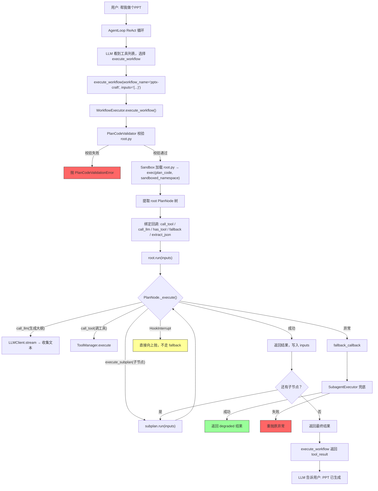

# Phase 11a — Workflow 引擎 设计文档

> 参考：jiuwenswarm `SkillTurbo` 模块（`jiuwenclaw/agentserver/skill_turbo/`）

## 一、为什么需要 Workflow 引擎

当前 ReAct 循环中，LLM 每一步重新决策。对简单任务足够，但对复杂流水线（PPT 生成、深度研究报告）会偏离、重复、遗漏。

jiuwenswarm 的解决方案是 SkillTurbo——把步骤写死成代码，引擎按代码顺序执行，不会偏离。Twinkle 引入同样的 Workflow 引擎。

**Workflow vs 传统 Skill**：

| | 传统 Skill（SKILL.md） | Workflow（root.py） |
|---|---|---|
| 本质 | 给 LLM 的提示词 | 预编的 Python 程序 |
| 执行者 | LLM（自主决策） | 引擎（确定性执行） |
| 可偏离 | 可以 | 不可以 |
| 数据传递 | 靠上下文记忆（不可靠） | `inputs` dict 显式传递（可靠） |
| 并行 | 不可能 | `asyncio.gather` 并行 |
| 失败恢复 | LLM 自己判断 | 自动 fallback |

两者共存，互不冲突，目录分离。

## 二、引擎执行流程



## 三、Twinkle Workflow 引擎架构

```
execute_workflow（@tool 注册到 AgentLoop）
  │
  └─ WorkflowExecutor — 编排引擎，决定"按什么顺序执行哪些节点"
       │
       ├─ PlanCodeValidator — AST 校验，安全防护（从 jiuwenswarm 移植）
       ├─ Sandbox — 安全命名空间，exec(plan_code) 隔离（从 jiuwenswarm 移植）
       └─ PlanNode — 基类，模板方法 run() + 抽象 _execute()
```

**调用链**：LLM 选择 `execute_workflow` 工具 → WorkflowExecutor 加载 root.py 执行 PlanNode 树。

**Fallback 机制**：WorkflowExecutor 是编排引擎，自身不负责"节点失败后怎么办"。当 PlanNode._execute() 抛异常时，run() 模板方法捕获异常，调 fallback_callback。回调内部创建 SubagentTaskSpec，把失败节点的任务交给子 agent 用 ReAct 方式兜底——"代码搞不定，让 LLM 自己试试"。

```
ContentPlan._execute() → 校验失败 → 重试2次 → 还是失败
  │
  ▼
PlanNode.run() 捕获异常 → 调 fallback_callback
  │
  ▼
WorkflowExecutor 创建 SubagentTaskSpec(objective="[Workflow fallback] ContentPlan: 生成大纲")
  │
  ▼
SubagentExecutor 执行子 agent（ReAct 模式兜底）
  │
  ├─ 成功 → 返回 degraded 结果
  └─ 失败 → 重抛原异常
```

**与 jiuwenswarm 的差异**：

| | jiuwenswarm SkillTurbo | Twinkle Workflow |
|---|---|---|
| 路由 | SkillTurboPlanner（LLM 二次路由） | `execute_workflow` 工具描述自描述（LLM 直接选） |
| 执行 | SkillTurboExecutor | WorkflowExecutor（砍掉 Rail/流式/trace/resume/并发限流） |
| 兜底 | DeepAgentFallbackHandler（契约验证+流式转发） | 复用 SubagentExecutor（无契约验证） |
| PlanNode | 流式 + 日志回调 | 砍掉流式和日志回调 |
| 校验/沙箱 | PlanCodeValidator + Sandbox | 直接移植，`AbortError` → `HookInterrupt` |

**关键设计**：
- Workflow 是工具，不是独立 Agent——LLM 自主选择调用，失败时 LLM 自然降级
- Workflow 内的 LLM 调用不走 AgentLoop Hook——是工具级调用，不是 ReAct 轮次
- PlanNode 通过回调注入获取能力（call_tool / call_llm / has_tool），不直接 import 外部模块
- root.py 是预置代码，但仍然用 exec + sandbox 执行——纵深防御 + 未来 Evolver 兼容

### 触发机制：LLM 如何知道何时调用 Workflow

**触发链路**：

```
用户提问 → AgentLoop ReAct → LLM 看到 execute_workflow 工具描述（含可用 workflow 列表）→ LLM 自主决定调用
```

**动态工具描述**：`execute_workflow` 的工具描述不是静态的，而是在 `tool_manager()` 注册时动态生成。`_build_tool_description()` 扫描 `<WORKSPACE>/workflows/*/root.py`，生成如下描述：

```
执行预定义的 Workflow，用于结构化多步骤任务。

可用 workflow：
  - echo-pipeline: 3节点流水线演示
  - ppt-gen: 生成 PPT

当用户意图匹配上述 workflow 时，优先调用此工具。
```

LLM 看到工具描述后，自行判断用户意图是否匹配。例如用户说"帮我生成一个PPT"，LLM 会调用 `execute_workflow(workflow_name="ppt-gen", inputs='{"topic":"xxx"}')`。

**与 jiuwenswarm 的对比**：

| 环节 | jiuwenswarm | Twinkle |
|------|-------------|---------|
| 告知 LLM 有哪些可用 workflow | `SkillProtocolPromptRail` 在 system prompt 中硬编码 "PPT 任务必须先调 skill_acceleration_exec" | 工具描述动态列出可用 workflow |
| 工具描述 | 静态（硬编码 "pptx-craft"） | 动态扫描 workflows 目录 |
| 路由 | `SkillTurboPlanner` 内部二次 LLM 路由（LLM 从注册 skill 列表选最匹配的） | 无二次路由，外层 LLM 直接选 |
| Fallback | skill_tool + SKILL.md 手动执行 | SubagentExecutor 兜底 |

**当前设计的取舍**：
- ✅ 简单：不需要额外的 prompt 注入和二次 LLM 调用
- ✅ 自描述：新增 workflow 只需放目录，工具描述自动更新
- ⚠️ 精确度：依赖外层 LLM 的判断力，没有 SkillProtocolPromptRail 的强制路由
- ⚠️ 可扩展：如果 workflow 数量增多，可以考虑加入 `SkillProtocolPromptRail` 类似的 Hook 或内部 LLM 路由

## 四、Twinkle 的设计决策

### 4.1 Workflow 是工具，不是独立 Agent

和 jiuwenswarm 一致。`execute_workflow` 工具注册到 AgentLoop，LLM 自主选择调用。

**路由方式不同**：jiuwenswarm 用 SkillTurboPlanner（再调一次 LLM 做路由），Twinkle 用 `execute_workflow` 工具描述自描述——工具描述动态列出可用 workflow，LLM 直接选。当前只有 PPT 一个 workflow，不需要 Planner。

### 4.2 非流式执行

返回最终结果字符串，不流式输出中间步骤。Workflow 作为工具调用，结果通过 `tool_result` 返回。后续可加流式，不影响基类。

### 4.3 Fallback 复用 SubagentExecutor

jiuwenswarm 的 `DeepAgentFallbackHandler` 有契约验证、流式转发、session 管理。Twinkle 直接复用 `SubagentExecutor`——无契约验证，成功返回 degraded 结果，失败重抛原异常。

### 4.4 Workflow 内的 LLM 调用不走 AgentLoop Hook

和 jiuwenswarm 一致。Workflow 内的 `call_llm` 是工具级调用（同 `compression._summarize`），不走 `BEFORE_MODEL_CALL`/`AFTER_MODEL_CALL` hook。

### 4.5 AbortError → HookInterrupt

jiuwenswarm 的 `AbortError` 对应 Twinkle 的 `HookInterrupt`。PlanNode 的 `run()` 中 `except HookInterrupt: raise` 不走 fallback，确保 HITL 中断不被吞掉。

## 五、核心组件

### 5.1 PlanNode 基类

参考 jiuwenswarm `PlanNode`，简化掉流式和日志回调。

**职责**：
- `plan_name` + `instruction`：节点标识和描述
- `sub_plans`：子节点列表，支持递归树
- `_execute(inputs) → Any`：子类实现的具体逻辑
- `run(inputs) → Any`：模板方法，自带 fallback 和 HookInterrupt 透传
- `execute_subplan(subplan, inputs)`：执行子节点，带 before/after 回调
- `set_runtime_callbacks(**kwargs)`：注入回调，递归传播到所有 sub_plans

**能力方法（委托给回调）**：
- `has_tool(name)` → bool
- `call_tool(name, **kwargs)` → Any
- `call_llm(prompt, system_prompt)` → str
- `extract_json(raw, expected_type)` → Any

**约束**：
- 节点禁止直接 `import os/subprocess`，必须通过 `call_tool` 访问外部能力
- 节点禁止覆盖 `run()`，框架统一处理异常和 fallback
- `plan_name` 在同一 workflow 内唯一

### 5.2 WorkflowExecutor

参考 jiuwenswarm `SkillTurboExecutor`，简化掉 Rail/流式缓冲/trace/resume/并发限流/节点产物持久化。

**职责**：
- `execute_workflow(plan_code, inputs)` → 校验 → 加载 → 绑定回调 → 执行（带超时）
- `_prepare_root_node(plan_code)` → PlanCodeValidator 校验 → 沙箱加载 → 绑定回调
- `_bind_node_callbacks(root)` → 注入 call_tool / call_llm / has_tool / fallback / extract_json

**回调封装**：

| 回调 | Twinkle 原语 | 说明 |
|------|-------------|------|
| `call_tool` | `ToolManager.execute(name, args)` | 返回 str，尝试 json.loads 解析 |
| `call_llm` | `LLMClient.stream(messages, tools=[])` + 收集 TextDelta | 同 `compression._summarize` 模式 |
| `has_tool` | `ToolManager.get(name) is not None` | |
| `fallback` | `SubagentExecutor.execute_subagent` | 构造 SubagentTaskSpec 兜底 |
| `extract_json` | `json_utils.extract_llm_json` | |

**Fallback 流程**：
1. 节点 `_execute` 抛异常（非 `HookInterrupt`）
2. `run()` 捕获 → 调 `_fallback_callback`
3. Executor 创建 SubagentTaskSpec 兜底
4. 成功 → 返回 degraded 结果
5. 失败 → 重抛原异常
6. 超过 `max_fallback_count` → 抛 `FallbackLimitExceededError`

### 5.3 PlanCodeValidator

从 jiuwenswarm 直接移植，仅依赖 `ast`。适配点：
- `AbortError` → `HookInterrupt`（`require_abort_reraise` 检查中）
- import 白名单改为 `twinkle.agentserver.workflow` 前缀

三个策略 profile：
- `plan_code`：只允许 `from ... import`，禁止裸 `import`
- `builtin_skill_code`：允许安全标准库（`asyncio`/`json`/`pathlib`/`re`/`typing`），禁止 `os`/`subprocess`/`sys` 等
- `generated_skill_code`：最严格，只允许 `from twinkle.agentserver.workflow.node import PlanNode`

### 5.4 Sandbox

从 jiuwenswarm 移植，简化：
- `_SAFE_BUILTINS`：~40 个安全内置函数（`len`/`str`/`int`/`list`/`dict`/`isinstance` 等，无 `open`/`exec`/`eval`/`getattr`）
- `_build_namespace()`：`{"__builtins__": _SAFE_BUILTINS, "PlanNode": PlanNode, "HookInterrupt": HookInterrupt}`
- `_safe_import()`：验证 import 白名单，用 `importlib.import_module`

### 5.5 json_utils

从 jiuwenswarm 直接移植 `extract_llm_json()`。处理四种 LLM 返回形态：
1. 已解析的 dict/list
2. 纯 JSON 字符串
3. `` ```json ... ``` `` 代码块
4. 括号计数法提取最外层 JSON 结构

### 5.6 execute_workflow 工具

`@tool` 注册到 AgentLoop。`workflow_name` 对应 `<WORKFLOWS_DIR>/<workflow_name>/root.py`，executor 读取该文件内容作为 `plan_code` 执行。

**动态工具描述**：`_build_tool_description()` 在 `tool_manager()` 注册时扫描 `<WORKSPACE>/workflows/*/root.py`，生成包含可用 workflow 列表的描述。LLM 看到描述后自主判断是否调用。`workflow_name` 经过正则校验（`^[a-zA-Z0-9_-]+$`）和路径解析校验，防止路径遍历。

## 六、与 jiuwenswarm 的映射

| jiuwenswarm | Twinkle | 说明 |
|---|---|---|
| `AbortError` | `HookInterrupt` | HITL 中断信号 |
| `PlanNode` | `PlanNode` | 砍掉流式/日志回调 |
| `SkillTurbo` | `execute_workflow` 工具 | jiuwenswarm 也改为工具 |
| `SkillTurboExecutor` | `WorkflowExecutor` | 砍掉 Rail/流式缓冲/trace/resume/并发限流/节点产物持久化 |
| `SkillTurboPlanner` | `execute_workflow` 自描述 | 工具描述动态列出可用 workflow |
| `DeepAgentFallbackHandler` | 复用 `SubagentExecutor` | 无契约验证 |
| `PlanCodeValidator` | `PlanCodeValidator` | 直接移植，`AbortError` → `HookInterrupt` |
| `skill_codes/` | `<WORKFLOWS_DIR>/` | 目录分离，不与 Skill 混放 |
| `stream_llm_collect` | `call_llm` 回调 | 不走 Hook |

## 七、实现顺序

1. `json_utils.py` — 零依赖，先移植先测试
2. `validator.py` — 仅依赖 `ast`，移植 + HookInterrupt 适配
3. `sandbox.py` — 安全命名空间构建
4. `node.py` — PlanNode 基类
5. `context.py` — ContextVar 桥接
6. `executor.py` — WorkflowExecutor 引擎（依赖 1-5）
7. `tools.py` — execute_workflow 工具入口
8. 配置 + 接线 — schema + server + tools/__init__
9. 测试 — 5 个测试文件

## 八、验收标准

1. 定义一个 3 层 PlanNode 树，执行成功，节点间 inputs 正确传递
2. 中间节点失败时自动触发 fallback（SubagentExecutor 兜底）
3. `HookInterrupt` 不走 fallback，直接向上抛
4. 沙箱拒绝 `import os` / `import subprocess`
5. `PlanCodeValidator` 拒绝 `exec` / `eval` / `open` 等危险调用
6. `execute_workflow` 工具在 `tool_manager()` 中注册，LLM 可调用
7. 超过 `max_fallback_count` 抛 `FallbackLimitExceededError`
8. 执行超时抛 `ExecutionTimeoutError`
