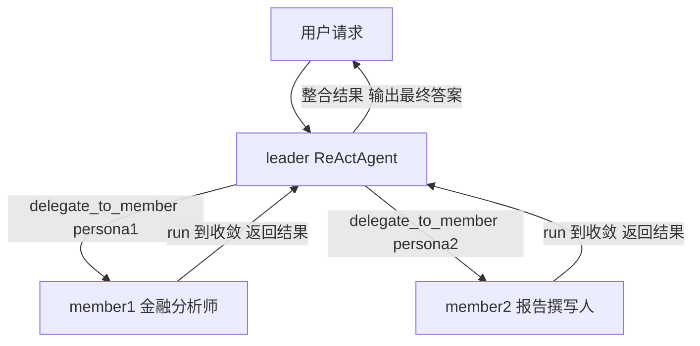

# Phase 18 — Twinkle Agent Team 协作 MVP

> 日期：2026-08-05 · 状态：设计完成，待实现
> 对齐：jiuwenswarm `TeamManager` + `TeamAgent`

---

## 0. 多智能体协作：概念与要解决的问题

> 本节是认知铺垫，先建立「multi-agent 是什么、要解决什么」，再看 §1+ 的具体设计为什么长这样。术语只是给大白话起的工程名，别被吓到。

### 0.1 什么是多智能体协作

- **单 agent**：一个 ReActAgent 跑 `think→tool→think` 循环，独自做完整个任务。
- **多 agent**：多个独立 ReActAgent（各有角色/persona）协同完成单 agent 难以胜任的复杂任务。典型形态是 **1 个 leader（协调者）+ N 个 member（执行者）**：
  - leader 不亲手干活，负责把大任务拆成小任务、分给 member、整合结果
  - member 各有角色（如「金融分析师」「报告撰写人」），领活干活
- 类比人类团队：leader = 项目经理，member = 各工种组员。

### 0.2 为什么需要多 agent（单 agent 的局限）

- **上下文有限**：复杂任务信息量大，全塞一个 context 会膨胀、易遗忘
- **单角色瓶颈**：一个 agent 难同时精通「调研 + 写作 + 编码」，分角色更准
- **串行**：单 agent 只能一步步做，多 agent 可并行做无依赖的子任务
- **难聚焦**：长任务里单 agent 容易跑偏，多 agent 各自聚焦子任务更稳

### 0.3 协作要解决的核心问题

| 问题 | 大白话 | 术语/机制 | Phase 18 | 后续阶段 |
|---|---|---|---|---|
| **分工** | 队长把大活拆成小活分给队员 | 任务分解、`create_task` | 部分（LLM 自决策拆） | Phase 19 task queue |
| **协调/依赖** | 子活有先后（B 等 A 做完） | 依赖图、`blocked_by`、环检测、依赖解除 | ❌ | Phase 19 |
| **通信** | 队员/队长之间怎么传话 | mailbox、P2P/Broadcast、steer | ❌（靠共享 workspace） | Phase 19 leader→member steer；member 间 defer |
| **状态管理** | 任务有生命周期（待干/在做/做完），防两人抢同一活 | 状态机、claim 独占、退出释放认领 | ❌ | Phase 19 |
| **身份** | 队员怎么被叫到、被认领 | `member_name`、persona | 部分（persona hash，不可读） | Phase 19 `member_name` |
| **容错** | 队员死了/卡住怎么办 | 超时、释放认领、Recovery | 部分（`_drive_member` 超时） | Phase 19 +释放认领；Recovery defer |

**不解决的后果举例**：分工没 task queue → leader 只能口头委派，任务结果没法跨 member 流转；依赖没依赖图 → member 乱序做，B 在 A 没好时开干白费；通信没机制 → member 只能靠共享文件间接协作；状态没 claim 独占 → 两 member 抢同一活；身份没 `member_name` → 消息和任务没法寻址到具体 member。

### 0.4 steer（消息怎么送到正在干活的 agent）

这是通信里最绕的点，单独讲清。member 正在跑（`think→tool` 循环中），leader 想给它递条子「方向变了，加一节」，怎么递？

**steer（打断递条式）**：member 的 run 循环**每跑一步先查信箱**，有新消息立刻作为一条临时输入注入当前轮，member 马上看到、据此调整。消息**不进对话历史**，跑完这轮就消失，不累积膨胀——所以下次 member 被唤醒时是干净状态。

jiuwenswarm 用 steer。Twinkle Phase 19 对齐 steer（单进程下更简单，不需 jiuwenswarm 的 supervisor 串行化）。

> **Phase 18 的定位**：只解决「分工（简化版，靠 delegate）+ 身份（persona hash）+ 容错（超时）」的最低限度，依赖/通信/状态管理全留给后续阶段（见 §9 已知限制）。

---

## 1. 目标

1 leader + 2-3 角色化 member 并发执行子任务，leader 整合结果输出最终答案。

**不做**：成员间直接通信、任务队列、Monitor 事件流、前端成员面板、team 级崩溃恢复。



leader 用 `asyncio.gather` 并发委派；member1/member2 **平级**、各自独立跑到收敛返回；**member 间无协作、无直接通信**（仅共享 workspace 目录，不构成协作）。

---

## 2. 对象模型

对齐 jiuwenswarm 的两层结构：

```
jiuwenswarm                          Twinkle Phase 18
─────────────────────────────        ─────────────────────────
TeamManager (全局单例)               TeamManager (全局单例)
  _team_agents: dict[sid, TeamAgent]   _teams: dict[sid, Team]
  create_team(sid) → TeamAgent         create_team(sid) → Team
  ensure_team(sid)              ensure_team(sid)

TeamAgent = 单 agent 实例             Team = per-session 容器
  (IS-A BaseAgent, 不是容器;          (不继承 agent; hold members)
   role=leader 或 teammate)
  composition DeepAgent (agent 内核)   _members: dict[key, ReActAgent]
  + team 编排设施(挂实例):              delegate(persona, objective) → str
    _spawn/_recovery/_session/         workspace: Path
    _stream/_coordination              cleanup()
  steer() / deliver_input              (无编排设施, 靠 delegate 驱动;
                                        Phase 19 起加 task_queue/steer)
team = N 个 TeamAgent 实例            team = 1 Team 容器
  (1 leader + N teammate;             (hold leader + members ReActAgent)
   leader spawn teammates)
  共享 infra: task_queue/event_bus/
    shared_state
```

**职责边界**：
- `TeamManager`：全局注册表。创建、获取、销毁 Team 实例。不直接操作 member。
- `Team`：一个 session 内的团队。管理 member agent 生命周期、处理委派、维护共享 workspace。
- `delegate_to_member` 工具：薄包装。从 ContextVar 拿 Team → 调 `team.delegate()`。

---

## 3. 架构总览

```
┌──────────────────────────────────────────────────────────────┐
│  config.yaml                                                 │
│  team:                                                       │
│    enabled: true                                             │
└────────────────────────┬─────────────────────────────────────┘
                         │
┌────────────────────────▼─────────────────────────────────────┐
│  server.py create_agent()                                    │
│                                                              │
│  team_mgr = TeamManager(llm, store, parent_tools, config)    │
│  hooks += [TeamContextHook(team_mgr)]                        │
└────────┬────────────────────────────────────────────────────┘
         │
         │  TeamContextHook.before_invoke:
         │    team = team_mgr.ensure_team(session_id)
         │    CURRENT_TEAM.set(team)
         │
         ▼
┌──────────────────────────────────────────────────────────────┐
│  TeamManager (全局)                                          │
│  _teams: dict[session_id, Team]                              │
│  ensure_team(sid) → Team                              │
│  destroy_team(sid)                                           │
└────────┬─────────────────────────────────────────────────────┘
         │  creates / retrieves
         ▼
┌──────────────────────────────────────────────────────────────┐
│  Team (per session)                                          │
│                                                              │
│  _members: dict[key, ReActAgent]   ← 缓存，跨 delegation 复用 │
│  workspace: Path                   ← team/<sid>/shared/      │
│                                                              │
│  delegate(persona, objective) → str                          │
│    ├─ 按 MEMBER_TOOL_WHITELIST 构建 ToolManager              │
│    ├─ system_prompt = base + persona + workspace 提示         │
│    ├─ 创建/复用 member ReActAgent                            │
│    ├─ agent.run() → 收敛                                     │
│    └─ 返回 final content                                    │
└────────┬─────────────────────────────────────────────────────┘
         │  ContextVar → delegate_to_member 工具
         │
         ▼
┌──────────────────────────────────────────────────────────────┐
│              ReActAgent._run_react_loop  (UNCHANGED)          │
│                                                              │
│  Step N: LLM → 并发 tool_calls:                              │
│    delegate_to_member(persona="金融分析师", objective="...")   │
│    delegate_to_member(persona="报告撰写人", objective="...")   │
│          ↓                                                   │
│          _try_parallel_tool_calls → asyncio.gather           │
│          ↓                      ↓                            │
│     ┌──────────────┐     ┌──────────────┐                   │
│     │ 金融分析师   │     │ 报告撰写人   │                   │
│     │ ReActAgent   │     │ ReActAgent   │                   │
│     │ 白名单工具   │     │ 白名单工具   │                   │
│     │ ws: shared/  │     │ ws: shared/  │                   │
│     └──────┬───────┘     └──────┬───────┘                   │
│            └────────┬──────────┘                             │
│                     ↓                                        │
│  Step N+1: LLM 整合结果 → 继续委派 or 输出                    │
└──────────────────────────────────────────────────────────────┘
```

---

## 4. 组件设计

### 4.1 常量（team/manager.py）

```python
# 对齐 jiuwenswarm team_runtime_inheritance.py TOOL_WHITELIST
MEMBER_TOOL_WHITELIST: frozenset[str] = frozenset({
    "web_search", "web_fetch",
    "read_file", "write_file", "edit_file", "list_files", "glob",
    "command_exec",
    "memory_search", "read_memory",
    "todo_create", "todo_update", "todo_list", "todo_get",
    "list_skill", "read_skill",
    "cron_list_jobs", "cron_create_job", "cron_update_job",
    "cron_delete_job", "cron_run_now",
})
```

### 4.2 TeamManager（team/manager.py）

```python
class TeamManager:
    """全局单例。session → Team 注册表。

    对齐 jiuwenswarm TeamManager._team_agents: dict[session_id, TeamAgent]。
    """

    def __init__(self, llm: LLMClient, store: SessionStore,
                 parent_tools: ToolManager, config: TeamConfig):
        self._llm = llm
        self._store = store
        self._parent_tools = parent_tools
        self._config = config
        self._teams: dict[str, Team] = {}

    def ensure_team(self, session_id: str) -> Team:
        """获取或创建 session 的 Team 实例。"""
        if session_id not in self._teams:
            self._teams[session_id] = Team(
                llm=self._llm,
                store=self._store,
                parent_tools=self._parent_tools,
                session_id=session_id,
                config=self._config,
            )
        return self._teams[session_id]

    def destroy_team(self, session_id: str) -> None:
        if team := self._teams.pop(session_id, None):
            team.cleanup()
```

### 4.3 Team（team/manager.py）

```python
class Team:
    """一个 session 内的团队实例。管理 member agent 生命周期。

    session 级团队编排入口。Twinkle 是容器设计（不继承 agent、hold members）；
    jiuwenswarm TeamAgent 是单 agent 实例（IS-A BaseAgent、composition DeepAgent +
    team 编排设施），两者非同类——见 §2 对照表。
    """

    def __init__(self, llm, store, parent_tools, session_id, config):
        self._llm = llm
        self._store = store
        self._parent_tools = parent_tools
        self._session_id = session_id
        self._config = config
        self._members: dict[str, ReActAgent] = {}
        self.workspace = team_workspace_dir(session_id)
        ensure_team_workspace(session_id)

    def _member_key(self, persona: str) -> str:
        import hashlib
        return hashlib.blake2b(persona.encode(), digest_size=8).hexdigest()

    def _ensure_member(self, persona: str) -> ReActAgent:
        key = self._member_key(persona)
        if key in self._members:
            return self._members[key]

        member = self._build_member(persona)
        self._members[key] = member
        return member

    def _build_member(self, persona: str) -> ReActAgent:
        # 1. ToolManager → 按 MEMBER_TOOL_WHITELIST 过滤
        tm = ToolManager()
        for t in self._parent_tools.list():
            if t.card.name in MEMBER_TOOL_WHITELIST:
                tm.register(t)

        # 2. 创建 session，写入 persona
        member_sid = f"{self._session_id}__team_{self._member_key(persona)}"
        self._store.create_session(member_sid)
        sp = build_system_prompt() + "\n\n" + persona
        sp += f"\n\n你的工作目录是 `{self.workspace}`。"
        self._store.append(member_sid, {"role": "system", "content": sp})

        # 3. 构建 ReActAgent
        hooks = [SkillHook(), MemoryHook(), LoggingHook(), RetryHook()]
        return ReActAgent(self._llm, self._store, tm,
                          hooks=tuple(hooks),
                          max_steps=SUBAGENT_MAX_STEPS)

    async def delegate(self, persona: str, objective: str,
                       prompt: str = "") -> str:
        """委派任务给 member，运行到收敛，返回最终结果。"""
        member = self._ensure_member(persona)
        member_sid = f"{self._session_id}__team_{self._member_key(persona)}"
        query = f"{objective}\n\n{prompt}" if prompt else objective
        request = AgentRequest(
            session_id=member_sid,
            request_id=f"{self._session_id}__team_{uuid4().hex[:8]}",
            query=query)
        return await self._drive_member(member, request)

    async def _drive_member(self, member, request) -> str:
        """运行 member agent 到收敛，返回 final content。"""
        # …（和 SubagentExecutor._drive_child 同款逻辑）
        # soft_timeout → "[member timeout]"
        # exception → "[member error]"
        # e2a.complete → final content
        # 截断到 SUBAGENT_MAX_RESULT_CHARS

    def cleanup(self):
        self._members.clear()
```

### 4.4 delegate_to_member 工具（tools/builtin/team_tools.py）

```python
@tool
async def delegate_to_member(persona: str, objective: str,
                             prompt: str = "") -> str:
    """委派任务给团队的一个成员。

    persona: 成员角色描述。如 "金融分析师，专长美股财报分析"
    objective: 任务目标（自包含，成员看不到这段对话）
    """
    team = CURRENT_TEAM.get()
    if team is None:
        return "[team unavailable]"
    return await team.delegate(persona, objective, prompt)
```

### 4.5 TeamContextHook

```python
# team/context.py
CURRENT_TEAM: ContextVar[Team | None] = ContextVar("team", default=None)

# hooks/builtin/team_context_hook.py  priority = 45
class TeamContextHook(AgentHook):
    def __init__(self, manager: TeamManager):
        self._manager = manager

    async def before_invoke(self, ctx: HookContext):
        team = self._manager.ensure_team(ctx.session_id)
        CURRENT_TEAM.set(team)
```

### 4.6 其余

- `TeamConfig`：只有 `enabled: bool = False`
- `TeamPrompt`：`build_system_prompt()` 条件追加委派指南
- `TeamWorkspace`：`team/workspace.py` — `team_workspace_dir` + `ensure_team_workspace`

---

## 5. 数据流

```
用户: "分析 AAPL Q3 财报"
  │
  ▼ ReActAgent.run()
  │  TeamContextHook → team_mgr.ensure_team(sid) → Team()
  │    CURRENT_TEAM.set(team)
  │    build_system_prompt() 注入委派指南
  │
  ▼ LLM → 并发 tool_calls:
      delegate_to_member(persona="金融分析师，专长美股财报",
                         objective="分析 AAPL 10-Q")
      delegate_to_member(persona="金融报告撰写人",
                         objective="写成结构化分析报告")
  │
  ▼ _try_parallel_tool_calls → asyncio.gather
  │  ├── Team.delegate("金融分析师", "分析 AAPL 10-Q")
  │  │     → _ensure_member: 首次，构建 ReActAgent
  │  │     → member.run() → 搜集数据 → 返回分析摘要
  │  └── Team.delegate("金融报告撰写人", "写成报告")
  │        → 构建另一个 ReActAgent → 返回报告
  │
  ▼ tool_results → leader session → LLM 整合 → 输出最终答案
```

---

## 6. 设计决策

| 决策 | 理由 |
|---|---|
| TeamManager + Team 两层 | 对齐 jiuwenswarm TeamManager + TeamAgent（入口角色）。TeamManager 是注册表，Team 管 member 生命周期。注：Twinkle Team 是容器（hold members），jiuwenswarm TeamAgent 是 agent 实例（leader/teammate），非同类（见 §2） |
| Team 是 per-session 对象 | 对应 jiuwenswarm `_team_agents: dict[session_id, TeamAgent]`（session→leader TeamAgent 入口）；Twinkle 映射到 Team 容器，jiuwenswarm 映射到 leader TeamAgent 实例 |
| Team 负责 delegate | member 创建/复用/运行都在 Team 内，不外泄给工具函数 |
| 工具只从 ContextVar 拿 Team | delegate_to_member 是薄包装，逻辑全在 Team |
| 硬编码 MEMBER_TOOL_WHITELIST | 对齐 jiuwenswarm TOOL_WHITELIST |
| 所有 member 同一工具集 | 对齐 jiuwenswarm。差异仅靠 persona |
| 不改 ReActAgent | step 循环 + 并行执行已存在 |

---

## 7. 文件变更

| 操作 | 文件 | ~行数 |
|---|---|---|
| 新增 | `team/__init__.py` | 5 |
| 新增 | `team/context.py` | 6 |
| 新增 | `team/workspace.py` | 25 |
| 新增 | `team/manager.py` — TeamManager + Team + MEMBER_TOOL_WHITELIST | 150 |
| 新增 | `tools/builtin/team_tools.py` — delegate_to_member | 18 |
| 新增 | `hooks/builtin/team_context_hook.py` | 20 |
| 改动 | `config/schema.py` — TeamConfig | 10 |
| 改动 | `config/__init__.py` — TEAM_ENABLED | 4 |
| 改动 | `config.yaml` — `team: {enabled: false}` | 4 |
| 改动 | `tools/__init__.py` — 注册 delegate_to_member | 2 |
| 改动 | `agent.py` — build_system_prompt() 追加 team 段 | 20 |
| 改动 | `server.py` — create_agent() 创建 TeamManager + hook | 12 |
| 改动 | `hooks/builtin/__init__.py` — 导出 TeamContextHook | 2 |

**总计 ~280 行**。

## 8. 验证

1. 金融：2 个不同 persona 的 member 并发执行 → leader 整合输出分析报告
2. 同 persona 第二次委派 → 复用 member 实例和 session 历史
3. `team.enabled: false` → 无注入、无 delegate_to_member 工具
4. member 调 delegate_to_member → `[error] unknown tool`

## 9. 已知限制

- leader 靠 LLM 自决策何时委派
- 无成员间直接通信（靠共享 workspace）
- 无 Monitor 事件流
- leader 单点故障
- 无 team state 持久化
