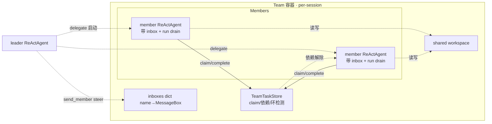
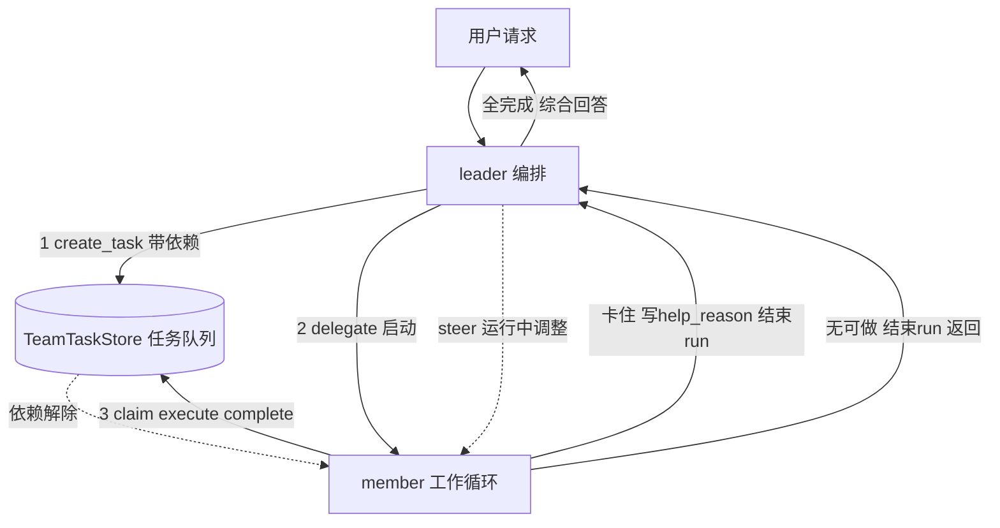

# Phase 19 — Team 协作核心设计

> 状态：设计稿（待评审）
> 日期：2026-08-07
> 范围：Phase 19 的「协作核心」子集——任务队列 + leader→member steer 注入 + member 身份

---

## 0. 背景与定位

### 0.1 基线：Phase 18 已落地

Phase 18 实现了独立 Team 子系统（`twinkle/agentserver/team/`）：

- `TeamManager`（全局 registry，`session_id → Team`）
- `Team`（per-session，hold `members: dict[member_key, ReActAgent]`，`delegate(persona, objective, prompt)` **同步**驱动 member 到收敛）
- `delegate_to_member` 工具（leader 调用 → `Team.delegate`）
- `TeamContextHook`（priority 45）
- Leader / Member 双工具白名单（`_TEAM_LEADER_TOOL_WHITELIST` / `MEMBER_TOOL_WHITELIST`）
- 共享 workspace（`team/<sid>/shared/`）
- 动态 persona（LLM 发明，非预定义角色）

Phase 18 的范式是 **leader 同步委派**（leader `await delegate` 阻塞等 member 跑到收敛才返回，非 fire-and-forget）：leader 调 `delegate_to_member(persona, objective)` → member 跑到收敛 → 返回结果。无任务队列、无成员通信、member 用 persona hash 作 key。

### 0.2 Phase 19 相比 Phase 18 做了什么

Phase 18 是同步委派（`delegate` 跑到收敛返回）；Phase 19 在其上加任务队列编排 + leader→member steer + member 身份。增量对照：

| 方面 | Phase 18 | Phase 19 变化 |
|---|---|---|
| 范式 | 同步委派：`delegate(persona, objective)` 跑到收敛返回 | 异步任务队列编排 + leader→member steer |
| 任务管理 | 无（delegate 直接带 objective） | `TeamTaskStore`：claim 独占 + 依赖图 + 环检测 + 4 态（pending/in_progress/completed/cancelled + blocked 派生） |
| member 身份 | persona hash 作 key（不可读） | `member_name`（leader 命名，稳定可读）作 key/寻址；persona 降为 prompt 个性化 |
| leader→member 通信 | 无 | 单向 steer：mailbox(`MessageBox`) + `ReActAgent.run` 每步 drain，注入当前 round，**不进 session store** |
| member→leader 通信 | 无（delegate 同步返回结果） | 走 task list：求助=写 `metadata.help_reason`+主动结束 run → delegate 返回 → leader `list_tasks` |
| member 退出 | 无释放 | 自动释放其 claim 未 complete 的 task（owner 清空、回 pending） |
| `ReActAgent.run` | 不变 | `__init__` 加可选 `inbox`，run 循环每步 drain 注入 |
| 工具 | `delegate_to_member` + Leader/Member 双白名单 | + team task 工具（`create_task`/`claim_task`/`complete_task`/`cancel_task`/`list_tasks`/`get_task`/`send_member`），双白名单重配 |
| member 跑法 | leader delegate 一次跑一个具体 objective | leader delegate 启动「认领执行 queue」工作循环，member 自主从 pool 选 task |

### 0.3 学习定位

Phase 19 让掌握的是 **单进程内、任务驱动型多 agent 协作编排的核心机制**（任务分解/认领/依赖/状态流转、leader→member 运行时动态注入、member 身份寻址）。这是 multi-agent 协作最实用的形态。**不是**「全面掌握多智能体系统设计」——分布式编排、崩溃恢复、可观测、动态扩缩容、高级编排模式都没碰。结合 Twinkle 定位（核心 agent pipeline 的学习型重写，非完整 multi-agent 框架），这个深度是合适的一站。

---

## 1. 解决的问题与方案

### 1.1 Phase 18 的局限

Phase 18 的同步委派有三个局限，Phase 19 要解决：

1. **无任务队列**——leader 只能逐个 `delegate(persona, objective)` 带 objective，做不了任务分解、先后依赖、member 自主认领。
2. **无运行中通信**——leader delegate 出去后没法给 member 递条子调整方向；member 也没法回报卡住/求助。
3. **member 无稳定身份**——persona hash 不可读，没法在 task/message 里当 `owner`/`to` 寻址。

### 1.2 方案

针对上述，Phase 19 做三件事：

- **TeamTaskStore（任务队列）**：复用 TodoStore（已有 `id`/`status`/`blocked_by`/`owner`/`metadata` 字段，`todo/store.py:23-34`），加编排层——claim 独占、依赖解除、依赖图环检测。4 态状态机（pending/in_progress/completed/cancelled）+ blocked 派生态（不做独立 blocked 状态、不做 6 态）；不照搬 jiuwenswarm 的 per-session 动态 SQLite 表，对齐 roadmap 原说「基于 TodoStore 扩展」。
- **leader→member 单向 steer**：每 member 一个 `MessageBox` 作 mailbox；leader `send_member` 投递——**只用于 member 跑时调整方向，不派发任务**（派发走 `create_task` 入队 + `delegate` 启动 member 认领，见 §3.6）；`ReActAgent.run` 每步 drain，注入当前 round，**不进 session store**（不污染历史/不膨胀）。steer 是 jiuwenswarm 协作精髓（动态注入运行中 round 不污染 session 历史，机制见 Phase 18 spec §0.4）；Twinkle 单进程 asyncio 下比 jiuwenswarm 更简单——leader/member 同 event loop，leader 直接 `box.put` 投递 member 信箱，member run 循环 `box.drain` 检查，不需 jiuwenswarm 的 supervisor 串行化。
- **member_name（member 身份）**：leader 显式命名，稳定可读，替代 persona hash 作 key/寻址；persona 降为 prompt 个性化。

### 1.3 关键机制

- **mailbox（信箱）+ steer 注入**：每个 member 一个私有信箱（一个 `MessageBox`），存发给该 member 的消息；信箱集合由 Team 持有（`dict[member_name, MessageBox]`），member 只 drain 自己的信箱、读不到别人的。steer 是 member 从自己信箱取消息的方式——run 循环每步主动 drain，把新消息作临时输入注入当前 round，不进 session 历史（详见 Phase 18 §0.4）。完整链路：leader `send_member(name, content)` → 投递到该 member 信箱 → member run 循环 drain → 注入当前 round。
- **状态机/依赖图的必要性**：多 member 并行认领 + 任务有先后的场景，光「待办/完成」两态撑不住——claim 独占（防两人抢同一 task）、依赖先后（B 等 A）、环检测（防 A→B→A 死锁）。「状态机+依赖图」是任务队列支撑协作编排的最小机制，不是过度设计。
- **环检测是依赖图伴生必需**：做依赖图就要防环（否则死锁），跟对不对齐无关。plan mode / stale sweep 才是可选增强，可 defer。

### 1.4 leader 不收消息通道

leader 要收消息就得 steer，而 leader steer 必须配 delegate 异步化（leader 在 `await delegate` 时不转 think，inbox 有消息也读不到）。当前方案复用 Phase 18 同步 delegate，故 **leader 不收任何消息注入**。

member→leader 全走 task list：

| leader 要收的 | 走 task queue 的方式 |
|---|---|
| 任务完成结果 | `complete_task(result)` → leader `list_tasks` 看 |
| 任务卡住/求助 | member 写 task `metadata.help_reason`=原因 + **主动结束 run** → delegate 返回 → leader `list_tasks` 看到 |
| 进度/发现 | 更新 task `metadata`/`result` → leader `get_task` 看 |

关键机制：member 工作循环检测到无可做 task（含自己刚标 `help_reason` 的 task）→ 主动结束 run → `_drive_member` 收到 complete frame → delegate 返回 → leader 接手 `list_tasks` 处理 → 重新 delegate 指示。**延迟短**（member 下个工作循环迭代就结束），不需并发、不改 leader run。

### 1.5 member 间不直接协作

member 间实时双向对话式协作需要 member 常驻 + 并发 + 互相 steer，当前方案不做——member 不常驻（idle 收消息延迟）、leader 不收消息（无法实时中转）、`send_member` 是 fire-and-forget（不阻塞等答复）。

当前方案定位是 **leader 拆任务 + member 独立执行 + task 依赖协调**：member 间不直接对话，信息靠 task 的 complete result 流转（T2 认领时 `get_task(T1)` 读 T1 结果）。故 **member→member P2P / Broadcast 全 defer**（见 §9.3），通信只保留 leader→member 单向 steer。

---

## 2. 架构总览 + 组件边界

### 2.0 整体架构（Phase 19 落地后）



Phase 19 在 Phase 18 的 Team 容器（hold members + workspace）之上，加 `TeamTaskStore`（任务编排层）+ member inboxes（steer 投递）+ `member_name` 寻址；改 `ReActAgent.run` 加 inbox drain。leader 不再直接带 objective 调 delegate，而是 `create_task` 入队 + `delegate` 启动 member 工作循环让 member 自主认领。各组件边界见 §2.2。

### 2.1 范式变化

从 Phase 18 的「同步委派」转向「**异步任务队列编排 + leader→member steer**」：

- leader 创建任务入队 → member 主动认领 → member 跑过程中靠 steer 收 leader 调整 → 完成回报（task result）→ leader 综合回答
- `delegate_to_member` 工具保留作「强制指派具体 task」后备路径，主路径走 task queue

### 2.2 新增/改动 4 个组件

| 组件 | 性质 | 职责 | 衔接 Phase 18 |
|---|---|---|---|
| **TeamTaskStore** | 新，team session 级 | 在 TodoStore 之上加编排层：claim 独占校验、依赖解除、环检测；复用 TodoTask 字段 | 复用 TodoStore 单例，按 team `session_id` 存；不新建存储 |
| **member inbox + 投递** | 新，挂 Team | 每 member 一个 `MessageBox`；`send_member(name, content)` 投递方法 | member 创建时建 inbox |
| **steer 注入通道** | 改 `ReActAgent.run` | run 循环每步 drain inbox，新消息作 user input 注入当前 round，**不进 session store** | member ReActAgent 持自己 inbox 引用 |
| **member 身份** | 改 Team | 引入 `member_name`（稳定可读）作 member_key 和寻址，替代 persona hash；persona 降为 prompt 个性化 | `_member_key`/`_member_session_id`/`delegate` 签名演进 |

### 2.3 配套工具

新增 team task/message 工具（加进 `tools/builtin/team_tools.py`）：`create_task` / `claim_task` / `complete_task` / `cancel_task` / `list_tasks` / `get_task` / `send_member`。按 Leader/Member 白名单配置（见 §4.3、§5.4）。

### 2.4 交互总览



实线 = 主流程（请求 → 拆任务 → 认领执行 → 回答）；虚线 = 辅助通道（steer 调整、依赖解除）。

---

## 3. member 身份

### 3.1 member_name 是什么

稳定、可读的成员标识，用于一切寻址——claim task 的 `owner`、`send_member` 的 `to`、Team 内 member 字典的 key。和 persona 正交：**member_name = 我叫什么（标识），persona = 我擅长什么（prompt 个性化）**。

### 3.2 来源——leader 显式命名

leader 在创建/委派 member 时把 `member_name` 当参数显式传入（如 `create_member("researcher", persona="金融分析师…")`），LLM 在 leader prompt 指导下起名（简短英文标识）。

不选：
- 不从 persona hash 派生——hash 不可读，没法在消息/task 里当 `owner`/`to` 显示给 agent 看
- 不引入预定义花名册（MemberSpec YAML）——Phase 18 动态 persona 是优点，YAGNI 砍掉花名册配置层

### 3.3 唯一性

Team 层校验同 team 内 `member_name` 唯一。`_members: dict[member_name, ReActAgent]` 天然防重，但要拒绝「同名不同 persona」的冲突创建。

### 3.4 对 Phase 18 的改动

| Phase 18 现状 | Phase 19 改成 |
|---|---|
| `_member_key(persona)` = persona hash | `_member_key` 直接用 `member_name`，不再 hash |
| `_member_session_id(persona)` = `…__team_{hash}` | `…__team_{member_name}`（可读、debug 友好） |
| `_members: dict[hash, Agent]` | `dict[member_name, Agent]` |
| `_ensure_member(persona)` | `_ensure_member(member_name, persona)` |
| `_build_member(persona)` | `_build_member(member_name, persona)` |
| `delegate(persona, objective, prompt)` | `delegate(member_name, persona, objective, prompt)`；`delegate_to_member` 工具签名同步加 `member_name` |

### 3.5 member_name 进 prompt

`build_member_system_prompt` 注入 `member_name`，让 member 在 claim task 时写 `owner=<自己 name>`、收 steer 消息时认 `to=<自己 name>`——寻址自洽的前提。

### 3.6 member 生命周期

1. leader `create_member(name, persona)` → 建实例 + inbox，idle
2. leader `delegate(name, directive)` → 启动 member 跑一次工作循环，directive 通常是「认领并执行 queue 中你能做的 task，直到无可做」
3. member run 循环内：`list_tasks` → `claim_task` → 执行 → `complete_task` → 重复 → 无可做 → run 结束 → idle
4. leader 有新 task → 再 `delegate` 唤醒；member 跑期间 leader 可 `send_member` → steer 注入

member **不常驻**，靠 `delegate` 启动工作循环，steer 只在 member 跑时有效。避免改 `ReActAgent.run` 成长循环，复用 Phase 18 delegate 通路，`objective` 语义从「具体任务」变成「认领队列指令」。

---

## 4. task queue

### 4.1 TeamTaskStore 定位

team session 级轻量编排层（新文件 `team/task_store.py`），**复用 TodoStore 单例**做存储（按 team `session_id` 存，不新建独立存储），自己只加 team 专用编排逻辑。底层 task 就是 `TodoTask`，`blocked_by`/`owner`/`status` 字段原样复用。

team task 工具从 `CURRENT_TEAM.get()` 拿 team 实例 → 拿 team `session_id` → 操作 TeamTaskStore。team task 存 team `session_id`（= leader session_id）的 TodoStore；member 个人 todo 存各自 `member_session_id` 的 TodoStore——按 session_id 分离。leader 在 team 模式下用 `create_task` 建团队任务（**不用 `todo_create`**——`todo_create` 会落在同一个 team session 的 TodoStore 里与 team task 混淆）。

### 4.2 状态机——复用 TodoStore 4 态 + blocked 派生

不新增状态，复用 TodoStore 现有 `pending`/`in_progress`/`completed`/`cancelled` 4 态：

| 转移 | 触发 | 校验 |
|---|---|---|
| → `pending` | leader `create_task` | — |
| `pending`→`in_progress`(=CLAIMED) | member `claim_task` | **owner 空** + 前置全 `completed`（非 blocked） |
| `in_progress`→`completed` | member `complete_task` | owner 必须是自己 |
| `pending`/`in_progress`→`cancelled` | leader `cancel_task` | — |
| `blocked` 派生态消失 | 某 task `complete` | 触发依赖解除 |

`blocked` 不做独立状态——`pending` + `blocked_by` 含未完成 task 即「blocked」（**仅表任务间依赖**），`blocked_by` 全 `completed` 即解除，纯派生。`in_progress` 即 CLAIMED（`owner` 标认领者）。注：member 求助（执行中遇困难）不走 blocked，走 `metadata.help_reason` + 结束 run（见 §1.4）。

### 4.3 三个编排逻辑（TeamTaskStore 核心方法）

1. **claim 独占**：`claim_task` 校验当前 `owner` 为空才允许，设 `owner=member_name` + `status=in_progress`；已被认领则拒绝。复用 `TodoStore._locks`（operation-level，已存在）保证 claim 的读-改-写原子；独占校验（owner 为空才占）是 TeamTaskStore 新增逻辑。
2. **环检测**：设 `blocked_by` 时 DFS 遍历依赖链，若回到自己则成环、拒绝（防 A→B→A 死锁）。依赖图伴生必需，不是增强项。
3. **依赖解除**：task `complete` 时，遍历所有 `blocked_by` 含此 task 的 `pending` task，若其全部前置已 `completed` → 它的 blocked 派生态消失、可被 claim。

### 4.4 team task 工具 + 白名单

| 工具 | Leader | Member |
|---|---|---|
| `create_task` | ✓ | — |
| `claim_task` | — | ✓ |
| `complete_task` | — | ✓ |
| `cancel_task` | ✓ | — |
| `list_tasks` / `get_task` | ✓ | ✓ |
| `send_member` | ✓ | — |

Leader 只协调不执行（不 claim/complete），Member 不能 create/cancel——对齐 Phase 18「leader 协调、member 执行」分工。

---

## 5. 通信 + steer 注入

### 5.1 两条单向线（砍 member 间协作后）

| 通道 | 机制 |
|---|---|
| **leader → member** | 单向 steer：leader `send_member(to=member_name, content)` → member `inbox`(MessageBox) → member run 循环 drain 注入当前 round，不进 session 历史 |
| **member → leader** | 走 task：求助 = 写 task `metadata.help_reason`=原因 + 主动结束 run → delegate 返回 → leader `list_tasks` 处理 |
| member → member / Broadcast | **defer，不做** |

### 5.2 steer 注入——改 `ReActAgent.run`

`ReActAgent.__init__` 加可选 `inbox: MessageBox | None`（member 传自己信箱，leader 传 `None`；`MessageBox` 类见 §5.4）。run 循环每步开头 drain：

```python
while step < max_steps:
    if self._inbox is not None:
        new = self._inbox.drain()   # steer 检查
        if new:
            messages.extend({"role": "user", "content": m} for m in new)  # 只加内存
    response = await llm.call(messages)
    ...
```

### 5.3 不进 session 历史怎么保证

注入的 user message **只加到 run 循环的内存 `messages` 列表**（传给 `llm.call`），**不 append 到 session store**。这次 run 内 member 看到消息、据此调整；run 结束（delegate 返回）后 session store 里没有这些消息——下次 delegate 是干净 session，不污染、不膨胀。

### 5.4 简化要点

- **曾考虑给 member 加 `list_messages` 主动查 inbox，砍掉**——member inbox 由 run 循环自动 drain，不需主动查
- **立小 `MessageBox` 类（包 `asyncio.Queue` + `put`/`drain`），不立大 TeamMessageStore**（无持久化/优先级/审计等编排语义）——Team 持 `dict[member_name, MessageBox]`；`send_member` 是 Leader 白名单里的 LLM 工具，工具实现内部调 `team.send_member(name, content)`（实际 `box.put` 到 member 信箱）；两层同名，LLM 只看得见工具
- **`send_member(to, content)` 仅加进 Leader 白名单**；Member 白名单不加任何消息工具

---

## 6. 数据流（完整链路）

场景：用户要 team「调研 X 并写报告」。

1. 用户请求 → leader run think
2. leader `create_task`（T1 调研、T2 写报告 `blocked_by=[T1]`）→ TeamTaskStore 存（TodoStore JSON）；环检测通过
3. leader `create_member("researcher", persona)` + `create_member("writer", persona)` → Team 建实例 + inbox，idle
4. leader `delegate("researcher", "认领执行 queue")` → 启动 researcher run 工作循环
5. researcher `list_tasks` → `claim T1`（owner=researcher, in_progress，独占校验通过）→ 执行（web_search…）→ `complete T1`(result=调研结果) → **触发依赖解除**：T2 的 blocked_by[T1] 现已 completed → T2 解除 blocked
6. researcher `list_tasks` 无可做 → 结束 run → delegate 返回 → leader 接手 think
7. leader `list_tasks`（T1 completed、T2 pending 可做）→ `delegate("writer", "认领执行 queue")` → 启动 writer run
8. writer `claim T2` → `get_task(T1)` 拿 T1 的 result（调研结果）→ 据此写报告
   - *可选 steer 演示*：leader 发现用户要加「风险提示」节 → `send_member(to="writer", "加风险提示节")` → writer inbox → writer run 下一步 drain 注入 → 调整
9. writer `complete T2` → 无可做 → 结束 run → delegate 返回 → leader `list_tasks` 全 completed → 综合回答用户 → leader run 结束

**信息流转关键**：writer 不直接问 researcher，而是 `get_task(T1)` 读 T1 的 complete result——**member 间信息靠 task result 流转**，不靠消息。leader→member 的 steer 只用于运行中调整方向。

---

## 7. 错误处理

| 异常情况 | 处理 |
|---|---|
| **环检测** | `create_task`/`update` 设 `blocked_by` 时 DFS 遍历依赖链，成环 → 拒绝 + 返回错误给 leader，leader 据此调整依赖 |
| **claim 独占** | `claim_task` 校验 `owner` 为空才允许；否则拒绝。member 顺序 delegate 启动（不并发跑），竞争概率低，但 `TodoStore._locks` 防万一，校验仍做 |
| **member 超时/错误** | 复用 Phase 18 `_drive_member` 的 `SUBAGENT_SOFT/HARD_TIMEOUT` + 异常捕获，返回 `[member timeout]`/`[member error]`；leader 接到据此标 task |
| **member 退出释放认领**（关键边界） | member run 结束（正常完成/超时/错误）时，Team 自动释放该 member **claim 但未 complete 的 task**：`owner` 清空、`status` 回 `pending`（`metadata` 保留——求助的 `help_reason` 不丢，leader `list_tasks` 仍可见）——防 task 卡在 `in_progress` 别人 claim 不了 |
| **依赖任务被取消** | T1 `cancelled` 时，`blocked_by=[T1]` 的 T2 **不级联自动处理**；leader `list_tasks` 看到 T1 cancelled 自己决策 T2（cancel 或重建 T1'）。当前不做 stale sweep（defer） |
| **steer 滞留** | member idle 时 leader 发消息 → 存 inbox 不处理不报错，下次 delegate 启动时 drain；无害（只是延迟） |

---

## 8. 测试

沿用 Twinkle 约定：`asyncio.run()` + `free_port`/`port_factory`，**不用 pytest-asyncio**（`tests/conftest.py`）。覆盖：

1. **状态机转移**——合法转移（create→pending, claim→in_progress, complete→completed, cancel→cancelled）+ 非法转移拒绝（如 completed→pending）
2. **claim 独占**——第二人 claim 已被认领 task → 拒绝
3. **环检测**——A blocked_by B、B blocked_by A → 拒绝；合法链 A→B → 允许
4. **依赖解除**——T1 complete → T2(blocked_by T1) 解除、可 claim
5. **member 退出释放认领**——member claim T 后 run 结束未 complete → T 自动释放回 pending + owner 空
6. **steer 注入**——leader `send_member` → member inbox → run drain → 验证消息出现在 llm 收到的 messages 但**不进 session store 历史**（核心断言：注入前后 session store 内容不变）
7. **member→leader 求助**——member 写 T `metadata.help_reason`=原因+结束 run → delegate 返回 → leader `list_tasks` 看到 T 的 `help_reason`
8. **member 超时**——`_drive_member` soft timeout → `[member timeout]`，task 释放

---

## 9. 对齐与取舍

### 9.1 对齐 jiuwenswarm 的点

- steer 注入精髓（动态注入运行中 round，不污染 session 历史）
- task 状态机 + 依赖图 + 环检测
- member_name 寻址（替代无标识的 spawn）
- leader 协调 / member 执行分工

### 9.2 当期取舍（不做 + 原因）

- **单进程**：不照搬 jiuwenswarm 跨进程 spawn / pyzmq / 外部 CLI / bridge / swarmflow / worktree / model pool / HITT / per-session 动态 SQLite 表（用 TodoStore + 进程内 dict/queue 替代）
- **leader 不收消息**：jiuwenswarm leader/member 互相 steer；当前方案 leader 不收任何消息注入（member→leader 走 task）
- **member 不常驻 + 顺序跑**：jiuwenswarm member 常驻 + 并发；当前 member 靠同步 delegate 启动工作循环（delegate A 等 A 结束再 delegate B，**顺序跑不并发**），steer 只在跑时有效。`claim_task` 独占校验是防御 + 为未来并发预留；member 自主 claim 价值在「从 pool 选 task」而非「leader 指定」，对齐 jiuwenswarm claim 语义

### 9.3 后续补清单（相比 jiuwenswarm 欠缺的编排能力）

Phase 19 后 Twinkle Team 仍是 jiuwenswarm TeamAgent 的子集。欠缺的编排能力按 jiuwenswarm 维度对标，后续阶段补：

| 能力 | jiuwenswarm 对应 | 何时补（触发条件） |
|---|---|---|
| member 常驻+并发+互相 steer | TeamAgent 原生 | team 需对话式来回协作 |
| member 间 P2P / Broadcast | — | team 需对话式来回协作时（需 member 常驻/并发） |
| 动态 spawn teammate | SpawnManager | leader 需运行时按负载增减 member |
| 崩溃恢复 | RecoveryManager | member 异常退出后自动续跑/重建 |
| 协调内核 | CoordinationKernel | member 常驻并发后需串行化/调度 |
| 流控制 | StreamController | team 作为整体被 stream 给前端 |
| 多 session 管理 | SessionManager | member 各自独立 session 生命周期 |
| 成员间事件总线 + Monitor 事件流 | EventBus + Monitor 14 事件 + `e2a.team_event` | 可观测阶段 |
| team 整体被 invoke/stream | Team 实现 BaseAgent 契约 或 外编排门面 | 前端/外部需统一 team 入口 |
| plan mode（PLAN_APPROVED 审批门禁） | — | 作为 task queue 增强项 |
| stale sweep（扫长时间不动 task） | — | 作为 task queue 增强项 |
| 前端 team 面板 | — | 与前端阶段一起 |
| team 记忆只读优化 | — | 给 Leader 加 `write_memory`（`agent.py:317` `_TEAM_LEADER_TOOL_WHITELIST`） |
| 大脑可替换 | MemberRuntime Protocol | **YAGNI 待定**——学习项目暂无换 agent 后端需求 |

**架构原则**：后续补编排统一做成独立组件（Team 组合），Team 保持纯容器不养厚——不养成「没继承 BaseAgent 的伪 TeamAgent」。当前 Team 不继承 agent 的「干净」部分是能力不足副产品（不 invoke Team 故无 LSP 张力），不是设计胜利；后续要 team 整体被 invoke 时，在「给 Team 实现 `invoke`（走回张力）」vs「外面包编排门面」间二选一，届时再定。

**追上 jiuwenswarm 的标志**：team 整体可 invoke/stream + member 自治（常驻/并发/互相 steer）+ 崩溃恢复 + 事件可观测。在那之前，Twinkle Team 是同层级的「起点」，不是「成品」。

---

## 附：Phase 19 落地后 Phase 18 既有测试影响

- `tests/test_team.py` 现有断言 `_member_key`/`_member_session_id`/`delegate(persona, …)` 签名、member 工具白名单——Phase 19 改了这些签名（加 `member_name`），需同步更新测试
- `_TEAM_LEADER_TOOL_WHITELIST` 加 `create_task`/`cancel_task`/`list_tasks`/`get_task`/`send_member`
- `MEMBER_TOOL_WHITELIST` 加 `claim_task`/`complete_task`/`list_tasks`/`get_task`
