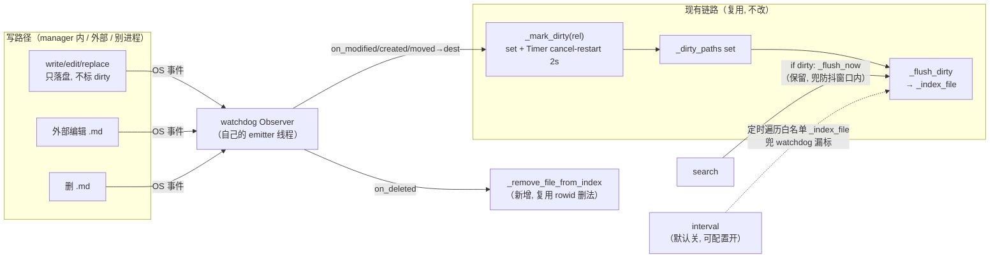

# Memory 文件监听器：watchdog 反向触发索引设计

> 日期：2026-09-03
> 状态：设计已与用户确认，待写实现计划
> 关联记忆：[[memory-store-index-debounce]] [[memory-dedup-gap]] [[decide-by-good-way-not-learning-project]]

## 1. 背景与目标

Twinkle 当前 MemoryManager 的写入路径是**进程内原子触发**：`write`/`edit`/`replace` 落盘后**直接**调 `self._mark_dirty(relative_path)`（[store.py:180/199/221](twinkle/agentserver/memory/store.py#L180)），`_mark_dirty`（[store.py:226-235](twinkle/agentserver/memory/store.py#L226-L235)）把路径加进 `_dirty_paths` set + 重置 2s `threading.Timer`。store.py:69 注释明说"省 watchdog：write 在 manager 内直接 mark_dirty，不需文件监听桥"。

这带来两个 gap：

1. **外部编辑不被索引**：用户或别的进程直接改 `.md`（绕过 manager 的 write），没人标 dirty → sqlite 不更新 → search 召回旧内容。manager 内的 write 路径覆盖不到外部写。
2. **删文件留幽灵 chunk**：`_index_file` 对缺失文件 `except OSError: return`（[store.py:262-266](twinkle/agentserver/memory/store.py#L262-L266)）只读不删。.md 被删后 `chunks`/`chunks_fts`/`chunks_vec` 残留 → search 召回已删内容。**此 gap 现在就存在**，不依赖 watchdog。

**目标**：
- 对齐 jiuwenswarm + openclaw 的"**write 只落盘，靠文件 watcher 反向触发索引**"模型——让 watchdog 成为 dirty 的自动触发源，补外部编辑 gap。
- 顺带补删文件幽灵 chunk gap（watchdog `on_deleted` 天然捕获删除）。
- 保留 Twinkle 的工程优势（`set` 精确路径 vs 参考的 `bool`+全目录扫），不为同构而劣化。

## 2. 两参考调研结论（模型 B）

两个参考都是**模型 B**：write 只落盘，靠文件 watcher 反向触发索引。决定性证据见 [research 调研](../research/)（本会话两轮 Explore agent 核实）。

### jiuwenswarm（`jiuwenclaw/agentserver/memory/manager.py`）
- `MemoryIndexManager` 是**只读索引器**——根本不写 md。写 md 由独立工具 `write_memory`/`edit_memory`（`memory_tools.py:412-548`），方法体内只 `open().write()` 落盘，**零** dirty/sync 调用。
- 索引触发靠 watchdog：`_setup_file_watcher`（manager.py:423-493）注册 `on_modified/created/deleted` → `_schedule_watch_sync`（500-531）= `asyncio.Task` cancel-restart + `asyncio.sleep(2s)`（`watchDebounceMs=2000`）→ `sync("watch")`。
- `dirty` 是**单个 bool**（manager.py:119），sync 时**全目录扫** + 每文件 hash 跳过（`_sync_memory_files` 630-660），不区分哪个文件变。
- 兜底：显式 `memory_index` 工具（LLM 写完再调，绕防抖立即 sync）+ onSearch `if dirty: sync`（853）+ `intervalMinutes` 默认 0（关）。

### openclaw（`extensions/memory-core/src`）
- 写原语 `writeMemoryContent`（`short-term-promotion-memory-write.ts:90-159`）只 `replaceFileAtomic`（临时文件+rename）落盘。全扩展 grep `markDirty/scheduleWatchSync` **零**命中写路径——只出现在 watcher 文件 `manager-watch-ops.ts`。
- chokidar `on('add'/'change'/'unlink'/'unlinkDir')` → `markDirty`（161-179）→ `scheduleWatchSync`（769-794）= `setTimeout` 去抖 → `sync({reason:"watch"})`。
- 信任 watcher 能捕获进程自己的写（写路径落在 watcher 显式监听的 `MEMORY.md`/`memory/` 目录上）。
- 兜底：onSearch 懒 sync（`sync.onSearch` + dirty 门控）+ 空索引 bootstrap（search 时若 `!hasIndexedContent` force sync）+ `ensureIntervalSync` 默认关（755-767）+ 会话生命周期 sync + watcher fallback 重连（`attachMemoryChokidarFallback` 716-753）。
- **固有脆弱点**：watcher 不可用则自身写漏索引，靠 interval/onSearch 兜。这是"write 靠 watchdog"模型的固有代价。

### 两者共识
- write 零索引触发，靠 watcher 反向捕获（包括进程自己的写）。
- interval 默认关，接受"watcher 偶发漏事件"的低概率风险。
- 都为 watcher 做了 fallback/兜底（j 显式工具，openclaw 重连+多重 sync）。

## 3. 核心决策（与用户确认）

1. **删 write/edit/replace 三处 `_mark_dirty`**（[store.py:180/199/221](twinkle/agentserver/memory/store.py#L180)）。write 只落盘，dirty 完全由 watchdog 标。对齐 j/openclaw 模型 B。
2. **`dirty` 容器保留 `set[str]`**，不抄 j/openclaw 的 `bool`+全目录扫。watchdog 事件标的就是具体路径，`set` 天然贴合；`_flush_dirty` 只索引变的那几个文件，比全目录扫 + hash 跳过更省。**不为同构而劣化**（[[decide-by-good-way-not-learning-project]]）。
3. **`on_deleted` 清理做**（决策点 A）。补既有删文件幽灵 chunk gap。新增 `_remove_file_from_index`，复用 [store.py:283-290](twinkle/agentserver/memory/store.py#L283-L290) 的 rowid 删法 + `DELETE FROM files WHERE path=?`。
4. **interval 兜底默认关、可配置开**（决策点 C）。对齐 j `intervalMinutes=0` + openclaw `ensureIntervalSync` 默认关。防 watchdog 长期漏事件；常态零开销。
5. **不抄 openclaw 的 watcher fallback 重连**（`attachMemoryChokidarFallback`/`closeAndFallback`）。Twinkle 用 Python `watchdog` 库，它自己管 emitter 重连；不引入 openclaw 那套重型 fallback。
6. **保留 search `if self._dirty_paths: self._flush_now()`**（[store.py:442](twinkle/agentserver/memory/store.py#L442)）。兜"watchdog 已标 dirty 但 2s 防抖窗口内未 flush"的，对齐 j onSearch + openclaw onSearch 懒 sync。

## 4. 方案选择

| 方案 | 机制 | 评价 |
|---|---|---|
| A（弃） | 零依赖轮询线程，定时全扫 hash 跳过 | 无依赖但轮询有延迟 + 常态空转开销；j/openclaw 都用真 watcher 不轮询 |
| **B（选）** | **`watchdog` 库，OS 原生事件**（Win ReadDirectoryChangesW / Mac FSEvents / Linux inotify） | 即时响应、跨平台标准、对齐 j/openclaw；新增一个依赖；watchdog 最佳实践建议配 interval 兜底防漏 |
| C（弃） | 扩展 search-flush 顺带扫外部变化 | 最轻无线程，但只在 search 时才补，非搜索路径的外部编辑仍漏；用户选定 B 对齐参考 |

**为何 B**：用户选定 + 对齐两个参考的真实 watcher + OS 原生事件即时响应。接受新增 `watchdog` 依赖 + interval 兜底（默认关）。

## 5. 组件改动

### 5.1 MemoryManager（`twinkle/agentserver/memory/store.py`）

**`__init__` 加 `enable_watcher: bool = True` kwarg**：
- `True` 时 `try: from watchdog.observers import Observer; self._observer = Observer(); self._observer.schedule(_MemoryEventHandler(self), str(self._dir), recursive=True); self._observer.start()`，`except Exception: log.warning("watchdog unavailable; memory degrades to no-watcher")`（对齐 [store.py:104-113](twinkle/agentserver/memory/store.py#L104-L113) sqlite-vec 可选降级模式）。
- `False` 时 `self._observer = None`（测试用，不起线程）。
- 新增 `self._interval_timer: threading.Timer | None = None`。

**删三处 `_mark_dirty`**：
- `write`（[store.py:180](twinkle/agentserver/memory/store.py#L180)）：删 `self._mark_dirty(relative_path)`，保留落盘。
- `edit`（[store.py:199](twinkle/agentserver/memory/store.py#L199)）：同。
- `replace`（[store.py:221](twinkle/agentserver/memory/store.py#L221)）：同。**注意**：replace 用 `tmp.replace(fpath)` 原子 rename，watchdog fire 的是 `on_moved`（不是 `on_modified`），由 5.3 的 `on_moved` 取 dest 捕获。

**新增 `_remove_file_from_index(relative_path)`**：复用 [store.py:283-290](twinkle/agentserver/memory/store.py#L283-L290) rowid 删法（`DELETE FROM chunks WHERE path=?` → `DELETE FROM chunks_fts WHERE rowid IN (...)` → `if _vec_enabled: DELETE FROM chunks_vec WHERE rowid IN (...)`）+ `DELETE FROM files WHERE path=?`。持 `_db_lock`。**不删 `embedding_cache`**：其 key=`md5(text)` 跨 chunk 共享，删了影响别处复用；对齐 `_index_file` 删旧 chunk 不碰 `embedding_cache`。

**新增 `close()`**：`if self._observer: self._observer.stop(); self._observer.join(timeout=2.0)` + cancel `_sync_timer` + cancel `_interval_timer` + 最终 `_flush_dirty()`。幂等可重入。

**新增 `_ensure_interval_sync()`**（默认关）：读 config `memory.watch_interval_seconds`，`<=0` 不起；`>0` 起循环 `threading.Timer`，到期遍历 `list_files()`（白名单文件）逐个 `_index_file`——[store.py:271-275](twinkle/agentserver/memory/store.py#L271-L275) 指纹跳过未变，只重建变了的。即**低频全目录 hash 扫**，防 watchdog 漏标（Twinkle 的 `set` 模型只 flush dirty 集，watchdog 若漏标某文件，该文件永远不入 dirty → 靠 interval 全扫发现变化兜底）。复用现有 `_index_file`，无新逻辑。

### 5.2 `_MemoryEventHandler`（store.py 内部类）

```python
from watchdog.events import FileSystemEventHandler

class _MemoryEventHandler(FileSystemEventHandler):
    def __init__(self, mgr: MemoryManager):
        self._mgr = mgr

    def _on(self, abs_path: str, is_delete: bool = False) -> None:
        try:
            # watchdog 给绝对路径 → 转相对;_dir 已 resolve(),这里也 resolve 对齐
            rel = str(Path(abs_path).resolve().relative_to(self._mgr._dir))
        except (ValueError, OSError):
            return  # 不在 memory_dir 下(如系统 temp 目录)→ 忽略
        rel = self._mgr._validate_memory_path(rel)  # 白名单:USER/MEMORY/daily
        if rel is None:
            return
        try:
            if is_delete:
                self._mgr._remove_file_from_index(rel)
            else:
                self._mgr._mark_dirty(rel)
        except Exception:
            log.exception("watcher event handling failed")

    def on_modified(self, e): self._on(e.src_path)
    def on_created(self, e):   self._on(e.src_path)
    def on_deleted(self, e):   self._on(e.src_path, is_delete=True)
    def on_moved(self, e):
        self._on(e.src_path, is_delete=True)  # 旧路径走删(.tmp 白名单外忽略;daily 改名则清旧)
        self._on(e.dest_path)                 # 新路径走建/改(replace rename 取 dest)
```

白名单复用现有 `_validate_memory_path`（[store.py:117-135](twinkle/agentserver/memory/store.py#L117-L135)）：`USER.md`/`MEMORY.md`/`daily_memory/YYYY-MM-DD.md`。`.tmp`、`dreaming_state.json`、`notes.md` 返回 None 忽略。事件回调异常 `log + 吞`，不让 emitter 线程崩。

### 5.3 `twinkle/agentserver/memory/__init__.py`
- `get_memory_manager()`（[__init__.py:12-42](twinkle/agentserver/memory/__init__.py#L12)）：构造 `MemoryManager(..., enable_watcher=True)`（默认），并 `atexit.register(mgr.close)`（对齐 [observability/provider.py:58-63](twinkle/observability/provider.py#L58-L63) atexit 模式）。
- `_set_memory_manager(new)`（[__init__.py:45-48](twinkle/agentserver/memory/__init__.py#L45)）：替换单例时若 `old = _MEMORY_MANAGER` 存在且 `old is not new`，先 `old.close()` 防 Observer 泄露。

### 5.4 配置（`twinkle/config/schema.py` + `twinkle/resources/config.yaml`）
- `MemoryConfig`（或现有 memory 配置段）加 `watch_interval_seconds: float = 0.0`（0=关，对齐 j/openclaw）。
- `config.yaml` memory 段加注释说明：默认关，高可靠场景可设 300 等。

### 5.5 依赖（`pyproject.toml`）
- 加 `watchdog>=4.0`（纯 Python + 各 OS 原生后端，无编译）。

## 6. 事件映射与数据流



| watchdog 事件 | 触发场景 | 动作 |
|---|---|---|
| `on_modified`/`on_created` | write/edit 普通写、外部编辑、新建 daily | `_mark_dirty(rel)` |
| `on_moved` | **replace 的 `tmp.replace(fpath)` 原子 rename** | 取 `dest_path` → `_mark_dirty(dest)`；src（.tmp）白名单外忽略 |
| `on_deleted` | 外部删 .md | `_remove_file_from_index(rel)` |

> **replace 这条最关键**：删了 write 的 `_mark_dirty` 后，replace 全靠 `on_moved` 捕 rename。若只处理 `on_modified`，replace 后索引永远不更新。openclaw 的 chokidar 把 rename 解析成 unlink+add 天然覆盖；watchdog 给的是 `on_moved(src, dest)`，必须显式取 dest。

## 7. 生命周期与测试隔离

watchdog Observer 是后台线程——测试隔离是最大坑。

- **`enable_watcher` kwarg**：`True`（生产）才起 Observer；`False`（测试）`self._observer=None`。
- **`close()`**：stop+join Observer + cancel timers + 最终 flush。幂等。
- **生产 `get_memory_manager`**：`enable_watcher=True` + `atexit.register(close)`。
- **`_set_memory_manager(new)`**：替换时 `old.close()` 防泄露。
- **测试 helper**（[test_memory_store.py:6](tests/test_memory_store.py#L6) `_mgr`）：默认 `enable_watcher=False`（一行改），现有索引测试不 spawn Observer 线程。其他直接构造 `MemoryManager` 的测试文件一并审改默认 off。
- **watcher 专项测试**：`enable_watcher=True` + try/finally `close()`。

### 测试影响（删 mark_dirty 后）
删 write 的 `_mark_dirty` + helper `enable_watcher=False` 后，靠"write 自带 dirty + search 兜底搜到"的测试会挂（没人标 dirty）。分两类处理：
- **已显式 `_flush_now()` 的**（test_model_change、test_fifo_cap 等）：不受影响（`_flush_now` 不依赖 dirty 非空——等等，`_flush_now` 走 `_drain_dirty`，dirty 空则无操作。所以这些测试也得改成 write 后显式 `_mark_dirty(path)` 再 `_flush_now`，或 `enable_watcher=True` + 等 2s）。
- **靠 search 兜底搜到刚写内容的**（test_write_does_not_index_until_flush、test_search_* 等）：改成 write 后显式 `_mark_dirty(path)` 模拟 watchdog 标 dirty，或 `enable_watcher=True` + 等防抖。

> **实现时要审计 test_memory_store.py 全部测试的触发方式**，逐个改。这是删 mark_dirty 的连带改动范围。

## 8. 错误处理与降级

- **Observer 启动失败**（import 失败/权限/OS 不支持）：`log.warning` + 降级无 watcher。search 的 `_flush_now` 仍在，但 dirty 只来自……无人标（write 不标了）→ **降级模式下 write 后无人标 dirty**，这是删 mark_dirty 的代价。对齐 j/openclaw：watcher 不可用就漏，靠 interval（若开）兜。spec 写明此降级风险。
- **事件回调异常**：`log + 吞`，不让 emitter 线程崩。
- **watchdog 漏单次事件**：该写不标 dirty → search if-dirty 不兜（dirty 空）→ 漏索引。j/openclaw 接受此低概率风险，靠 interval（默认关）最终兜。Twinkle 对齐即接受同等风险。

## 9. 测试计划

1. **外部写自动索引**：`enable_watcher=True`，外部直接 `Path.write_text` 写 MEMORY.md → 等 2s 防抖 → `search` 搜到（验证 watcher 自动触发，不靠 write 内 mark_dirty）。
2. **外部新建 daily**：外部建 `daily_memory/2026-09-03.md` → 被索引。
3. **外部删 .md 清幽灵**：建+索引后外部删 → chunks 清掉（验证 `_remove_file_from_index`）。
4. **replace 的 rename 路径**：`mgr.replace("MEMORY.md", ...)` → 等 `on_moved` → 新内容可召回、旧内容不召回（验证 `on_moved` 取 dest，最关键）。
5. **`enable_watcher=False` 不起线程**：现有索引测试不破坏（helper 默认 off）。
6. **`close()` 真停**：close 后 Observer 线程结束、无泄露。
7. **`_set_memory_manager` 替换**：旧 mgr 的 Observer 被 close。
8. **白名单过滤**：写 `notes.md`/`dreaming_state.json` → 不触发索引。
9. **降级**：watchdog import 失败（monkeypatch）→ `log.warning` + 不崩。

## 10. 风险与取舍

| 风险 | 性质 | 处理 |
|---|---|---|
| watchdog 漏单次事件 → 漏索引 | 概率性（OS 事件对 close/rename 基本可靠） | interval 默认关可配置开；接受同 j/openclaw 风险 |
| 删 write mark_dirty → 降级模式（watcher 不可用）下 write 无人标 dirty | 确定性（watcher 挂了必漏） | 靠 interval（若开）；spec 写明 |
| 测试改动范围大 | 确定性（删 mark_dirty 连带） | 实现时审计 test_memory_store.py 逐个改 |
| on_moved 没覆盖 → replace 漏索引 | 确定性（漏 on_moved 则 replace 全废） | 5.2 显式取 dest；测试 #4 验证 |

**不抄的部分**（明确边界）：
- 不抄 openclaw 的 watcher fallback 重连（`attachMemoryChokidarFallback`/`closeAndFallback`）——watchdog 库自带 emitter 管理。
- 不抄 j 的 `memory_index` 显式工具——Twinkle 无此工具，靠 watchdog + search + interval。
- 不抄 j/openclaw 的 `bool`+全目录扫——保留 Twinkle `set` 精确路径优势。
